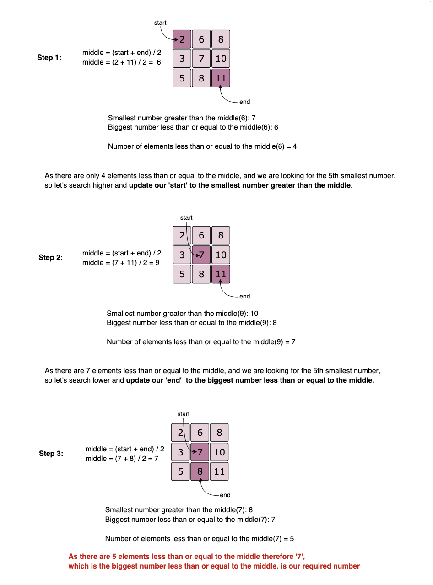

# Pattern 14: K-way merge

This pattern helps us solve problems that involve a list of sorted arrays.

Whenever we are given `K` sorted arrays, we can use a <b>Heap</b> to efficiently perform a sorted traversal of all the elements of all arrays. We can push the smallest (first) element of each sorted array in a <b>Min Heap</b> to get the overall minimum. While inserting elements to the <b>Min Heap</b> we keep track of which array the element came from. We can, then, remove the top element from the <b>heap</b> to get the smallest element and push the next element from the same array, to which this smallest element belonged, to the <b>heap</b>. We can repeat this process to make a sorted traversal of all elements.

Although this course uses <b>Heaps</b> to solve <b>Top 'K' Elements</b> problems, <b>JavaScript</b> does not have a built in method for <b>Heaps/Priority Queues</b>. It can be very time consuming to implement a <b>Heap class</b> from scratch, especially during an interview. After reviewing the <i>JavaScript</i> solutions on <i>Leetcode</i> the most effecient way to solve a <b>Top 'K' Elements</b> problem is usually with <b>[QuickSort](https://github.com/Chanda-Abdul/leetcode/blob/master/0%20%E2%9D%97Sort%20Algorithms.md#-quick-sort)</b>, <b>[BinarySearch](https://github.com/Chanda-Abdul/leetcode/blob/master/0%20%E2%9D%97Sort%20Algorithms.md#binary-search)</b>, <b>[BucketSort](https://initjs.org/bucket-sort-in-javascript-dc040b8f0058)</b>, <b>[Greedy Algorithms](https://github.com/Chanda-Abdul/Grokking-Algorithm-Book-Notes/blob/main/8.%20Greedy%20Algoritms.md)</b>, or <b>[HashMaps](https://developer.mozilla.org/en-US/docs/Web/JavaScript/Reference/Global_Objects/Map)</b>.

## 👩🏽‍🦯 🌴 😐📖 Merge K Sorted Lists (medium)

https://leetcode.com/problems/merge-k-sorted-lists/

> Given an array of `K` sorted <b>LinkedLists</b>, merge them into one sorted list.

### Array Sort

```cpp
#include <iostream>
#include <vector>
#include <algorithm>
using namespace std;

struct ListNode {
    int value;
    ListNode* next;
    ListNode(int value = 0, ListNode* next = nullptr) : value(value), next(next) {}
};

ListNode* mergeLists(vector<ListNode*>& lists) {
    if (lists.empty()) return nullptr;

    vector<int> mergeArr;
    ListNode* resultList = new ListNode(-1);

    // Collect all values
    for (auto list : lists) {
        ListNode* curr = list;
        while (curr) {
            mergeArr.push_back(curr->value);
            curr = curr->next;
        }
    }

    // Sort and rebuild list
    sort(mergeArr.begin(), mergeArr.end());
    ListNode* curr = resultList;

    for (int n : mergeArr) {
        ListNode* temp = new ListNode(n);
        curr->next = temp;
        curr = curr->next;
    }

    return resultList->next;
}

int main() {
    ListNode* l1 = new ListNode(2);
    l1->next = new ListNode(6);
    l1->next->next = new ListNode(8);

    ListNode* l2 = new ListNode(3);
    l2->next = new ListNode(6);
    l2->next->next = new ListNode(7);

    ListNode* l3 = new ListNode(1);
    l3->next = new ListNode(3);
    l3->next->next = new ListNode(4);

    vector<ListNode*> lists = {l1, l2, l3};
    ListNode* result = mergeLists(lists);

    cout << "Here are the elements from the merged list: ";
    while (result != nullptr) {
        cout << result->value << " ";
        result = result->next;
    }
    cout << endl;

    return 0;
}
```

let l1 = new ListNode(2);
l1.next = new ListNode(6);
l1.next.next = new ListNode(8);

let l2 = new ListNode(3);
l2.next = new ListNode(6);
l2.next.next = new ListNode(7);

l1.next = new ListNode(6);

let l3 = new ListNode(1);
l3.next = new ListNode(3);
l3.next.next = new ListNode(4);

l2.next = new ListNode(6);
result = mergeLists([l1, l2, l3]);

let output = "Here are the elements form the merged list: ";
while (result != null) {
output += result.value + " ";
result = result.next;
}
console.log(output);

````

### Compare Each Node One by One

```cpp
#include <iostream>
#include <vector>
using namespace std;

struct ListNode {
    int value;
    ListNode* next;
    ListNode(int value = 0, ListNode* next = nullptr) : value(value), next(next) {}
};

ListNode* findMinNode(vector<ListNode*>& lists) {
    int index = -1;
    int min_val = INT_MAX;

    for (int i = 0; i < lists.size(); i++) {
        if (!lists[i]) continue;
        if (lists[i]->value <= min_val) {
            min_val = lists[i]->value;
            index = i;
        }
    }

    ListNode* resultNode = nullptr;

    if (index != -1) {
        resultNode = lists[index];
        lists[index] = lists[index]->next;
    }

    return resultNode;
}

ListNode* mergeLists(vector<ListNode*>& lists) {
    // compare one by one
    if (lists.empty()) return nullptr;

    ListNode* resultList = new ListNode(-1);
    ListNode* curr = resultList;
    ListNode* temp = findMinNode(lists);

    while (temp) {
        curr->next = temp;
        curr = curr->next;
        temp = findMinNode(lists);
    }

    return resultList->next;
}

int main() {
    ListNode* l1 = new ListNode(2);
    l1->next = new ListNode(6);
    l1->next->next = new ListNode(8);

    ListNode* l2 = new ListNode(3);
    l2->next = new ListNode(6);
    l2->next->next = new ListNode(7);

    ListNode* l3 = new ListNode(1);
    l3->next = new ListNode(3);
    l3->next->next = new ListNode(4);

    vector<ListNode*> lists = {l1, l2, l3};
    ListNode* result = mergeLists(lists);

    cout << "Here are the elements from the merged list: ";
    while (result != nullptr) {
        cout << result->value << " ";
        result = result->next;
    }
    cout << endl;

    return 0;
}
````

## 🔎 Kth Smallest Number in M Sorted Lists (Medium)

> Given `M` sorted arrays, find the `Kth` smallest number among all the arrays.

```cpp
#include <iostream>
#include <vector>
#include <queue>
#include <tuple>
using namespace std;

int findKthSmallest(vector<vector<int>>& lists, int k) {
    // Min heap: {value, array_index, element_index}
    priority_queue<tuple<int, int, int>, vector<tuple<int, int, int>>, greater<tuple<int, int, int>>> minHeap;

    // Put the 1st element of each list in the min heap
    for (int i = 0; i < lists.size(); i++) {
        if (!lists[i].empty()) {
            minHeap.push(make_tuple(lists[i][0], i, 0));
        }
    }

    int numberCount = 0;
    int number = 0;

    while (!minHeap.empty()) {
        int val = get<0>(minHeap.top());
        int list_idx = get<1>(minHeap.top());
        int elem_idx = get<2>(minHeap.top());
        minHeap.pop();

        number = val;
        numberCount++;

        if (numberCount == k) {
            break;
        }

        // If the array of the top element has more elements, add the next element to the heap
        if (elem_idx + 1 < lists[list_idx].size()) {
            minHeap.push(make_tuple(lists[list_idx][elem_idx + 1], list_idx, elem_idx + 1));
        }
    }

    return number;
}

int main() {
    vector<vector<int>> lists = {{2, 6, 8}, {3, 6, 7}, {1, 3, 4}};
    cout << "Kth smallest number is: " << findKthSmallest(lists, 5) << endl;

    return 0;
}
```

### Similar Problems

### 🔎 🌴 Median of Two Sorted Arrays

https://leetcode.com/problems/median-of-two-sorted-arrays/

> Given `M` sorted arrays, find the median number among all arrays.

<b>Solution:</b> This problem is similar to our parent problem with K=Median. So if there are `N` total numbers in all the arrays we need to find the `Kth` minimum number where `K=N/2`.

### 👩🏽‍🦯 🌴 Merge K Sorted Arrays

https://leetcode.com/problems/merge-k-sorted-lists/

> Given a list of `K` sorted arrays, merge them into one sorted list.

<b>Solution:</b> This problem is similar to [Merge K Sorted Lists](#🔎-median-of-two-sorted-arrays) except that the input is a list of arrays compared to LinkedLists. To handle this, we can use a similar approach as discussed in our parent problem by keeping a track of the array and the element indices.

## 🔎 🌴 Kth Smallest Number in a Sorted Matrix (Hard)

https://leetcode.com/problems/kth-smallest-element-in-a-sorted-matrix/

> Given an `N * N` matrix where each row and column is sorted in ascending order, find the `Kth` smallest element in the matrix.

This problem follows the [K-way merge pattern](#pattern-14-k-way-merge) and can be easily converted to [Kth Smallest Number in M Sorted Lists](#🔎-kth-smallest-number-in-m-sorted-lists-medium). As each row (or column) of the given matrix can be seen as a sorted list, we essentially need to find the `Kth` smallest number in `N` sorted lists.

Since each row and column of the matrix is sorted, is it possible to use <b>Binary Search</b> to find the `Kth`smallest number?

The biggest problem to use <b>Binary Search</b>, in this case, is that we don’t have a straightforward sorted array, instead, we have a matrix. As we remember, in <b>Binary Search</b>, we calculate the middle index of the search space <i>(‘1’ to ‘N’)</i> and see if our required number is pointed out by the middle index; if not we either search in the lower half or the upper half. In a sorted matrix, we can’t really find a middle. Even if we do consider some index as middle, it is not straightforward to find the search space containing numbers bigger or smaller than the number pointed out by the middle index.

An alternative could be to apply the <b>Binary Search</b> on the <i>“number range”</i> instead of the <i>“index range”</i>. As we know that the smallest number of our matrix is at the top left corner and the biggest number is at the bottom right corner. These two numbers can represent the <i>“range”</i> i.e., the `start` and the `end` for the <b>Binary Search</b>. Here is how our algorithm will work:

1. Start the <b>Binary Search</b> with `start = matrix[0][0]` and `end = matrix[n-1][n-1]`.
2. Find `middle` of the `start` and the `end`. This middle number is NOT necessarily an element in the matrix.
3. Count all the numbers smaller than or equal to `middle` in the matrix. As the matrix is sorted, we can do this in `O(N)`.
4. While counting, we can keep track of the <i>“smallest number greater than the middle”</i> (let’s call it `n1`) and at the same time the <i>“biggest number less than or equal to the middle” </i>(let’s call it `n2`). These two numbers will be used to adjust the <i>“number range”</i> for the <b>Binary Search</b> in the next iteration.
5. If the count is equal to <b>`K`</b>, `n2` will be our required number as it is the <i>“biggest number less than or equal to the middle”</i>, and is definitely present in the matrix.
   If the count is less than <b>`K`</b>, we can update `start = n2` to search in the higher part of the matrix and if the count is greater than <b>`K`</b>, we can update `end = n1` to search in the lower part of the matrix in the next iteration.



```cpp
#include <iostream>
#include <vector>
#include <algorithm>
using namespace std;

int countLessEqual(vector<vector<int>>& matrix, int mid, int& smaller, int& larger) {
    int count = 0;
    int n = matrix.size();
    int row = n - 1;
    int col = 0;

    while (row >= 0 && col < n) {
        if (matrix[row][col] > mid) {
            // As matrix[row][col] is bigger than the mid,
            // keep track of the smallest number greater than the mid
            larger = min(larger, matrix[row][col]);
            row--;
        } else {
            // As matrix[row][col] is <= mid
            // keep track of the biggest number <= mid
            smaller = max(smaller, matrix[row][col]);
            count += row + 1;
            col++;
        }
    }
    return count;
}

int findKthSmallest(vector<vector<int>>& matrix, int k) {
    int n = matrix.size();
    int start = matrix[0][0];
    int end = matrix[n - 1][n - 1];

    while (start < end) {
        int mid = start + (end - start) / 2;

        int smaller = matrix[0][0];
        int larger = matrix[n - 1][n - 1];
        int count = countLessEqual(matrix, mid, smaller, larger);

        if (count == k) return smaller;
        if (count < k) {
            // search higher
            start = larger;
        } else {
            // search lower
            end = smaller;
        }
    }

    return start;
}

int main() {
    vector<vector<int>> matrix1 = {{1, 4}, {2, 5}};
    cout << "Kth smallest number is: " << findKthSmallest(matrix1, 2) << endl;

    vector<vector<int>> matrix2 = {{-5}};
    cout << "Kth smallest number is: " << findKthSmallest(matrix2, 1) << endl;

    vector<vector<int>> matrix3 = {{2, 6, 8}, {3, 7, 10}, {5, 8, 11}};
    cout << "Kth smallest number is: " << findKthSmallest(matrix3, 5) << endl;

    vector<vector<int>> matrix4 = {{1, 5, 9}, {10, 11, 13}, {12, 13, 15}};
    cout << "Kth smallest number is: " << findKthSmallest(matrix4, 8) << endl;

    return 0;
}
```

- The <b>Binary Search</b> could take `O(log(max-min ))` iterations where `max` is the largest and `min` is the smallest element in the matrix and in each iteration we take `O(N)`
  for counting, therefore, the overall time complexity of the algorithm will be `O(N*log(max-min))`.
- The algorithm runs in constant space `O(1)`.

## 📍 Smallest Number Range (Hard)

https://leetcode.com/problems/smallest-range-covering-elements-from-k-lists/

> Given `M` sorted arrays, find the smallest range that includes at least one number from each of the `M` lists.

This problem follows the [K-way merge pattern](#pattern-14-k-way-merge) and we can follow a similar approach as discussed in [Merge K Sorted Lists](#👩🏽‍🦯-🌴-merge-k-sorted-arrays).

We can start by inserting the first number from all the arrays in a `min-heap()`. We will keep track of the largest number that we have inserted in the heap (let’s call it `maxNumber`).

In a loop, we’ll take the smallest (top) element from the `min-heap()` and `maxNumber` has the largest element that we inserted in the heap. If these two numbers give us a smaller range, we’ll update our range. Finally, if the array of the top element has more elements, we’ll insert the next element to the heap.

We can finish searching the minimum range as soon as an array is completed or, in other terms, the <b>heap</b> has less than `M` elements.

```cpp
#include <iostream>
#include <vector>
#include <queue>
#include <climits>
using namespace std;

struct MinHeapElement {
    int value;
    int groupID;
    int index;

    bool operator>(const MinHeapElement& other) const {
        return value > other.value;
    }
};

pair<int, int> smallestRange(vector<vector<int>>& nums) {
    priority_queue<MinHeapElement, vector<MinHeapElement>, greater<MinHeapElement>> minHeap;
    vector<int> pointers(nums.size(), 0);
    int rangeStart = 0;
    int rangeEnd = INT_MAX;
    int maxNumber = INT_MIN;

    // Put the first element of each array into the heap
    for (int i = 0; i < nums.size(); i++) {
        minHeap.push({nums[i][0], i, 0});
        maxNumber = max(maxNumber, nums[i][0]);
    }

    // Take the smallest(top) element from the heap, if it gives us smaller range, update the ranges
    // If the array of the top element has more elements, insert the next element in the heap
    while (true) {
        MinHeapElement minElement = minHeap.top();
        minHeap.pop();

        if (maxNumber - minElement.value < rangeEnd - rangeStart) {
            rangeStart = minElement.value;
            rangeEnd = maxNumber;
        }

        pointers[minElement.groupID]++;
        if (pointers[minElement.groupID] >= nums[minElement.groupID].size()) {
            break;
        }

        // Insert the next element into the heap
        int nextValue = nums[minElement.groupID][pointers[minElement.groupID]];
        minHeap.push({nextValue, minElement.groupID, pointers[minElement.groupID]});
        maxNumber = max(maxNumber, nextValue);
    }

    return make_pair(rangeStart, rangeEnd);
}

int main() {
    pair<int, int> result1 = smallestRange({{4, 10, 15, 24, 26}, {0, 9, 12, 20}, {5, 18, 22, 30}});
    cout << "Smallest range is: [" << result1.first << ", " << result1.second << "]" << endl;

    pair<int, int> result2 = smallestRange({{1, 2, 3}, {1, 2, 3}, {1, 2, 3}});
    cout << "Smallest range is: [" << result2.first << ", " << result2.second << "]" << endl;

    pair<int, int> result3 = smallestRange({{1, 5, 8}, {4, 12}, {7, 8, 10}});
    cout << "Smallest range is: [" << result3.first << ", " << result3.second << "]" << endl;

    pair<int, int> result4 = smallestRange({{1, 9}, {4, 12}, {7, 10, 16}});
    cout << "Smallest range is: [" << result4.first << ", " << result4.second << "]" << endl;

    return 0;
}
```

- Since, at most, we’ll be going through all the elements of all the arrays and will remove/add one element in the heap in each step, the time complexity of the above algorithm will be `O(N*logM)` where `N` is the total number of elements in all the `M` input arrays.
- The space complexity will be `O(M)` because, at any time, our `min-heap()` will be store one number from all the `M` input arrays.

## 🌟 K Pairs with Largest Sums (Hard)

https://leetcode.com/problems/find-k-pairs-with-smallest-sums/

> Given two sorted arrays in descending order, find `K` pairs with the largest sum where each pair consists of numbers from both the arrays.

This problem follows the [K-way merge pattern](#pattern-14-k-way-merge) and we can follow a similar approach as discussed in [Merge K Sorted Lists](#👩🏽‍🦯-🌴-merge-k-sorted-arrays).

We can go through all the numbers of the two input arrays to create pairs and initially insert them all in the <b>heap</b> until we have `K` pairs in <b>Min Heap</b>. After that, if a pair is bigger than the top (smallest) pair in the <b>heap</b>, we can remove the smallest pair and insert this pair in the <b>heap</b>.

We can optimize our algorithms in two ways:

1. Instead of iterating over all the numbers of both arrays, we can iterate only the first `K` numbers from both arrays. Since the arrays are sorted in descending order, the pairs with the maximum sum will be constituted by the first `K` numbers from both the arrays.
2. As soon as we encounter a pair with a sum that is smaller than the smallest (top) element of the <b>heap</b>, we don’t need to process the next elements of the array. Since the arrays are sorted in descending order, we won’t be able to find a pair with a higher sum moving forward.

😕

```cpp
#include <iostream>
#include <vector>
#include <queue>
#include <algorithm>
using namespace std;

struct HeapElem {
    vector<int> indices;
    int val;
    bool operator>(const HeapElem& other) const {
        return val > other.val; // Min-heap (top has smallest sum)
    }
};

vector<vector<int>> findKLargestPairs(vector<int>& nums1, vector<int>& nums2, int k) {
    if (nums1.empty() || nums2.empty()) return {};

    priority_queue<HeapElem, vector<HeapElem>, greater<HeapElem>> heap;

    for (int i = 0; i < min(k, (int)nums1.size()); i++) {
        for (int j = 0; j < min(k, (int)nums2.size()); j++) {
            HeapElem elem;
            elem.indices = {nums1[i], nums2[j]};
            elem.val = nums1[i] + nums2[j];

            if (heap.size() < k) {
                heap.push(elem);
            } else if (elem.val < heap.top().val) {
                // If sum is smaller than smallest sum in heap, remove top and insert new
                heap.pop();
                heap.push(elem);
            } else {
                // Found a pair with larger sum; arrays are sorted descending, break
                break;
            }
        }
    }

    vector<vector<int>> result;
    while (!heap.empty()) {
        result.push_back(heap.top().indices);
        heap.pop();
    }
    return result;
}

int main() {
    vector<int> nums1 = {9, 8, 2};
    vector<int> nums2 = {6, 3, 1};
    auto pairs = findKLargestPairs(nums1, nums2, 3);

    cout << "Pairs with largest sum are: ";
    for (const auto& pair : pairs) {
        cout << "[" << pair[0] << ", " << pair[1] << "] ";
    }
    cout << endl;
    // [9, 6], [9, 3], [8, 6]

    vector<int> nums3 = {5, 2, 1};
    vector<int> nums4 = {2, -1};
    auto pairs2 = findKLargestPairs(nums3, nums4, 3);

    cout << "Pairs with largest sum are: ";
    for (const auto& pair : pairs2) {
        cout << "[" << pair[0] << ", " << pair[1] << "] ";
    }
    cout << endl;
    // [5, 2], [5, -1], [2, 2]

    return 0;
}
```

- Since, at most, we’ll be going through all the elements of both arrays and we will add/remove one element in the heap in each step, the time complexity of the above algorithm will be `O(N∗M∗logK)` where `N` and `M` are the total number of elements in both arrays, respectively. If we assume that both arrays have at least `K` elements then the time complexity can be simplified to `O(K^2logK)`, because we are not iterating more than `K` elements in both arrays.
- The space complexity will be `O(K)` because, at any time, our <b>Min Heap</b> will be storing `K` largest pairs.

## 💫 Kth Smallest Number (hard)

https://leetcode.com/problems/find-k-pairs-with-smallest-sums/

> Given an unsorted array of numbers, find `Kth` smallest number in it.

Please note that it is the `Kth` smallest number in the sorted order, not the `Kth` distinct element.

### Example 1:

```
Input: [1, 5, 12, 2, 11, 5], K = 3
Output: 5
Explanation: The 3rd smallest number is '5', as the first two smaller numbers are [1, 2].
```

### Example 2:

```
Input: [1, 5, 12, 2, 11, 5], K = 4
Output: 5
Explanation: The 4th smallest number is '5', as the first three smaller numbers are
[1, 2, 5].
```

### Example 3:

```
Input: [5, 12, 11, -1, 12], K = 3
Output: 11
Explanation: The 3rd smallest number is '11', as the first two small numbers are [5, -1].
```

This is a well-known problem and there are multiple solutions available to solve this. A few other similar problems are:

1. [Find the `Kth` largest number in an unsorted array.](https://www.geeksforgeeks.org/kth-smallestlargest-element-unsorted-array/)
2. [Find the median of an unsorted array.](https://www.geeksforgeeks.org/median-of-an-unsorted-array-in-liner-time-on/)
3. [Find the `K` smallest or largest numbers in an unsorted array.](https://www.geeksforgeeks.org/kth-smallestlargest-element-unsorted-array/)

Let’s discuss different algorithms to solve this problem and understand their time and space complexity. Similar solutions can be devised for the above-mentioned three problems.

### 1. Brute-force

The simplest brute-force algorithm will be to find the `Kth` smallest number in a step by step fashion. This means that, first, we will find the smallest element, then 2nd smallest, then 3rd smallest and so on, until we have found the `Kth` smallest element. Here is what the algorithm will look like:

```cpp
#include <iostream>
#include <vector>
#include <algorithm>
#include <climits>
using namespace std;

int findKthSmallestNumber(vector<int>& nums, int k) {
    int previousSmallestNum = INT_MIN;
    int previousSmallestIndex = -1;
    int currentSmallestNum = INT_MAX;
    int currentSmallestIndex = -1;

    for (int i = 0; i < k; i++) {
        for (int j = 0; j < nums.size(); j++) {
            if (nums[j] > previousSmallestNum && nums[j] < currentSmallestNum) {
                // Found the next smallest number
                currentSmallestNum = nums[j];
                currentSmallestIndex = j;
            } else if (nums[j] == previousSmallestNum && j > previousSmallestIndex) {
                // Found a number equal to previous smallest with different index
                currentSmallestNum = nums[j];
                currentSmallestIndex = j;
                break;
            }
        }
        previousSmallestNum = currentSmallestNum;
        previousSmallestIndex = currentSmallestIndex;
        currentSmallestNum = INT_MAX;
    }
    return previousSmallestNum;
}

int main() {
    vector<int> nums1 = {1, 5, 12, 2, 11, 5};
    cout << "Kth smallest number is: " << findKthSmallestNumber(nums1, 3) << endl;

    vector<int> nums2 = {1, 5, 12, 2, 11, 5};
    cout << "Kth smallest number is: " << findKthSmallestNumber(nums2, 4) << endl;

    vector<int> nums3 = {5, 12, 11, -1, 12};
    cout << "Kth smallest number is: " << findKthSmallestNumber(nums3, 3) << endl;

    return 0;
}
```

- The time complexity of the above algorithm will be `O(N∗K)`. The algorithm runs in constant space `O(1)`.

### 2. Brute-force using Sorting

We can use an <i>in-place sort</i> like a <b>HeapSort</b> to sort the input array to get the `Kth` smallest number.

Following is the code for this solution:

```cpp
#include <iostream>
#include <vector>
#include <queue>
#include <algorithm>
using namespace std;

int findKthSmallestNumber(vector<int>& nums, int k) {
    // Sort and return k-1 index
    sort(nums.begin(), nums.end());
    return nums[k - 1];
}

int main() {
    vector<int> nums1 = {1, 5, 12, 2, 11, 5};
    cout << "Kth smallest number is: " << findKthSmallestNumber(nums1, 3) << endl;

    vector<int> nums2 = {1, 5, 12, 2, 11, 5};
    cout << "Kth smallest number is: " << findKthSmallestNumber(nums2, 4) << endl;

    vector<int> nums3 = {5, 12, 11, -1, 12};
    cout << "Kth smallest number is: " << findKthSmallestNumber(nums3, 3) << endl;

    return 0;
}
```

- Sorting will take `O(NlogN)` and if we are not using an in-place sorting algorithm, we will need `O(N)`space.

### 3. Using Max-Heap

As discussed in [Kth Smallest Number](#💫-kth-smallest-number-hard), we can iterate the array and use a <b>Max Heap</b> to keep track of `K` smallest number. In the end, the root of the heap will have the `Kth` smallest number.

Here is what this algorithm will look like:

```cpp
#include <iostream>
#include <vector>
#include <queue>
#include <algorithm>
using namespace std;

int findKthSmallestNumber(vector<int>& nums, int k) {
    priority_queue<int> maxHeap; // Max heap to keep k smallest

    // Put first k numbers in max heap
    for (int i = 0; i < k; i++) {
        maxHeap.push(nums[i]);
    }

    // Go through remaining numbers
    for (int i = k; i < nums.size(); i++) {
        if (nums[i] < maxHeap.top()) {
            maxHeap.pop();
            maxHeap.push(nums[i]);
        }
    }

    return maxHeap.top();
}

int main() {
    vector<int> nums1 = {1, 5, 12, 2, 11, 5};
    cout << "Kth smallest number is: " << findKthSmallestNumber(nums1, 3) << endl;

    vector<int> nums2 = {1, 5, 12, 2, 11, 5};
    cout << "Kth smallest number is: " << findKthSmallestNumber(nums2, 4) << endl;

    vector<int> nums3 = {5, 12, 11, -1, 12};
    cout << "Kth smallest number is: " << findKthSmallestNumber(nums3, 3) << endl;

    return 0;
}
```

- The time complexity of the above algorithm is `O(K*logK + (N-K)*logK)`which is asymptotically equal to `O(N∗logK)`. The space complexity will be `O(K)` because we need to store `K` smallest numbers in the heap.

### 4. Using Min-Heap

Also discussed in `Kth` Smallest Number, we can use a Min Heap to find the `Kth` smallest number. We can insert all the numbers in the min-heap and then extract the top `K` numbers from the heap to find the `Kth` smallest number.

- Building a heap with `N`elements will take `O(N)`and extracting `K` numbers will take `O(K∗logN)`. Overall, the time complexity of this algorithm will be `O(N+K∗logN)`and the space complexity will be `O(N)`.

### 5. Using Partition Scheme of <b>Quicksort</b>

[Quicksort](https://github.com/Chanda-Abdul/leetcode/blob/master/0%20%E2%9D%97Sort%20Algorithms.md#-quick-sort) picks a number called <b>pivot</b> and partition the input array around it. After <i>partitioning</i>, all numbers smaller than the <b>pivot</b> are to the left of the <b>pivot</b>, and all numbers greater than or equal to the <b>pivot</b> are to the right of the <b>pivot</b>. This ensures that the <b>pivot</b> has reached its correct sorted position.

We can use this <i>partitioning</i> scheme to find the `Kth` smallest number. We will recursively partition the input array and if, after <i>partitioning</i>, our <b>pivot</b> is at the `K-1` index we have found our required number; if not, we will choose one the following option:

1. If <b>pivot</b>’s position is larger than `K-1`, we will recursively partition the array on numbers lower than the <b>pivot</b>.
2. If <b>pivot</b>’s position is smaller than `K-1`, we will recursively partition the array on numbers greater than the <b>pivot</b>.

Here is what our algorithm will look like:

```cpp
#include <iostream>
#include <vector>
#include <algorithm>
using namespace std;

int partition(vector<int>& nums, int low, int high) {
    if (low == high) return low;

    int pivot = nums[high];
    for (int i = low; i < high; i++) {
        if (nums[i] < pivot) {
            swap(nums[low], nums[i]);
            low++;
        }
    }
    swap(nums[low], nums[high]);
    return low;
}

int findKthSmallestNumber_rec(vector<int>& nums, int k, int start, int end) {
    int p = partition(nums, start, end);

    if (p == k - 1) return nums[p];
    if (p > k - 1) return findKthSmallestNumber_rec(nums, k, start, p - 1);
    return findKthSmallestNumber_rec(nums, k, p + 1, end);
}

int findKthSmallestNumber(vector<int>& nums, int k) {
    return findKthSmallestNumber_rec(nums, k, 0, nums.size() - 1);
}

int main() {
    vector<int> nums1 = {1, 5, 12, 2, 11, 5};
    cout << "Kth smallest number is: " << findKthSmallestNumber(nums1, 3) << endl;

    vector<int> nums2 = {1, 5, 12, 2, 11, 5};
    cout << "Kth smallest number is: " << findKthSmallestNumber(nums2, 4) << endl;

    vector<int> nums3 = {5, 12, 11, -1, 12};
    cout << "Kth smallest number is: " << findKthSmallestNumber(nums3, 3) << endl;

    return 0;
}
```

- The above algorithm is known as <b>QuickSelect</b> and has a Worst case time complexity of `O(N^2)`. The best and average case is `O(N)`., which is better than the best and average case of <b>Quicksort</b>. Overall, <b>QuickSelect</b> uses the same approach as <b>Quicksort</b> i.e., <i>partitioning</i> the data into two parts based on a <b>pivot</b>. However, contrary to <b>Quicksort</b>, instead of recursing into both sides <b>QuickSelect</b> only recurses into one side – the side with the element it is searching for. This reduces the average and best case time complexity from `O(N∗logN)` to `O(N)`.

- The worst-case occurs when, at every step, the partition procedure splits the N-length array into arrays of size `1` and `N−1`. This can only happen when the input array is sorted or if all of its elements are the same. This <i>“unlucky”</i> selection of <b>pivot</b> elements requires `O(N)`recursive calls, leading to an `O(N^2)` worst-case.

- Worst-case space complexity will be `O(N)`used for the recursion stack. See details under <b>Quicksort</b>.

### 6. Using Randomized <i>partitioning</i> Scheme of Quicksort

As mentioned above, the worst case for <b>Quicksort</b> occurs when the partition procedure splits the `N-length` array into arrays of size `1` and `N−1`. To mitigate this, instead of always picking a fixed index for <b>pivot</b> (e.g., in the above algorithm we always pick `nums[high]` as the <b>pivot</b>), we can randomly select an element as <b>pivot</b>. After randomly choosing the <b>pivot</b> element, we expect the split of the input array to be reasonably well balanced on average.

Here is what our algorithm will look like (only the highlighted lines have changed):

```cpp
#include <iostream>
#include <vector>
#include <algorithm>
#include <random>
using namespace std;

int partition(vector<int>& nums, int low, int high) {
    if (low == high) return low;

    // Randomly select pivot
    random_device rd;
    mt19937 gen(rd());
    uniform_int_distribution<> dis(low, high);
    int pivotIndex = dis(gen);
    swap(nums[pivotIndex], nums[high]);

    int pivot = nums[high];
    for (int i = low; i < high; i++) {
        if (nums[i] < pivot) {
            swap(nums[low], nums[i]);
            low++;
        }
    }
    swap(nums[low], nums[high]);
    return low;
}

int findKthSmallestNumber_rec(vector<int>& nums, int k, int start, int end) {
    int p = partition(nums, start, end);

    if (p == k - 1) return nums[p];
    if (p > k - 1) return findKthSmallestNumber_rec(nums, k, start, p - 1);
    return findKthSmallestNumber_rec(nums, k, p + 1, end);
}

int findKthSmallestNumber(vector<int>& nums, int k) {
    return findKthSmallestNumber_rec(nums, k, 0, nums.size() - 1);
}

int main() {
    vector<int> nums1 = {1, 5, 12, 2, 11, 5};
    cout << "Kth smallest number is: " << findKthSmallestNumber(nums1, 3) << endl;

    vector<int> nums2 = {1, 5, 12, 2, 11, 5};
    cout << "Kth smallest number is: " << findKthSmallestNumber(nums2, 4) << endl;

    vector<int> nums3 = {5, 12, 11, -1, 12};
    cout << "Kth smallest number is: " << findKthSmallestNumber(nums3, 3) << endl;

    return 0;
}
```

- The above algorithm has the same worst and average case time complexities as mentioned for the previous algorithm. But choosing the <b>pivot</b> randomly has the effect of rendering the worst-case very unlikely, particularly for large arrays. Therefore, the expected time complexity of the above algorithm will be `O(N)`, but the absolute worst case is still `O(N^2)`. Practically, this algorithm is a lot faster than the non-randomized version.

### 7. Using the [Median of Medians algorithm](https://en.wikipedia.org/wiki/Median_of_medians)

We can use the <b>[Median of Medians algorithm](https://www.w3resource.com/javascript-exercises/fundamental/javascript-fundamental-exercise-88.php)</b> to choose a good <b>pivot</b> for the <i>partitioning</i> algorithm of the [Quicksort](https://github.com/Chanda-Abdul/leetcode/blob/master/0%20%E2%9D%97Sort%20Algorithms.md#-quick-sort). This algorithm finds an approximate median of an array in linear time `O(N)`. When this approximate median is used as the <b>pivot</b>, the worst-case complexity of the <i>partitioning</i> procedure reduces to linear `O(N)`, which is also the asymptotically optimal worst-case complexity of any sorting/selection algorithm. This algorithm was originally developed by <i>Blum, Floyd, Pratt, Rivest, and Tarjan</i> and was describe in their [1973 paper](http://people.csail.mit.edu/rivest/pubs/BFPRT73.pdf).

This is how the <i>partitioning</i> algorithm works:

1. If we have 5 or less than 5 elements in the input array, we simply take its first element as the <b>pivot</b>. If not then we divide the input array into subarrays of five elements (for simplicity we can ignore any subarray having less than five elements).
2. Sort each subarray to determine its median. Sorting a small and fixed numbered array takes constant time. At the end of this step, we have an array containing medians of all the subarray.
3. Recursively call the <i>partitioning</i> algorithm on the array containing medians until we get our <b>pivot</b>.
4. Every time the partition procedure needs to find a <b>pivot</b>, it will follow the above three steps.

Here is what this algorithm will look like:

```cpp
#include <iostream>
#include <vector>
#include <algorithm>
using namespace std;

vector<int> findMedianOfMedians(vector<int>& nums, int low, int high);
int partition(vector<int>& nums, int low, int high);

int medianOfMedians(vector<int> nums, int low, int high) {
    int n = high - low + 1;
    if (n < 5) return nums[low];

    vector<vector<int>> partitions;
    for (int i = 0; i < nums.size(); i += 5) {
        if (i + 5 <= nums.size()) {
            vector<int> part(nums.begin() + i, nums.begin() + i + 5);
            partitions.push_back(part);
        }
    }

    // Sort each partition and find median
    vector<int> medians;
    for (auto& p : partitions) {
        sort(p.begin(), p.end());
        medians.push_back(p[2]); // Median at index 2
    }

    if (medians.size() == 1) return medians[0];
    return medianOfMedians(medians, 0, medians.size() - 1);
}

int partition(vector<int>& nums, int low, int high) {
    if (low == high) return low;

    int median = medianOfMedians(nums, low, high);
    for (int i = low; i < high; i++) {
        if (nums[i] == median) {
            swap(nums[i], nums[high]);
            break;
        }
    }

    int pivot = nums[high];
    for (int i = low; i < high; i++) {
        if (nums[i] < pivot) {
            swap(nums[low], nums[i]);
            low++;
        }
    }
    swap(nums[low], nums[high]);
    return low;
}

int findKthSmallestNumber_rec(vector<int>& nums, int k, int start, int end) {
    int p = partition(nums, start, end);

    if (p == k - 1) return nums[p];
    if (p > k - 1) return findKthSmallestNumber_rec(nums, k, start, p - 1);
    return findKthSmallestNumber_rec(nums, k, p + 1, end);
}

int findKthSmallestNumber(vector<int>& nums, int k) {
    return findKthSmallestNumber_rec(nums, k, 0, nums.size() - 1);
}

int main() {
    vector<int> nums1 = {1, 5, 12, 2, 11, 5};
    cout << "Kth smallest number is: " << findKthSmallestNumber(nums1, 3) << endl;

    vector<int> nums2 = {1, 5, 12, 2, 11, 5};
    cout << "Kth smallest number is: " << findKthSmallestNumber(nums2, 4) << endl;

    vector<int> nums3 = {5, 12, 11, -1, 12};
    cout << "Kth smallest number is: " << findKthSmallestNumber(nums3, 3) << endl;

    return 0;
}
```

- The above algorithm has a guaranteed `O(N)`worst-case time. Please see the proof of its running time here and under <i>“Selection-based pivoting”</i>. The worst-case space complexity is `O(N)`.

### Conclusion

Theoretically, the [Median of Medians](#7-using-the-median-of-medians-algorithmhttpsenwikipediaorgwikimedianofmedians) algorithm gives the best time complexity of `O(N)`but practically both the [Median of Medians](#7-using-the-median-of-medians-algorithmhttpsenwikipediaorgwikimedianofmedians) and the [Randomized partitioning algorithms](#6-using-randomized-ipartitioningi-scheme-of-quicksort) nearly perform equally.

In the context of <b>Quicksort</b>, given an `O(N)`selection algorithm using the [Median of Medians](#7-using-the-median-of-medians-algorithmhttpsenwikipediaorgwikimedianofmedians), one can use it to find the ideal <b>pivot</b> (the median) at every step of <b>Quicksort</b> and thus produce a sorting algorithm with `O(NlogN)`running time in the worst-case. Though practical implementations of this variant are considerably slower on average, they are of theoretical interest because they show that an optimal selection algorithm can yield an optimal sorting algorithm.
