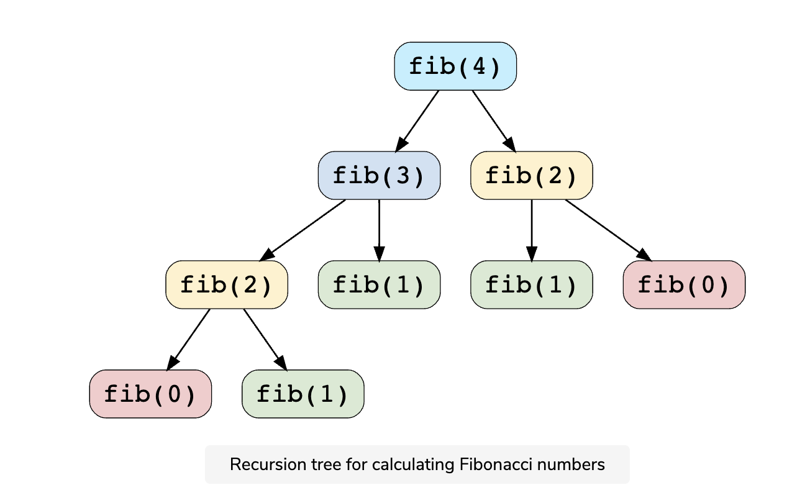
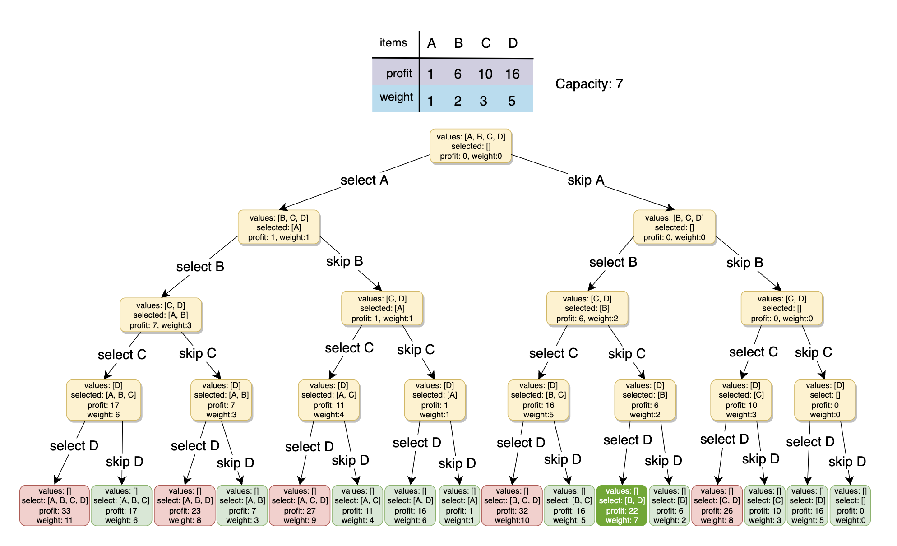
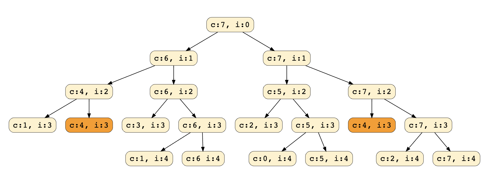
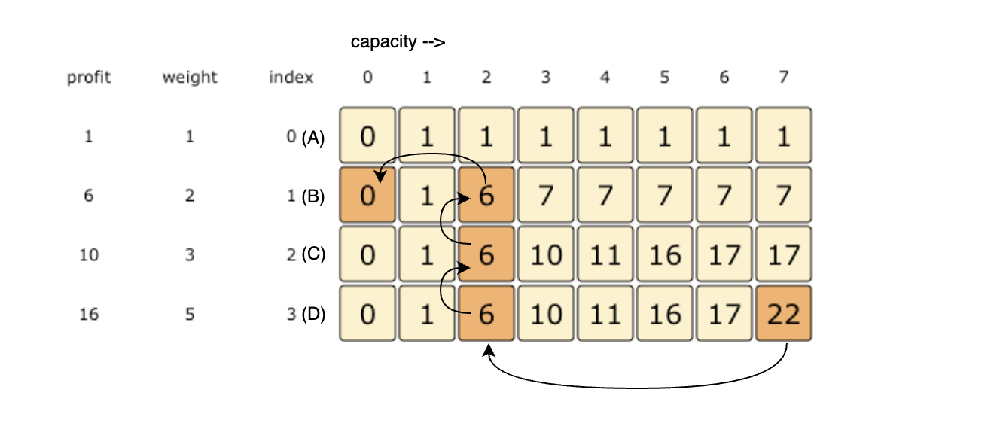
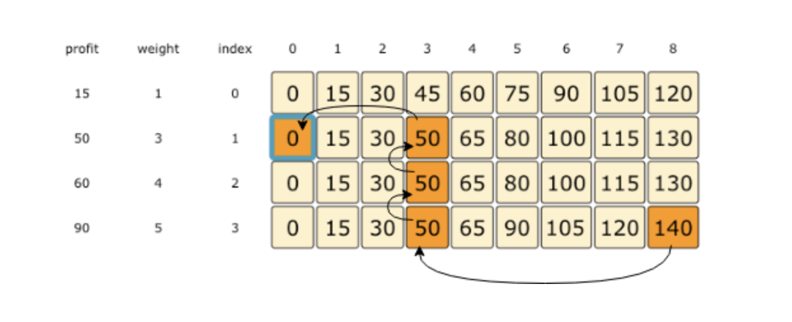
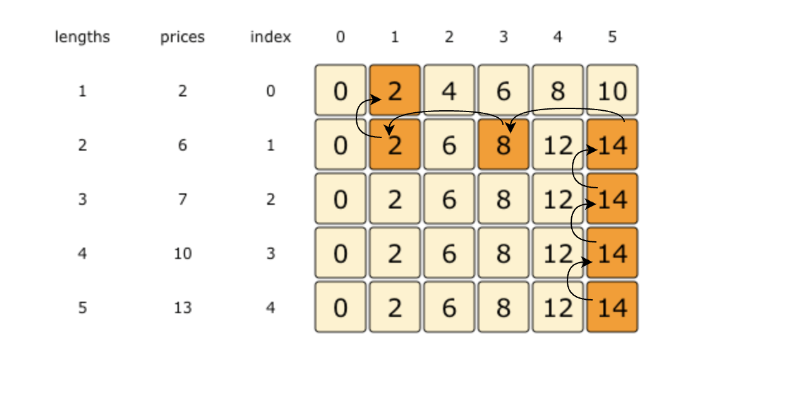
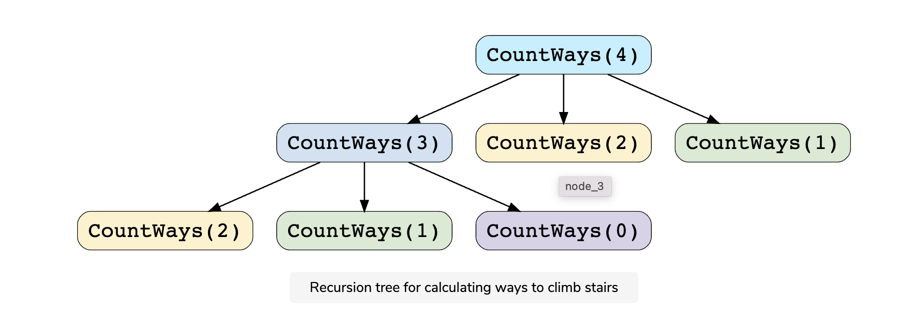
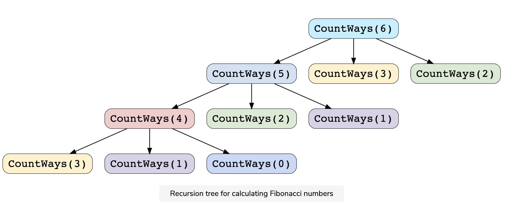

# Pattern 15: 0-1 Knapsack (Dynamic Programming)

from this [course](https://www.educative.io/courses/grokking-dynamic-programming-patterns-for-coding-interviews)
| |
| --------------------------------------------------------------------------------- |
| <b>[Pattern 1: 0/1 Knapsack](#pattern-1-01-knapsack)</b> |
| <b>[Pattern 2: Unbounded Knapsack](#pattern-2-unbounded-knapsack)</b> |
| <b>[Pattern 3: Fibonacci Numbers](#pattern-3-fibonacci-numbers)</b> |
| <b>[Pattern 4: Palindromic Subsequence](#pattern-4-palindromic-subsequence)</b> |
| <b>[Pattern 5: Longest Common Substring](#pattern-5-longest-common-substring)</b> |

<b>Dynamic Programming (DP)</b> is an algorithmic technique for solving an optimization problem by breaking it down into simpler subproblems and utilizing the fact that the optimal solution to the overall problem depends upon the optimal solution to its subproblems.

Let’s take the example of the <b>Fibonacci numbers</b>. As we all know, <i>Fibonacci numbers</i> are a series of numbers in which each number is the sum of the two preceding numbers. The first few <i>Fibonacci numbers</i> are `0, 1, 1, 2, 3, 5, and 8`, and they continue on from there.

If we are asked to calculate the nth Fibonacci number, we can do that with the following equation,

```cpp
// Fib(n) = Fib(n-1) + Fib(n-2), for n > 1
```

As we can clearly see here, to solve the overall problem (i.e. `Fib(n)`), we broke it down into two smaller subproblems (which are `Fib(n-1)` and `Fib(n-2)`). This shows that we can use <b>DP</b> to solve this problem.

## Characteristics of Dynamic Programming

Before moving on to understand different methods of solving a <b>DP</b> problem, let’s first take a look at what are the characteristics of a problem that tells us that we can apply <b>DP</b> to solve it.

### Overlapping Subproblems

Subproblems are smaller versions of the original problem. Any problem has overlapping sub-problems if finding its solution involves solving the same subproblem multiple times. Take the example of the Fibonacci numbers; to find the `fib(4)`, we need to break it down into the following sub-problems:



We can clearly see the overlapping subproblem pattern here, as `fib(2)` has been evaluated twice and `fib(1)` has been evaluated three times.

### Optimal Substructure Property

Any problem has optimal substructure property if its overall optimal solution can be constructed from the optimal solutions of its subproblems. For Fibonacci numbers, as we know,

```cpp
// Fib(n) = Fib(n-1) + Fib(n-2)
```

This clearly shows that a problem of size `n` has been reduced to subproblems of size `n-1` and `n-2`. Therefore, Fibonacci numbers have optimal substructure property.

## Dynamic Programming Methods

DP offers two methods to solve a problem.

### Top-down with Memoization

In this approach, we try to solve the bigger problem by recursively finding the solution to smaller sub-problems. Whenever we solve a sub-problem, we cache its result so that we don’t end up solving it repeatedly if it’s called multiple times. Instead, we can just return the saved result. This technique of storing the results of already solved subproblems is called <b>Memoization</b>.

We’ll see this technique in our example of Fibonacci numbers. First, let’s see the non-DP recursive solution for finding the nth Fibonacci number:

```cpp
#include <iostream>
using namespace std;

int calculateFibonacci(int n) {
  if (n < 2) return n;

  return calculateFibonacci(n - 1) + calculateFibonacci(n - 2);
}

int main() {
  cout << "5th Fibonacci is ---> " << calculateFibonacci(5) << endl;
  cout << "6th Fibonacci is ---> " << calculateFibonacci(6) << endl;
  cout << "7th Fibonacci is ---> " << calculateFibonacci(7) << endl;

  return 0;
}
```

As we saw above, this problem shows the overlapping subproblems pattern, so let’s make use of <b>Memoization</b> here. We can use an array to store the already solved subproblems

```cpp
#include <iostream>
#include <unordered_map>
using namespace std;

unordered_map<int, int> memo;

int fib(int n) {
    if (n < 2) return n;

    // if we have already solved this subproblem, simply return the result from the cache
    if (memo.find(n) != memo.end()) return memo[n];

    memo[n] = fib(n - 1) + fib(n - 2);
    return memo[n];
}

int calculateFibonacci(int n) {
    return fib(n);
}

int main() {
    cout << "5th Fibonacci is ---> " << calculateFibonacci(5) << endl;
    cout << "6th Fibonacci is ---> " << calculateFibonacci(6) << endl;
    cout << "7th Fibonacci is ---> " << calculateFibonacci(7) << endl;

    return 0;
}
```

### Bottom-up with Tabulation

<b>Tabulation</b> is the opposite of the top-down approach and avoids recursion. In this approach, we solve the problem <i>“bottom-up”</i> (i.e. by solving all the related sub-problems first). This is typically done by filling up an `n`-dimensional table. Based on the results in the table, the solution to the top/original problem is then computed.

<b>Tabulation</b> is the opposite of <b>Memoization</b>, as in <b>Memoization</b> we solve the problem and maintain a map of already solved sub-problems. In other words, in <b>memoization</b> , we do it <i>top-down</i> in the sense that we solve the top problem first (which typically recurses down to solve the sub-problems).

Let’s apply <b>Tabulation</b> to our example of Fibonacci numbers. Since we know that every Fibonacci number is the sum of the two preceding numbers, we can use this fact to populate our table.

Here is the code for our <b>bottom-up dynamic programming</b> approach:

```cpp
#include <iostream>
#include <vector>
using namespace std;

int calculateFibonacci(int n) {
    if (n < 2) return n;

    vector<int> dp(n + 1);
    dp[0] = 0;
    dp[1] = 1;

    for (int i = 2; i <= n; i++) {
        dp[i] = dp[i - 1] + dp[i - 2];
    }

    return dp[n];
}

int main() {
    cout << "5th Fibonacci is ---> " << calculateFibonacci(5) << endl;
    cout << "6th Fibonacci is ---> " << calculateFibonacci(6) << endl;
    cout << "7th Fibonacci is ---> " << calculateFibonacci(7) << endl;

    return 0;
}
```

<b>In this course, we will always start with a brute-force recursive solution, which is the best way to start solving any DP problem!</b> Once we have a recursive solution then we will apply <i>memoization</i> and Tabulation techniques.

Let’s apply this knowledge to solve some of the frequently asked <b>DP</b> problems.

# Pattern 1: 0/1 Knapsack

## Problem Set

1. [🔎 0/1 Knapsack](#🔎-01-knapsack-medium)
2. [Equal Subset Sum Partition](#equal-subset-sum-partition-medium)
3. [Subset Sum](#🔎-subset-sum-medium)
4. [Minimum Subset Sum Difference ](#minimum-subset-sum-difference-hard)
5. [🌟Count of Subset Sum](#🌟count-of-subset-sum-hard)
6. [🌟 Target Sum](#🌟-target-sum-hard)

<b>0/1 Knapsack pattern</b> is based on the famous problem with the same name which is efficiently solved using <b>Dynamic Programming (DP)</b>.

In this pattern, we will go through a set of problems to develop an understanding of <b>DP</b>. We will always start with a brute-force recursive solution to see the overlapping subproblems, i.e., realizing that we are solving the same problems repeatedly.

After the recursive solution, we will modify our algorithm to apply advanced techniques of <b>Memoization</b> and <b>Bottom-Up Dynamic Programming</b> to develop a complete understanding of this pattern.

Let’s jump onto our first problem.

## 🔎 0/1 Knapsack (medium)

https://leetcode.com/problems/maximum-earnings-from-taxi/

> Given the weights and profits of `N` items, we are asked to put these items in a <b>knapsack</b> with a capacity `C`. The goal is to get the `maximum profit` out of the <b>knapsack</b> items. Each item can only be selected once, as we don’t have multiple quantities of any item.

Let’s take Merry’s example, who wants to carry some fruits in the <b>knapsack</b> to get `maximum profit`. Here are the weights and profits of the fruits:

- `Items: { Apple, Orange, Banana, Melon }`
- `Weights: { 2, 3, 1, 4 }`
- `Profits: { 4, 5, 3, 7 }`
- `Knapsack capacity: 5`

Let’s try to put various combinations of fruits in the knapsack, such that their total weight is not more than `5`:

- `Apple + Orange (total weight 5) => 9 profit`
- `Apple + Banana (total weight 3) => 7 profit`
- `Orange + Banana (total weight 4) => 8 profit`
- `Banana + Melon (total weight 5) => 10 profit`

This shows that `Banana + Melon` is the best combination as it gives us the `maximum profit`, and the total weight does not exceed the capacity.

> Given two integer arrays to represent weights and profits of `N` items, we need to find a subset of these items which will give us maximum profit such that their cumulative weight is not more than a given number `C`. Each item can only be selected once, which means either we put an item in the <b>knapsack</b> or we skip it.

### Basic Brute Force Soultion

A basic <b>brute-force solution</b> could be to try all combinations of the given items (as we did above), allowing us to choose the one with `maximum profit` and a weight that doesn’t exceed `C`. Take the example of four items `A, B, C, and D`, as shown in the diagram below. To try all the combinations, our algorithm will look like:


All <b>green boxes</b> have a total weight that is less than or equal to the capacity `7`, and all the <b>red ones</b> have a weight that is more than `7`. The best solution we have is with items `[B, D]` having a total profit of `22` and a total weight of `7`.

### Brute-Force Solution

```cpp
#include <iostream>
#include <vector>
#include <algorithm>
using namespace std;

int knapsackRecursive(vector<int>& profits, vector<int>& weights, int capacity, int currIndex) {
    // check base case
    if (capacity <= 0 || currIndex >= profits.size()) return 0;

    // recursive call after choosing the element at currIndex
    // create a new set which INCLUDES item at currIndex if the total weight does not exceed the capacity
    int currentProfit = 0;

    if (weights[currIndex] <= capacity) {
        currentProfit = profits[currIndex] + knapsackRecursive(profits, weights, capacity - weights[currIndex], currIndex + 1);
    }

    // recursively process the remaining capacity and items WITHOUT item at currIndex
    int currentProfitMinusIndexItem = knapsackRecursive(profits, weights, capacity, currIndex + 1);

    // return the set from the above two sets with higher profit
    return max(currentProfit, currentProfitMinusIndexItem);
}

int solveKnapsack(vector<int>& profits, vector<int>& weights, int capacity) {
    return knapsackRecursive(profits, weights, capacity, 0);
}

int main() {
    vector<int> profits = {1, 6, 10, 16};
    vector<int> weights = {1, 2, 3, 5};

    cout << "Total knapsack profit: ---> $" << solveKnapsack(profits, weights, 7) << endl;
    cout << "Total knapsack profit: ---> $" << solveKnapsack(profits, weights, 6) << endl;

    return 0;
}
```

#### Time & Space Complexity

- The above algorithm’s <b>time complexity</b> is exponential `O(2ⁿ)`, where `n` represents the total number of items. This can also be confirmed from the above recursion tree. As we can see, we will have a total of `31` 😲 recursive calls – calculated through `(2ⁿ) + (2ⁿ) - 1`, which is <i>asymptotically</i> equivalent to `O(2ⁿ)`.
- The <b>space complexity</b> is `O(n)`. This space will be used to store the <i>recursion stack</i>. Since the recursive algorithm works in a depth-first fashion, which means that we can’t have more than `n` recursive calls on the call stack at any time.

### Overlapping Sub-problems

Let’s visually draw the recursive calls to see if there are any overlapping sub-problems. As we can see, in each recursive call, `profits` and `weights` arrays remain constant, and only `capacity` and `currIndex` change. For simplicity, let’s denote capacity with `c` and `currIndex` with `i`:

We can clearly see that `c:4, i=3` has been called twice. Hence we have an <b>overlapping sub-problems pattern</b>. We can use <b>[Memoization](https://en.wikipedia.org/wiki/Memoization)</b> to solve <b>overlapping sub-problems</b> efficiently.

### Top-down Dynamic Programming with Memoization

We can use <b>memoization</b> to overcome the overlapping sub-problems. <b>[Memoization](https://en.wikipedia.org/wiki/Memoization)</b> is when we store the results of all the previously solved <b>sub-problems</b> and return the results from memory if we encounter a problem that has already been solved.

Since we have two changing values (`capacity` and `currIndex`) in our recursive `function knapsackRecursive()`, we can use a two-dimensional array to store the results of all the solved sub-problems. As mentioned above, we need to store results for every sub-array (i.e., for every possible index `i`) and every possible capacity `c`.

Here is the code with <b>memoization</b>

```cpp
#include <iostream>
#include <vector>
#include <algorithm>
using namespace std;

int knapsackRecursive(vector<int>& profits, vector<int>& weights, int capacity, int currIndex, vector<vector<int>>& memo) {
    // check base case
    if (capacity <= 0 || currIndex >= profits.size()) return 0;

    if (memo[currIndex][capacity] != -1) {
        return memo[currIndex][capacity];
    }

    // recursive call after choosing the element at currIndex
    int currentProfit = 0;
    if (weights[currIndex] <= capacity) {
        currentProfit = profits[currIndex] + knapsackRecursive(profits, weights, capacity - weights[currIndex], currIndex + 1, memo);
    }

    // recursively process the remaining capacity and items WITHOUT item at currIndex
    int currentProfitMinusIndexItem = knapsackRecursive(profits, weights, capacity, currIndex + 1, memo);

    // return the set from the above two sets with higher profit
    memo[currIndex][capacity] = max(currentProfit, currentProfitMinusIndexItem);
    return memo[currIndex][capacity];
}

int solveKnapsack(vector<int>& profits, vector<int>& weights, int capacity) {
    vector<vector<int>> memo(profits.size(), vector<int>(capacity + 1, -1));
    return knapsackRecursive(profits, weights, capacity, 0, memo);
}

int main() {
    vector<int> profits = {1, 6, 10, 16};
    vector<int> weights = {1, 2, 3, 5};

    cout << "Total knapsack profit: ---> $" << solveKnapsack(profits, weights, 7) << endl;
    cout << "Total knapsack profit: ---> $" << solveKnapsack(profits, weights, 6) << endl;

    return 0;
}
```

#### Time & Space Complexity

- Since our <b>Memoization</b> array `memo[profits.length][capacity+1]` stores the results for all subproblems, we can conclude that we will not have more than `N*C` subproblems (where `N` is the number of items and `C` is the <b>knapsack</b> capacity). This means that our <b>time complexity</b> will be `O(N*C)`.
- The above algorithm will use `O(N*C)` space for the <b>Memoization</b> array. Other than that, we will use `O(N)` space for the recursion call-stack. So the total <b>space complexity</b> will be `O(N*C + N)`, which is <i>asymptotically</i> equivalent to `O(N*C)`.

### Bottom-up Dynamic Programming

Let’s try to populate our `memo[][]` array from the above solution by working in a <b>bottom-up</b> fashion. Essentially, we want to find the `maximum profit` for every sub-array and every possible capacity. <b>This means that `dp[i][c]` will represent the maximum <b>knapsack</b> profit for capacity `c` calculated from the first `i` items</b>.

So, for each item at index `i` (`0 <= i < items.length`) and capacity `c` (`0 <= c <= capacity`), we have two options:

1. Exclude the item at index `i`. In this case, we will take whatever profit we get from the sub-array excluding this item => `dp[i-1][c]`
2. Include the item at index `i` if its weight is not more than the capacity. In this case, we include its profit plus whatever profit we get from the remaining capacity and from remaining items => `profit[i] + dp[i-1][c-weight[i]]`

Finally, our optimal solution will be maximum of the above two values:

`dp[i][c] = max (dp[i-1][c], profit[i] + dp[i-1][c-weight[i]])`

```cpp
#include <iostream>
#include <vector>
#include <algorithm>
using namespace std;

int solveKnapsack(vector<int>& profits, vector<int>& weights, int capacity) {
    // bottom-up dynamic programming approach
    int n = profits.size();

    if (capacity <= 0 || n == 0 || weights.size() != n) return 0;

    vector<vector<int>> dp(n, vector<int>(capacity + 1, 0));

    // populate the capacity=0 columns; with 0 capacity we have 0 profit
    for (int i = 0; i < n; i++) {
        dp[i][0] = 0;
    }

    // if we have only one weight, we will take it if it is not more than the capacity
    for (int c = 0; c <= capacity; c++) {
        if (weights[0] <= c) {
            dp[0][c] = profits[0];
        }
    }

    // process all sub-arrays for all the capacities
    for (int i = 1; i < n; i++) {
        for (int c = 1; c <= capacity; c++) {
            int profitWithI = 0;
            int profitMinusI = 0;
            // include the item, if its not more than the capacity
            if (weights[i] <= c) profitWithI = profits[i] + dp[i - 1][c - weights[i]];

            // exclude the item
            profitMinusI = dp[i - 1][c];

            // take the maximum
            dp[i][c] = max(profitWithI, profitMinusI);
        }
    }
    // maximum profit will be at the bottom-right corner
    return dp[n - 1][capacity];
}

int main() {
    vector<int> profits1 = {1, 6, 10, 16};
    vector<int> weights1 = {1, 2, 3, 5};
    cout << "Total knapsack profit: ---> $" << solveKnapsack(profits1, weights1, 7) << endl;

    vector<int> profits2 = {1, 6, 10, 16};
    vector<int> weights2 = {1, 2, 3, 5};
    cout << "Total knapsack profit: ---> $" << solveKnapsack(profits2, weights2, 6) << endl;

    return 0;
}
```

#### Time & Space Complexity

- The above solution has the time and <b>space complexity</b> of `O(N*C)`, where `N` represents total items, and `C` is the maximum capacity.

#### How can we find the selected items?

As we know, the final profit is at the bottom-right corner. Therefore, we will start from there to find the items that will be going into the <b>knapsack</b>.

As you remember, at every step, we had two options: include an item or skip it. If we skip an item, we take the profit from the remaining items (i.e., from the cell right above it); if we include the item, then we jump to the remaining profit to find more items.

Let’s understand this from the above example:


1. `22` did not come from the top cell (which is `17`); hence we must include the item at index `3` (which is item `D`).
2. Subtract the profit of item `D` from `22` to get the remaining profit `6`. We then jump to profit `6` on the same row.
3. `6` came from the top cell, so we jump to row `2`.
4. Again, `6` came from the top cell, so we jump to row `1`.
5. `6` is different from the top cell, so we must include this item (which is item `B`).
6. Subtract the profit of `B` from `6` to get profit `0`. We then jump to profit `0` on the same row. As soon as we hit zero remaining profit, we can finish our item search.
7. Thus, the items going into the <b>knapsack</b> are `{B, D}`.

Let’s write a function to print the set of items included in the <b>knapsack</b>.

```cpp
#include <iostream>
#include <vector>
#include <algorithm>
#include <string>
using namespace std;

int solveKnapsack(vector<int>& profits, vector<int>& weights, int capacity) {
    // bottom-up dynamic programming approach with item selection
    int n = profits.size();
    if (capacity <= 0 || n == 0 || weights.size() != n) return 0;

    vector<vector<int>> dp(n, vector<int>(capacity + 1, 0));

    // populate the capacity=0 columns; with 0 capacity we have 0 profit
    for (int i = 0; i < n; i++) {
        dp[i][0] = 0;
    }

    // if we have only one weight, we will take it if it is not more than the capacity
    for (int c = 0; c <= capacity; c++) {
        if (weights[0] <= c) {
            dp[0][c] = profits[0];
        }
    }

    // process all sub-arrays for all the capacities
    for (int i = 1; i < n; i++) {
        for (int c = 1; c <= capacity; c++) {
            int profitWithI = 0;
            int profitMinusI = 0;
            // include the item, if its not more than the capacity
            if (weights[i] <= c) profitWithI = profits[i] + dp[i - 1][c - weights[i]];
            // exclude the item
            profitMinusI = dp[i - 1][c];
            // take the maximum
            dp[i][c] = max(profitWithI, profitMinusI);
        }
    }

    // function to print the set of items included in the knapsack
    string selectedWeights = "";
    int totalProfit = dp[weights.size() - 1][capacity];
    int remainingCapacity = capacity;
    for (int i = weights.size() - 1; i > 0; i--) {
        if (totalProfit != dp[i - 1][remainingCapacity]) {
            selectedWeights = "{" + to_string(weights[i]) + "lbs @ $" + to_string(profits[i]) + "}" + selectedWeights;
            remainingCapacity -= weights[i];
            totalProfit -= profits[i];
        }
    }

    if (totalProfit != 0) selectedWeights = to_string(weights[0]) + " " + selectedWeights;

    cout << "Selected weights : " << selectedWeights << " with Total knapsack profit of ---> $ "
         << dp[n - 1][capacity] << endl;

    // maximum profit will be at the bottom-right corner
    return dp[n - 1][capacity];
}

int main() {
    vector<int> profits1 = {1, 6, 10, 16};
    vector<int> weights1 = {1, 2, 3, 5};
    cout << "Total knapsack profit: ---> $" << solveKnapsack(profits1, weights1, 7) << endl;

    vector<int> profits2 = {1, 6, 10, 16};
    vector<int> weights2 = {1, 2, 3, 5};
    cout << "Total knapsack profit: ---> $" << solveKnapsack(profits2, weights2, 6) << endl;

    return 0;
}
```

### Challenge

Can we improve our <b>bottom-up DP</b> solution even further? Can you find an algorithm that has `O(C)` space complexity?

```cpp
#include <iostream>
#include <vector>
#include <algorithm>
#include <string>
using namespace std;

int solveKnapsack(vector<int>& profits, vector<int>& weights, int capacity) {
    // optimal O(C) bottom-up dynamic programming approach
    int n = profits.size();
    if (capacity <= 0 || n == 0 || weights.size() != n) return 0;

    // we only need one previous row to find the optimal solution - using 2 rows
    vector<vector<int>> dp(2, vector<int>(capacity + 1, 0));

    // if we have only one weight, we will take it if it is not more than the capacity
    for (int c = 0; c <= capacity; c++) {
        if (weights[0] <= c) {
            dp[0][c] = dp[1][c] = profits[0];
        }
    }

    // process all sub-arrays for all the capacities
    for (int i = 1; i < n; i++) {
        for (int c = 1; c <= capacity; c++) {
            int profitWithI = 0;
            int profitMinusI = 0;
            // include the item, if its not more than the capacity
            if (weights[i] <= c)
                profitWithI = profits[i] + dp[(i - 1) % 2][c - weights[i]];
            // exclude the item
            profitMinusI = dp[(i - 1) % 2][c];
            // take the maximum
            dp[i % 2][c] = max(profitWithI, profitMinusI);
        }
    }

    // function to print the set of items included in the knapsack
    string selectedWeights = "";
    int totalProfit = dp[(weights.size() - 1) % 2][capacity];
    int remainingCapacity = capacity;
    for (int i = weights.size() - 1; i > 0; i--) {
        if (totalProfit != dp[(i - 1) % 2][remainingCapacity]) {
            selectedWeights = "{" + to_string(weights[i]) + "lbs @ $" + to_string(profits[i]) + "}" + selectedWeights;
            remainingCapacity -= weights[i];
            totalProfit -= profits[i];
        }
    }

    if (totalProfit != 0) selectedWeights = to_string(weights[0]) + " " + selectedWeights;

    cout << "Selected weights : " << selectedWeights << " with Total knapsack profit of ---> $ "
         << dp[(n - 1) % 2][capacity] << endl;

    // maximum profit will be at the bottom-right corner
    return dp[(n - 1) % 2][capacity];
}

int main() {
    vector<int> profits1 = {1, 6, 10, 16};
    vector<int> weights1 = {1, 2, 3, 5};
    cout << "Total knapsack profit: ---> $" << solveKnapsack(profits1, weights1, 7) << endl;

    vector<int> profits2 = {1, 6, 10, 16};
    vector<int> weights2 = {1, 2, 3, 5};
    cout << "Total knapsack profit: ---> $" << solveKnapsack(profits2, weights2, 6) << endl;

    return 0;
}
```

The solution above is similar to the previous solution; the only difference is that we use `i%2` instead of `i` and `(i-1)%2` instead of `i-1`. This solution has a <b>space complexity</b> of `O(2*C) = O(C)`, where `C` is the knapsack’s maximum capacity.

This <b>space optimization solution</b> can also be implemented using a single array. It is a bit tricky, but the intuition is to use the same array for the previous and the next iteration!

If you see closely, we need two values from the previous iteration: `dp[c]` and `dp[c-weight[i]]`

Since our inner loop is iterating over `c:0-->capacity`, let’s see how this might affect our two required values:

1. When we access `dp[c]`, it has not been overridden yet for the current iteration, so it should be fine.
2. `dp[c-weight[i]]` might be overridden if `weight[i] > 0`. Therefore we can’t use this value for the current iteration.

To solve the second case, we can change our inner loop to process in the reverse direction: `c:capacity-->0`. This will ensure that whenever we change a value in `dp[]`, we will not need it again in the current iteration.

```cpp
#include <iostream>
#include <vector>
#include <algorithm>
using namespace std;

int solveKnapsack(vector<int>& profits, vector<int>& weights, int capacity) {
    // space optimization solution, O(C) bottom-up dynamic programming approach
    int n = profits.size();

    if (capacity <= 0 || n == 0 || weights.size() != n) return 0;

    // we only need one previous row to find the optimal solution
    vector<int> dp(capacity + 1, 0);

    // if we have only one weight, we will take it if it is not more than the capacity
    for (int c = 0; c <= capacity; c++) {
        if (weights[0] <= c) {
            dp[c] = profits[0];
        }
    }

    // process all sub-arrays for all the capacities
    for (int i = 1; i < n; i++) {
        for (int c = capacity; c >= 0; c--) {
            int profitWithI = 0;
            int profitMinusI = 0;
            // include the item, if its not more than the capacity
            if (weights[i] <= c) profitWithI = profits[i] + dp[c - weights[i]];

            // exclude the item
            profitMinusI = dp[c];

            // take the maximum
            dp[c] = max(profitWithI, profitMinusI);
        }
    }

    string selectedWeights = "";
    int totalProfit = dp[capacity];
    int remainingCapacity = capacity;

    cout << "Selected weights : " << selectedWeights << " with Total knapsack profit of ---> $ " << dp[capacity] << endl;

    // maximum profit will be at the bottom-right corner
    return dp[capacity];
}

int main() {
    vector<int> profits1 = {1, 6, 10, 16};
    vector<int> weights1 = {1, 2, 3, 5};
    cout << "Total knapsack profit: ---> $" << solveKnapsack(profits1, weights1, 7) << endl;

    vector<int> profits2 = {1, 6, 10, 16};
    vector<int> weights2 = {1, 2, 3, 5};
    cout << "Total knapsack profit: ---> $" << solveKnapsack(profits2, weights2, 6) << endl;

    return 0;
}
```

## Equal Subset Sum Partition (medium)

https://leetcode.com/problems/partition-equal-subset-sum/

> Given a set of positive numbers, find if we can partition it into two subsets such that the sum of elements in both subsets is equal.

This problem follows the <b>[0/1 Knapsack pattern](#pattern-1-01-knapsack)</b>. A basic <b>brute-force</b> solution could be to try all combinations of partitioning the given numbers into two sets to see if any pair of sets has an equal sum.

Assume that `S` represents the total sum of all the given numbers. Then the two equal subsets must have a sum equal to `S/2`. This essentially transforms our problem to: <i>"Find a subset of the given numbers that has a total sum of `S/2`"</i>.

So our <b>brute-force</b> algorithm will look like:

```cpp
#include <iostream>
#include <vector>
#include <numeric>
using namespace std;

bool canPartitionRecursive(vector<int>& num, int sum, int currIndex) {
    // recursive base case check
    if (sum == 0) return true;

    if (num.size() == 0 || currIndex >= num.size()) return false;

    // recursive call after choosing the number at currIndex
    // if the number at currIndex exceed the sum, we shouldn't process
    if (num[currIndex] <= sum) {
        if (canPartitionRecursive(num, sum - num[currIndex], currIndex + 1))
            return true;
    }

    // recursive call after excluding the number at currIndex
    return canPartitionRecursive(num, sum, currIndex + 1);
}

bool canPartition(vector<int>& num) {
    // brute force
    int sum = accumulate(num.begin(), num.end(), 0);

    // if sum is an odd number, we can't have two subset with equal sum
    if (sum % 2 != 0) return false;

    return canPartitionRecursive(num, sum / 2, 0);
}

int main() {
    vector<int> num1 = {1, 2, 3, 4};
    cout << "Can partition: " << (canPartition(num1) ? "True" : "False") << endl; // True
    // The given set can be partitioned into two subsets with equal sum: {1, 4} & {2, 3}

    vector<int> num2 = {1, 1, 3, 4, 7};
    cout << "Can partition: " << (canPartition(num2) ? "True" : "False") << endl; // True
    // The given set can be partitioned into two subsets with equal sum: {1, 3, 4} & {1, 7}

    vector<int> num3 = {2, 3, 4, 6};
    cout << "Can partition: " << (canPartition(num3) ? "True" : "False") << endl; // False
    // The given set cannot be partitioned into two subsets with equal sum.

    return 0;
}
```

- The <b>time complexity</b> of the above algorithm is exponential `O(2ⁿ)`, where `n` represents the total number.
- The <b>space complexity</b> is `O(n)`, which will be used to store the <i>recursion stack</i>.

### Top-down Dynamic Programming with Memoization

We can use <b>Memoization</b> to overcome the overlapping sub-problems. As stated in previous lessons, <b>Memoization</b> is when we store the results of all the previously solved sub-problems so we can return the results from memory if we encounter a problem that has already been solved.

Since we need to store the results for every subset and for every possible `sum`, therefore we will be using a two-dimensional array to store the results of the solved sub-problems. The first dimension of the array will represent different subsets and the second dimension will represent different `sums` that we can calculate from each subset. These two dimensions of the array can also be inferred from the two changing values (`sum` and `currIndex`) in our recursive `function canPartitionRecursive()`.

Here is the code for <b>Top-down Dynamic Programming with Memoization</b>:

```cpp
#include <iostream>
#include <vector>
#include <unordered_map>
using namespace std;

unordered_map<string, bool> memo;

bool canPartitionRecursive(vector<int>& num, int sum, int currIndex) {
    // recursive base case check
    if (sum == 0) return true;
    if (num.size() == 0 || currIndex >= num.size()) return false;

    // create a unique key for memoization
    string key = to_string(currIndex) + "-" + to_string(sum);
    if (memo.find(key) != memo.end()) return memo[key];

    // recursive call after choosing the number at currIndex
    if (num[currIndex] <= sum) {
        if (canPartitionRecursive(num, sum - num[currIndex], currIndex + 1)) {
            memo[key] = true;
            return true;
        }
    }

    // recursive call after excluding the number at currIndex
    memo[key] = canPartitionRecursive(num, sum, currIndex + 1);
    return memo[key];
}

bool canPartition(vector<int>& num) {
    // Top-down DP with memoization
    int sum = 0;
    for (int i = 0; i < num.size(); i++) sum += num[i];

    // if sum is an odd number, we can't have two subset with equal sum
    if (sum % 2 != 0) return false;

    memo.clear();
    return canPartitionRecursive(num, sum / 2, 0);
}

int main() {
    cout << boolalpha;
    vector<int> nums1 = {1, 2, 3, 4};
    cout << "Can partition: " << canPartition(nums1) << endl; // True
    // The given set can be partitioned into two subsets with equal sum: {1, 4} & {2, 3}

    vector<int> nums2 = {1, 1, 3, 4, 7};
    memo.clear();
    cout << "Can partition: " << canPartition(nums2) << endl; // True
    // The given set can be partitioned into two subsets with equal sum: {1, 3, 4} & {1, 7}

    vector<int> nums3 = {2, 3, 4, 6};
    memo.clear();
    cout << "Can partition: " << canPartition(nums3) << endl; // False
    // The given set cannot be partitioned into two subsets with equal sum.

    return 0;
}
```

- The above algorithm has the time and <b>space complexity</b> of `O(N*S)`, where `N` represents total numbers and `S` is the total sum of all the numbers.

### Bottom-up Dynamic Programming

Let’s try to populate our `dp[][]` array from the above solution by working in a <b>bottom-up</b> fashion. Essentially, we want to find if we can make all possible sums with every subset. This means, `dp[i][s]` will be `true` if we can make the sum `s` from the first `i` numbers.

So, for each number at index `i` (`0 <= i < num.length`) and sum `s` (`0 <= s <= S/2`), we have two options:

1. Exclude the number. In this case, we will see if we can get `s` from the subset excluding this number: `dp[i-1][s]`
2. Include the number if its value is not more than `s`. In this case, we will see if we can find a subset to get the remaining sum: `dp[i-1][s-num[i]]`
   If either of the two above scenarios is `true`, we can find a subset of numbers with a sum equal to `s`.

Let’s start with our <i>base case of zero capacity</i>:

From the above visualization, we can clearly see that it is possible to partition the given set into two subsets with equal sums, as shown by bottom-right cell: `dp[3][5] => T`

```cpp
#include <iostream>
#include <vector>
using namespace std;

int canPartition(vector<int>& num) {
    // Bottom-up Dynamic Programming
    int n = num.size();

    int sum = 0;
    for (int i = 0; i < num.size(); i++) sum += num[i];

    // if sum is an odd number, we can't have two subset with equal sum
    if (sum % 2 != 0) return false;

    // we are trying to find a subset of given numbers that has a total sum of sum/2
    sum /= 2;

    vector<vector<bool>> dp(n, vector<bool>(sum + 1, false));

    // populate the sum = 0 columns, as can always have 0 sum with an empty set
    for (int i = 0; i < n; i++) dp[i][0] = true;

    // with only one number, we can form a subset when the required sum is equal to its value
    for (int s = 1; s <= sum; s++) {
        dp[0][s] = (num[0] == s);
    }

    // process all subsets for all sums
    for (int i = 1; i < n; i++) {
        for (int s = 1; s <= sum; s++) {
            // if we can get the sum s with the number at index i
            if (dp[i - 1][s]) {
                dp[i][s] = dp[i - 1][s];
            } else if (s >= num[i]) {
                // else if we can find a subset to get the remaining sum
                dp[i][s] = dp[i - 1][s - num[i]];
            }
        }
    }

    // the bottom right corner will have our answer
    return dp[n - 1][sum];
}

int main() {
    vector<int> num1 = {1, 2, 3, 4};
    cout << "Can partition: " << (canPartition(num1) ? "True" : "False") << endl; // True
    // The given set can be partitioned into two subsets with equal sum: {1, 4} & {2, 3}

    vector<int> num2 = {1, 1, 3, 4, 7};
    cout << "Can partition: " << (canPartition(num2) ? "True" : "False") << endl; // True
    // The given set can be partitioned into two subsets with equal sum: {1, 3, 4} & {1, 7}

    vector<int> num3 = {2, 3, 4, 6};
    cout << "Can partition: " << (canPartition(num3) ? "True" : "False") << endl; // False
    // The given set cannot be partitioned into two subsets with equal sum.

    return 0;
}
```

- The above solution the has time and <b>space complexity</b> of `O(N*S)`, where `N` represents total numbers and `S` is the total sum of all the numbers.

## 🔎 Subset Sum (medium)

https://www.techiedelight.com/subset-sum-problem/

> Given a set of positive numbers, determine if a subset exists whose sum is equal to a given number `S`.

This problem follows the <b>[0/1 Knapsack pattern](#pattern-1-01-knapsack)</b> and is quite similar to <b>[Equal Subset Sum Partition](#equal-subset-sum-partition-medium)</b>. A basic <b>brute-force</b> solution could be to try all subsets of the given numbers to see if any set has a sum equal to `S`.

So our <b>brute-force</b> algorithm will look like:

```cpp
// Pseudocode for brute-force approach:
for each number 'i'
 create a new set which INCLUDES number 'i' if it does not exceed 'S', and recursively
    process the remaining numbers
 create a new set WITHOUT number 'i', and recursively process the remaining numbers
return true if any of the above two sets has a sum equal to 'S', otherwise return false
```

Since this problem is quite similar to <b>[Equal Subset Sum Partition](#equal-subset-sum-partition-medium)</b>, let’s jump directly to the <b>bottom-up dynamic programming</b> solution.

### Bottom-up Dynamic Programming

We’ll try to find if we can make all possible sums with every subset to populate the array `dp[TotalNumbers][S+1]`.

For every possible sum `s` (where `0 <= s <= S`), we have two options:

1. Exclude the number. In this case, we will see if we can get the sum `s` from the subset excluding this number => `dp[index-1][s]`
2. Include the number if its value is not more than `s`. In this case, we will see if we can find a subset to get the remaining sum => `dp[index-1][s-num[index]]`

If either of the above two scenarios returns `true`, we can find a subset with a sum equal to `s`.

Here is the code for our <b>bottom-up dynamic programming</b> approach:

```cpp
#include <iostream>
#include <vector>
using namespace std;

bool canPartition(vector<int>& nums, int sum) {
    // bottom-up dynamic programming approach
    int n = nums.size();

    vector<vector<bool>> dp(n, vector<bool>(sum + 1, false));

    // populate the sum=0 columns, as we can always have 0 sum with an empty set
    for (int i = 0; i < n; i++) dp[i][0] = true;

    // with only one number, we can form a subset only when the required sum is equal to its value
    for (int s = 1; s <= sum; s++) dp[0][s] = (nums[0] == s);

    // process all subsets for all sums
    for (int i = 1; i < nums.size(); i++) {
        for (int s = 1; s <= sum; s++) {
            // if we can get the sum s without the number at index i
            if (dp[i - 1][s]) {
                dp[i][s] = dp[i - 1][s];
            } else if (s >= nums[i]) {
                // else include the number and see if we can find a subset to get the remaining sum
                dp[i][s] = dp[i - 1][s - nums[i]];
            }
        }
    }
    // the bottom right corner will have our answer
    return dp[nums.size() - 1][sum];
}

int main() {
    vector<int> nums1 = {1, 2, 3, 4};
    cout << "Can partitioning be done: ---> " << (canPartition(nums1, 6) ? "True" : "False") << endl;
    // True
    // The given set has a subset whose sum is '6': {1, 2, 3}

    vector<int> nums2 = {1, 2, 7, 1, 5};
    cout << "Can partitioning be done: ---> " << (canPartition(nums2, 10) ? "True" : "False") << endl;
    // True
    // The given set has a subset whose sum is '10': {1, 2, 7}

    vector<int> nums3 = {1, 3, 4, 8};
    cout << "Can partitioning be done: ---> " << (canPartition(nums3, 6) ? "True" : "False") << endl;
    // False
    // The given set does not have any subset whose sum is equal to '6'.

    return 0;
}
```

- The above solution has the time and <b>space complexity</b> of `O(N*S)`, where `N` represents total numbers and `S` is the required sum.

### Challenge

- [x] Can we improve our <b>bottom-up DP</b> solution even further? Can you find an algorithm that has `O(S)` space complexity?

```cpp
#include <iostream>
#include <vector>
using namespace std;

bool canPartition(vector<int>& nums, int sum) {
    // O(S) space bottom-up dynamic programming approach
    int n = nums.size();
    vector<bool> dp(sum + 1, false);

    // sum=0, as we can always have 0 sum with an empty set
    dp[0] = true;

    // with only one number, we can form a subset only when the required sum is equal to its value
    for (int s = 1; s <= sum; s++) dp[s] = (nums[0] == s);

    // process all subsets for all sum
    for (int i = 1; i < nums.size(); i++) {
        for (int s = sum; s >= 0; s--) {
            // if dp[s]==true, this means we can get the sum s without num[i]
            // then move on to the next number else we can include num[i]
            // and see if we can find a subset to get the remaining sum
            if (!dp[s] && s >= nums[i]) {
                dp[s] = dp[s - nums[i]];
            }
        }
    }
    return dp[sum];
}

int main() {
    cout << boolalpha;
    cout << "Can partitioning be done: ---> " << canPartition({1, 2, 3, 4}, 6) << endl;
    // True, The given set has a subset whose sum is '6': {1, 2, 3}

    cout << "Can partitioning be done: ---> " << canPartition({1, 2, 7, 1, 5}, 10) << endl;
    // True, The given set has a subset whose sum is '10': {1, 2, 7}

    cout << "Can partitioning be done: ---> " << canPartition({1, 3, 4, 8}, 6) << endl;
    // False, The given set does not have any subset whose sum is equal to '6'.

    return 0;
}
```

## Minimum Subset Sum Difference (hard)

https://leetcode.com/problems/partition-array-into-two-arrays-to-minimize-sum-difference/

> Given a set of positive numbers, partition the set into two subsets with minimum difference between their subset sums.

This problem follows the <b>[0/1 Knapsack pattern](#pattern-1-01-knapsack)</b> and can be converted into a <b>[Subset Sum](#🔎-subset-sum-medium)</b> problem.

Let’s assume `str1` and `str2` are the two desired subsets. A basic <b>brute-force</b> solution could be to try adding each element either in `str1` or `str2` in order to find the combination that gives the minimum sum difference between the two sets.

So our <b>brute-force</b> algorithm will look like:

```cpp
// Pseudocode for brute-force approach:
for each number 'i'
  add number 'i' to str1 and recursively process the remaining numbers
  add number 'i' to str2 and recursively process the remaining numbers
return the minimum absolute difference of the above two sets
```

Here is the code for the <b>brute-force</b> solution:

```cpp
#include <iostream>
#include <vector>
#include <algorithm>
#include <cmath>
using namespace std;

int canPartitionRecursive(vector<int>& nums, int currIndex, int sum1, int sum2) {
    // recursive base check
    if (currIndex == nums.size()) return abs(sum1 - sum2);

    // recursive call after including the number at the currIndex in the first set
    int difference1 = canPartitionRecursive(nums, currIndex + 1, sum1 + nums[currIndex], sum2);

    // recursive call after including the number at the currIndex in the second set
    int difference2 = canPartitionRecursive(nums, currIndex + 1, sum1, sum2 + nums[currIndex]);

    return min(difference1, difference2);
}

int canPartition(vector<int>& nums) {
    // brute force
    return canPartitionRecursive(nums, 0, 0, 0);
}

int main() {
    vector<int> nums1 = {1, 2, 3, 9};
    cout << "Can partitioning be done: ---> " << canPartition(nums1) << endl;
    // 3
    // We can partition the given set into two subsets where minimum absolute difference between the sum of numbers is '3'. Following are the two subsets: {1, 2, 3} & {9}.

    vector<int> nums2 = {1, 2, 7, 1, 5};
    cout << "Can partitioning be done: ---> " << canPartition(nums2) << endl;
    // 0
    // We can partition the given set into two subsets where minimum absolute difference between the sum of number is '0'. Following are the two subsets: {1, 2, 5} & {7, 1}.

    vector<int> nums3 = {1, 3, 100, 4};
    cout << "Can partitioning be done: ---> " << canPartition(nums3) << endl;
    // 92
    // We can partition the given set into two subsets where minimum absolute difference between the sum of numbers is '92'. Here are the two subsets: {1, 3, 4} & {100}.

    return 0;
}
```

- Because of the two recursive calls, the <b>time complexity</b> of the above algorithm is exponential `O(2ⁿ)`, where `n` represents the total number.
- The <b>space complexity</b> is `O(n)` which is used to store the <i>recursion stack</i>.

### Top-down Dynamic Programming with Memoization

We can use <b>memoization</b> to overcome the overlapping sub-problems.

We will be using a two-dimensional array to store the results of the solved sub-problems. We can uniquely identify a sub-problem from `currIndex` and `sum1` as `sum2` will always be the sum of the remaining numbers.

```cpp
#include <iostream>
#include <vector>
#include <algorithm>
#include <numeric>
#include <cmath>
#include <unordered_map>
using namespace std;

int canPartitionRecursive(vector<int>& nums, int currIndex, int sum1, int sum2, vector<unordered_map<int, int>>& dp) {
    // recursive base check
    if (currIndex == nums.size()) return abs(sum1 - sum2);

    // check if we have not already processed a similar problem
    if (dp[currIndex].find(sum1) == dp[currIndex].end()) {
        // recursive call after including the number at the currIndex in the first set
        int difference1 = canPartitionRecursive(nums, currIndex + 1, sum1 + nums[currIndex], sum2, dp);

        // recursive call after including the number at the currIndex in the second set
        int difference2 = canPartitionRecursive(nums, currIndex + 1, sum1, sum2 + nums[currIndex], dp);

        dp[currIndex][sum1] = min(difference1, difference2);
    }
    return dp[currIndex][sum1];
}

int canPartition(vector<int>& nums) {
    // Top-down Dynamic Programming with Memoization
    int sum = accumulate(nums.begin(), nums.end(), 0);
    vector<unordered_map<int, int>> dp(nums.size());

    return canPartitionRecursive(nums, 0, 0, 0, dp);
}

int main() {
    vector<int> nums1 = {1, 2, 3, 9};
    cout << "Can partitioning be done: ---> " << canPartition(nums1) << endl;
    // 3
    // We can partition the given set into two subsets where minimum absolute difference between the sum of numbers is '3'. Following are the two subsets: {1, 2, 3} & {9}.

    vector<int> nums2 = {1, 2, 7, 1, 5};
    cout << "Can partitioning be done: ---> " << canPartition(nums2) << endl;
    // 0
    // We can partition the given set into two subsets where minimum absolute difference between the sum of number is '0'. Following are the two subsets: {1, 2, 5} & {7, 1}.

    vector<int> nums3 = {1, 3, 100, 4};
    cout << "Can partitioning be done: ---> " << canPartition(nums3) << endl;
    // 92
    // We can partition the given set into two subsets where minimum absolute difference between the sum of numbers is '92'. Here are the two subsets: {1, 3, 4} & {100}.

    return 0;
}
```

//We can partition the given set into two subsets where minimum absolute difference between the sum of number is '0'. Following are the two subsets: {1, 2, 5} & {7, 1}.

console.log(`Can partitioning be done: ---> ${canPartition([1, 3, 100, 4])}`);
//92
//We can partition the given set into two subsets where minimum absolute difference between the sum of numbers is '92'. Here are the two subsets: {1, 3, 4} & {100}.

````

### Bottom-up Dynamic Programming

Let’s assume `S` represents the total sum of all the numbers. So, in this problem, we are trying to find a subset whose sum is as close to `S/2` as possible, because if we can partition the given set into two subsets of an equal sum, we get the minimum difference, i.e. zero. This transforms our problem to <b>Subset Sum</b>, where we try to find a subset whose sum is equal to a given number-- `S/2` in our case. If we can’t find such a subset, then we will take the subset which has the sum closest to `S/2`. This is easily possible, as we will be calculating all possible sums with every subset.

Essentially, we need to calculate all the possible sums up to `S/2` for all numbers. So how can we populate the array `db[TotalNumbers][S/2+1]` in the bottom-up fashion?

For every possible sum `s` (where `0 <= s <= S/2`), we have two options:

1. Exclude the number. In this case, we will see if we can get the sum `s` from the subset excluding this `number => dp[index-1][s]`
2. Include the number if its value is not more than `s`. In this case, we will see if we can find a subset to get the remaining `sum => dp[index-1][s-num[index]]`

If either of the two above scenarios is `true`, we can find a subset with a sum equal to `s`. We should dig into this before we can learn how to find the closest subset.

Let’s draw this visually, with the example input `{1, 2, 3, 9}`. Since the total sum is `15`, we will try to find a subset whose sum is equal to the half of it, i.e. `7`.

[](./subsetsum.jpg)

The above visualization tells us that it is not possible to find a subset whose sum is equal to `7`. So what is the closest subset we can find? We can find the subset if we start moving backwards in the last row from the bottom right corner to find the first `T`. The first `T` in the diagram above is the sum `6`, which means that we can find a subset whose sum is equal to `6`. This means the other set will have a sum of `9` and the minimum difference will be `3`.

Here is the code for our <b>bottom-up dynamic programming</b> approach:

```cpp
#include <iostream>
#include <vector>
#include <algorithm>
#include <cmath>
using namespace std;

int canPartition(vector<int>& nums) {
    // bottom-up dynamic programming
    int n = nums.size();
    int sum = 0;
    for (int i = 0; i < n; i++) sum += nums[i];

    int requiredSum = sum / 2;
    vector<vector<bool>> dp(n, vector<bool>(requiredSum + 1, false));

    // populate the sum=0 columns, as we can always form 0 sum with empty set
    for (int i = 0; i < n; i++) dp[i][0] = true;

    // with only one number, we can form a subset only when the required sum is equal to that number
    for (int s = 1; s <= requiredSum; s++) {
        dp[0][s] = (nums[0] == s);
    }

    // process all subsets for all sums
    for (int i = 1; i < n; i++) {
        for (int s = 1; s <= requiredSum; s++) {
            // if we can get the sum 's' without the number at index 'i'
            if (dp[i - 1][s]) {
                dp[i][s] = dp[i - 1][s];
            } else if (s >= nums[i]) {
                // else include the number and see if we can find a subset to get the remaining sum
                dp[i][s] = dp[i - 1][s - nums[i]];
            }
        }
    }

    int sum1 = 0;
    // Find the largest index in the last row which is true
    for (int i = requiredSum; i >= 0; i--) {
        if (dp[n - 1][i] == true) {
            sum1 = i;
            break;
        }
    }

    int sum2 = sum - sum1;
    return abs(sum2 - sum1);
}

int main() {
    vector<int> nums1 = {1, 2, 3, 9};
    cout << "Can partitioning be done: ---> " << canPartition(nums1) << endl;
    // 3, We can partition into: {1, 2, 3} & {9}

    vector<int> nums2 = {1, 2, 7, 1, 5};
    cout << "Can partitioning be done: ---> " << canPartition(nums2) << endl;
    // 0, We can partition into: {1, 2, 5} & {7, 1}

    vector<int> nums3 = {1, 3, 100, 4};
    cout << "Can partitioning be done: ---> " << canPartition(nums3) << endl;
    // 92, We can partition into: {1, 3, 4} & {100}

    return 0;
}
````

- The above solution has the time and <b>space complexity</b> of `O(N*S)`, where `N` represents total numbers and `S` is the total sum of all the numbers.

## 🌟Count of Subset Sum (hard)

https://leetcode.com/problems/combination-sum/

> Given a set of positive numbers, find the total number of subsets whose sum is equal to a given number `S`.

This problem follows the <b>[0/1 Knapsack pattern](#pattern-1-01-knapsack)</b> and is quite similar to <b>[Subset Sum](#🔎-subset-sum-medium)</b>. The only difference in this problem is that we need to count the number of subsets, whereas in <b>[Subset Sum](#🔎-subset-sum-medium)</b> we only wanted to know if a subset with the given sum existed.

A basic <b>brute-force</b> solution could be to try all subsets of the given numbers to count the subsets that have a sum equal to `S`. So our <b>brute-force</b> algorithm will look like:

```cpp
// Pseudocode for brute-force approach:
for each number 'i'
  create a new set which includes number 'i' if it does not exceed 'S', and recursively
      process the remaining numbers and sum
  create a new set without number 'i', and recursively process the remaining numbers
return the count of subsets who has a sum equal to 'S'
```

Here is the code for the <b>brute-force</b> solution:

```cpp
#include <iostream>
#include <vector>
using namespace std;

int countSubsetsRecursive(vector<int>& num, int sum, int currIndex) {
    // recursive base case check
    if (sum == 0) return 1;
    if (num.size() == 0 || currIndex >= num.size()) return 0;

    // recursive call after selecting the number at the currIndex
    // if the number at currIndex exceeds the sum, we shouldn't process this
    int sum1 = 0;
    if (num[currIndex] <= sum) {
        sum1 = countSubsetsRecursive(num, sum - num[currIndex], currIndex + 1);
    }

    // recursive call after excluding the number at currIndex
    int sum2 = countSubsetsRecursive(num, sum, currIndex + 1);
    return sum1 + sum2;
}

int countSubsets(vector<int>& num, int sum) {
    return countSubsetsRecursive(num, sum, 0);
}

int main() {
    vector<int> nums1 = {1, 1, 2, 3};
    cout << "Count of subset sum is: ---> " << countSubsets(nums1, 4) << endl;
    // 3, The given set has '3' subsets whose sum is '4': {1, 1, 2}, {1, 3}, {1, 3}

    vector<int> nums2 = {1, 2, 7, 1, 5};
    cout << "Count of subset sum is: ---> " << countSubsets(nums2, 9) << endl;
    // 3, The given set has '3' subsets whose sum is '9': {2, 7}, {1, 7, 1}, {1, 2, 1, 5}

    return 0;
}
```

- The <b>time complexity</b> of the above algorithm is exponential `O(2ⁿ)`, where `n` represents the total number.
- The <b>space complexity</b> is `O(n)` which is used to store the <i>recursion stack</i>.

### Top-down Dynamic Programming with Memoization

We can use <b>memoization</b> to overcome the overlapping sub-problems. We will be using a two-dimensional array to store the results of solved sub-problems. As mentioned above, we need to store results for every subset and for every possible sum.

```cpp
#include <iostream>
#include <vector>
#include <unordered_map>
#include <string>
using namespace std;

unordered_map<string, int> memo;

int countSubsetsRecursive(vector<int>& num, int sum, int currIndex) {
    // recursive base case check
    if (sum == 0) return 1;
    if (num.size() == 0 || currIndex >= num.size()) return 0;

    // create unique key for memoization
    string key = to_string(currIndex) + "-" + to_string(sum);
    if (memo.find(key) != memo.end()) return memo[key];

    // recursive call after selecting the number at the currIndex
    // if the number at currIndex exceeds the sum, we shouldn't process this
    int sum1 = 0;
    if (num[currIndex] <= sum) {
        sum1 = countSubsetsRecursive(num, sum - num[currIndex], currIndex + 1);
    }
    // recursive call after excluding the number at currIndex
    int sum2 = countSubsetsRecursive(num, sum, currIndex + 1);
    memo[key] = sum1 + sum2;

    return memo[key];
}

int countSubsets(vector<int>& num, int sum) {
    memo.clear();
    return countSubsetsRecursive(num, sum, 0);
}

int main() {
    vector<int> nums1 = {1, 1, 2, 3};
    cout << "Count of subset sum is: ---> " << countSubsets(nums1, 4) << endl;
    // 3, The given set has '3' subsets whose sum is '4': {1, 1, 2}, {1, 3}, {1, 3}

    vector<int> nums2 = {1, 2, 7, 1, 5};
    cout << "Count of subset sum is: ---> " << countSubsets(nums2, 9) << endl;
    // 3, The given set has '3' subsets whose sum is '9': {2, 7}, {1, 7, 1}, {1, 2, 1, 5}

    return 0;
}
```

### Bottom-up Dynamic Programming

We will try to find if we can make all possible sums with every subset to populate the array `db[TotalNumbers][S+1]`.

So, at every step we have two options:

1. Exclude the number. Count all the subsets without the given number up to the given `sum => dp[index-1][sum]`
2. Include the number if its value is not more than the `sum`. In this case, we will count all the subsets to get the remaining `sum => dp[index-1][sum-num[index]]`

To find the total sets, we will add both of the above two values:

```cpp
// DP formula:
dp[index][sum] = dp[index-1][sum] + dp[index-1][sum-num[index]]
```

Here is the code for our <b>bottom-up dynamic programming</b> approach:

```cpp
#include <iostream>
#include <vector>
using namespace std;

int countSubsets(vector<int>& num, int sum) {
    // bottom-up dynamic programming approach
    int n = num.size();
    vector<vector<int>> dp(n, vector<int>(sum + 1, 0));

    // populate the sum=0 columns, as we will always have an empty set for zero sum
    for (int i = 0; i < n; i++) {
        dp[i][0] = 1;
    }

    // with only one number, we can form a subset only when the required sum is equal to its value
    for (int s = 1; s <= sum; s++) {
        dp[0][s] = (num[0] == s) ? 1 : 0;
    }

    // process all subsets for all sums
    for (int i = 1; i < num.size(); i++) {
        for (int s = 1; s <= sum; s++) {
            // exclude the number
            dp[i][s] = dp[i - 1][s];
            // include the number, if it does not exceed the sum
            if (s >= num[i]) {
                dp[i][s] += dp[i - 1][s - num[i]];
            }
        }
    }

    // the bottom-right corner will have our answer
    return dp[num.size() - 1][sum];
}

int main() {
    vector<int> num1 = {1, 1, 2, 3};
    cout << "Count of subset sum is: ---> " << countSubsets(num1, 4) << endl;
    // 3
    // The given set has '3' subsets whose sum is '4': {1, 1, 2}, {1, 3}, {1, 3}
    // Note that we have two similar sets {1, 3}, because we have two '1' in our input.

    vector<int> num2 = {1, 2, 7, 1, 5};
    cout << "Count of subset sum is: ---> " << countSubsets(num2, 9) << endl;
    // 3
    // The given set has '3' subsets whose sum is '9': {2, 7}, {1, 7, 1}, {1, 2, 1, 5}

    return 0;
}
```

- The above solution has the time and <b>space complexity</b> of `O(N*S)`, where `N` represents total numbers and `S` is the desired sum.

### Challenge

- [ ] Can we improve our <b>bottom-up DP</b> solution even further? Can you find an algorithm that has `O(S)` space complexity?

```cpp
#include <iostream>
#include <vector>
using namespace std;

int countSubsets(vector<int>& num, int sum) {
    // O(S) bottom-up dynamic programming approach
    int n = num.size();
    vector<int> dp(sum + 1, 0);
    dp[0] = 1;

    // with only one number, we can form a subset only when the required sum is equal to its value
    for (int s = 1; s <= sum; s++) {
        dp[s] = (num[0] == s) ? 1 : 0;
    }

    // process all subsets for all sums
    for (int i = 1; i < num.size(); i++) {
        for (int s = sum; s >= 0; s--) {
            if (s >= num[i]) {
                dp[s] += dp[s - num[i]];
            }
        }
    }

    return dp[sum];
}

int main() {
    vector<int> nums1 = {1, 1, 2, 3};
    cout << "Count of subset sum is: ---> " << countSubsets(nums1, 4) << endl;
    // 3, The given set has '3' subsets whose sum is '4': {1, 1, 2}, {1, 3}, {1, 3}

    vector<int> nums2 = {1, 2, 7, 1, 5};
    cout << "Count of subset sum is: ---> " << countSubsets(nums2, 9) << endl;
    // 3, The given set has '3' subsets whose sum is '9': {2, 7}, {1, 7, 1}, {1, 2, 1, 5}

    return 0;
}
```

## 🌟 Target Sum (hard)

https://leetcode.com/problems/target-sum/

> You are given a set of positive numbers and a target sum `S`. Each number should be assigned either a `+` or `-` sign. We need to find the total ways to assign symbols to make the sum of the numbers equal to the target `S`.

This problem follows the <b>[0/1 Knapsack pattern](#01-knapsack-medium)</b> and can be converted into <b>[Count of Subset Sum](#count-of-subset-sum-hard)</b>. Let’s dig into this.

We are asked to find two subsets of the given numbers whose difference is equal to the given target `S`. Take the first example above. As we saw, one solution is `{+1-1-2+3}`. So, the two subsets we are asked to find are `{1, 3}` & `{1, 2}` because,

```cpp
// Formula:
(1 + 3) - (1 + 2) = 1
```

Now, let’s say `Sum(str1)` denotes the total sum of set `str1`, and `Sum(str2)` denotes the total sum of set `str2`. So the required equation is:

```cpp
// Formula:
Sum(str1) - Sum(str2) = S
```

This equation can be reduced to the [subset sum](#🔎-subset-sum-medium) problem. Let’s assume that `Sum(num)` denotes the total sum of all the numbers, therefore:

```cpp
// Formula:
Sum(str1) + Sum(str2) = Sum(num)
```

Let’s add the above two equations:

```cpp
// Formula derivation:
Sum(str1) - Sum(str2) + Sum(str1) + Sum(str2) = S + Sum(num)
2 * Sum(str1) = S + Sum(num)
Sum(str1) = (S + Sum(num)) / 2
```

Which means that one of the set `str1` has a sum equal to `(S + Sum(num)) / 2`. This essentially converts our problem to: <b>"Find the count of subsets of the given numbers whose sum is equal to `(S + Sum(num)) / 2`"</b>

Let’s take the <b>dynamic programming</b> code of <b>[Count of Subset Sum](#count-of-subset-sum-hard)</b> and extend it to solve this problem:

```cpp
#include <iostream>
#include <vector>
#include <numeric>
using namespace std;

int countSubsets(vector<int>& num, int sum) {
    int n = num.size();
    vector<vector<int>> dp(n, vector<int>(sum + 1, 0));

    // populate the sum=0 columns, as we will always have an empty set for zero sum
    for (int i = 0; i < n; i++) {
        dp[i][0] = 1;
    }

    // with only one number, we can form a subset only when the required sum is equal to its value
    for (int s = 1; s <= sum; s++) {
        dp[0][s] = (num[0] == s) ? 1 : 0;
    }

    // process all subsets for all sums
    for (int i = 1; i < num.size(); i++) {
        for (int s = 1; s <= sum; s++) {
            // exclude the number
            dp[i][s] = dp[i - 1][s];

            // include the number if it does not exceed the sum
            if (s >= num[i]) {
                dp[i][s] += dp[i - 1][s - num[i]];
            }
        }
    }

    // the bottom-right corner will have our answer
    return dp[n - 1][sum];
}

int findTargetSubsets(vector<int>& num, int s) {
    int totalSum = accumulate(num.begin(), num.end(), 0);

    // if s + totalSum is odd, we cannot find a subset with sum equal to (s + totalSum)/2
    if (totalSum < s || (s + totalSum) % 2 == 1) return 0;

    return countSubsets(num, (s + totalSum) / 2);
}

int main() {
    vector<int> num1 = {1, 1, 2, 3};
    cout << "Count of Target sum is: ---> " << findTargetSubsets(num1, 1) << endl;
    // 3
    // The given set has '3' ways to make a sum of '1': {+1-1-2+3} & {-1+1-2+3} & {+1+1+2-3}

    vector<int> num2 = {1, 2, 7, 1};
    cout << "Count of Target sum is: ---> " << findTargetSubsets(num2, 9) << endl;
    // 2
    // The given set has '2' ways to make a sum of '9': {+1+2+7-1} & {-1+2+7+1}

    return 0;
}
```

- The above solution has time and <b>space complexity</b> of `O(N*S)`, where `N` represents total numbers and `S` is the desired sum.

- We can further improve the solution to use only `O(S)` space.

Here is the code for the <b>space-optimized solution</b>, using only a single array:

```cpp
#include <iostream>
#include <vector>
#include <numeric>
using namespace std;

int countSubsets(vector<int>& num, int sum) {
    int n = num.size();
    vector<int> dp(sum + 1, 0);
    dp[0] = 1;

    // with only one number, we can form a subset only when the required sum is equal to its value
    for (int s = 1; s <= sum; s++) {
        dp[s] = (num[0] == s) ? 1 : 0;
    }

    // process all subsets for all sums
    for (int i = 1; i < num.size(); i++) {
        for (int s = sum; s >= 0; s--) {
            if (s >= num[i]) dp[s] += dp[s - num[i]];
        }
    }

    return dp[sum];
}

int findTargetSubsets(vector<int>& num, int s) {
    // O(s) space optimized solution
    int totalSum = accumulate(num.begin(), num.end(), 0);

    // if s + totalSum is odd, we cannot find a subset with sum equal to (s + totalSum)/2
    if (totalSum < s || (s + totalSum) % 2 == 1) return 0;

    return countSubsets(num, (s + totalSum) / 2);
}

int main() {
    vector<int> num1 = {1, 1, 2, 3};
    cout << "Count of Target sum is: ---> " << findTargetSubsets(num1, 1) << endl;
    // 3
    // The given set has '3' ways to make a sum of '1': {+1-1-2+3} & {-1+1-2+3} & {+1+1+2-3}

    vector<int> num2 = {1, 2, 7, 1};
    cout << "Count of Target sum is: ---> " << findTargetSubsets(num2, 9) << endl;
    // 2
    // The given set has '2' ways to make a sum of '9': {+1+2+7-1} & {-1+2+7+1}

    return 0;
}
```

# Pattern 2: Unbounded Knapsack

## Problem Set

1. [Unbounded Knapsack](#unbounded-knapsack)
2. [Rod Cutting](#rod-cutting)
3. [🔎👩🏽‍🦯 Coin Change](#🔎👩🏽‍🦯-coin-change)
4. [Minimum Coin Change](#minimum-coin-change)
5. [Maximum Ribbon Cut](#maximum-ribbon-cut)

##

> Given the weights and profits of `N` items, we are asked to put these items in a <b>knapsack</b> with a capacity `C`. The goal is to get the `maximum profit` out of the <b>knapsack</b> items. The only difference between the <b>[0/1 Knapsack pattern](#pattern-1-01-knapsack)</b> problem and this problem is that we are allowed to use an unlimited quantity of an item.

Let’s take Merry’s example, who wants to carry some fruits in the <b>knapsack</b> to get `maximum profit`. Here are the weights and profits of the fruits:

- `Items: { Apple, Orange, Banana, Melon }`
- `Weights: { 2, 3, 1, 4 }`
- `Profits: { 4, 5, 3, 7 }`
- `Knapsack capacity: 5`

Let’s try to put various combinations of fruits in the knapsack, such that their total weight is not more than `5`:

- `Apple + Orange (total weight 5) => 9 profit`
- `Apple + Banana (total weight 3) => 7 profit`
- `Orange + Banana (total weight 4) => 8 profit`
- `Banana + Melon (total weight 5) => 10 profit`

## Unbounded Knapsack

> Given two integer arrays to represent weights and profits of `N` items, we need to find a subset of these items which will give us maximum profit such that their cumulative weight is not more than a given number `C`. We can assume an infinite supply of item quantities; therefore, each item can be selected multiple times.

### Basic Brute Force Solution

A basic <b>brute-force solution</b> could be to try all combinations of the given items to choose the one with maximum profit and a weight that doesn’t exceed `C`. This is what our algorithm will look like:

```cpp
// Pseudocode for unbounded knapsack:
for each item 'i'
  create a new set which includes one quantity of item 'i' if it does not exceed the capacity, and
     recursively call to process all items
  create a new set without item 'i', and recursively process the remaining items
return the set from the above two sets with higher profit
```

The only difference between the <b>[0/1 Knapsack pattern](#pattern-1-01-knapsack)</b> problem and this one is that, after including the item, we recursively call to process all the items (including the current item). In <b>[0/1 Knapsack pattern](#pattern-1-01-knapsack)</b>., however, we recursively call to process the remaining items.

```cpp
#include <iostream>
#include <vector>
#include <algorithm>
using namespace std;

int knapsackRecursive(vector<int>& profits, vector<int>& weights, int capacity, int currIndex) {
    // recursive base case check
    if (capacity <= 0 || profits.size() == 0 || weights.size() != profits.size() || currIndex >= profits.size())
        return 0;

    // recursive call after choosing the items at the currIndex
    // **recursive call on all items as we did not increment currIndex**
    int currentProfit = 0;
    if (weights[currIndex] <= capacity) {
        currentProfit = profits[currIndex] + knapsackRecursive(profits, weights, capacity - weights[currIndex], currIndex);
    }

    // recursive call after excluding the element at the currIndex
    int currentProfitMinusIndexItem = knapsackRecursive(profits, weights, capacity - weights[currIndex], currIndex + 1);

    return max(currentProfit, currentProfitMinusIndexItem);
}

int solveKnapsack(vector<int>& profits, vector<int>& weights, int capacity) {
    return knapsackRecursive(profits, weights, capacity, 0);
}

int main() {
    vector<int> profits = {15, 50, 60, 90};
    vector<int> weights = {1, 3, 4, 5};
    cout << "Total knapsack profit: ---> " << solveKnapsack(profits, weights, 8) << endl;
    return 0;
}
```

- The <b>time complexity</b> of the above algorithm is exponential `O(2ᴺ⁺ᶜ)`, where `N` represents the total number of items.
- The <b>space complexity</b> will be `O(N+C)` to store the <i>recursion stack</i>.

Let’s try to find a better solution.

### Top-down Dynamic Programming with Memoization

Once again, we can use <b>memoization</b> to overcome the overlapping sub-problems.

We will be using a two-dimensional array to store the results of solved sub-problems. As mentioned above, we need to store results for every sub-array and for every possible capacity. Here is the code:

```cpp
#include <iostream>
#include <vector>
#include <algorithm>
using namespace std;

vector<vector<int>> dp;

int knapsackRecursive(vector<int>& profits, vector<int>& weights, int capacity, int currIndex) {
    // recursive base case check
    if (capacity <= 0 || profits.size() == 0 || weights.size() != profits.size() || currIndex >= profits.size())
        return 0;

    if (dp[currIndex][capacity] != -1) return dp[currIndex][capacity];

    // recursive call after choosing the items at the currIndex
    // **recursive call on all items as we did not increment currIndex**
    int currentProfit = 0;
    if (weights[currIndex] <= capacity) {
        currentProfit = profits[currIndex] + knapsackRecursive(profits, weights, capacity - weights[currIndex], currIndex);
    }

    // recursive call after excluding the element at the currIndex
    int currentProfitMinusIndexItem = knapsackRecursive(profits, weights, capacity - weights[currIndex], currIndex + 1);

    dp[currIndex][capacity] = max(currentProfit, currentProfitMinusIndexItem);
    return dp[currIndex][capacity];
}

int solveKnapsack(vector<int>& profits, vector<int>& weights, int capacity) {
    dp.assign(profits.size(), vector<int>(capacity + 1, -1));
    return knapsackRecursive(profits, weights, capacity, 0);
}

int main() {
    vector<int> profits = {15, 50, 60, 90};
    vector<int> weights = {1, 3, 4, 5};
    cout << "Total knapsack profit: ---> " << solveKnapsack(profits, weights, 8) << endl;
    return 0;
}
```

#### What is the time and space complexity of the above solution?

- Since our <i>memoization</i> array `dp[profits.length][capacity+1]` stores the results for all the subproblems, we can conclude that we will not have more than `N*C` subproblems (where `N` is the number of items and `C` is the <b>knapsack</b> capacity). This means that our <b>time complexity</b> will be `O(N∗C)`.
- The above algorithm will be using `O(N*C)` space for the <i>memoization</i> array. Other than that we will use `O(N)` space for the recursion call-stack. So the total <b>space complexity</b> will be `O(N*C + N)`, which is <i>asymptotically</i> equivalent to `O(N*C)`.

### Bottom-up Dynamic Programming

Let’s try to populate our `dp[][]` array from the above solution, working in a <i>bottom-up</i> fashion. Essentially, what we want to achieve is: <i>“Find the maximum profit for every sub-array and for every possible capacity”</i>.

So for every possible capacity `c` (`0 <= c <= capacity`), we have two options:

1. Exclude the item. In this case, we will take whatever profit we get from the sub-array excluding this item: `dp[index-1][c]`
2. Include the item if its weight is not more than the `c`. In this case, we include its profit plus whatever profit we get from the remaining capacity: `profit[index] + dp[index][c-weight[index]]`

Finally, we have to take the maximum of the above two values:

```cpp
// DP formula:
dp[index][c] = max(dp[index - 1][c], profit[index] + dp[index][c - weight[index]]);
```

```cpp
#include <iostream>
#include <vector>
#include <algorithm>
using namespace std;

int solveKnapsack(vector<int>& profits, vector<int>& weights, int capacity) {
    // base case check
    if (capacity <= 0 || profits.size() == 0 || weights.size() != profits.size())
        return 0;

    int n = profits.size();
    vector<vector<int>> dp(n, vector<int>(capacity + 1, 0));

    // populate the capacity=0 columns
    for (int i = 0; i < n; i++) dp[i][0] = 0;

    // process all sub-arrays for all capacities
    for (int i = 0; i < n; i++) {
        for (int c = 1; c <= capacity; c++) {
            int currentProfit = 0;
            int currentProfitMinusIndex = 0;

            if (weights[i] <= c) currentProfit = profits[i] + dp[i][c - weights[i]];
            if (i > 0) currentProfitMinusIndex = dp[i - 1][c];
            dp[i][c] = max(currentProfit, currentProfitMinusIndex);
        }
    }
    // maximum profit will be in the bottom right corner
    return dp[n - 1][capacity];
}

int main() {
    vector<int> profits = {15, 50, 60, 90};
    vector<int> weights = {1, 3, 4, 5};
    cout << "Total knapsack profit: ---> " << solveKnapsack(profits, weights, 8) << endl;
    cout << "Total knapsack profit: ---> " << solveKnapsack(profits, weights, 6) << endl;
    return 0;
}
```

- The above solution has time and <b>space complexity</b> of `O(N*C)`, where `N` represents total items and `C` is the maximum capacity.

As we know, the final profit is at the right-bottom corner; hence we will start from there to find the items that will be going to the <b>knapsack</b>.

As you remember, at every step we had two options: include an item or skip it. If we skip an item, then we take the profit from the cell right above it; if we include the item, then we jump to the remaining profit to find more items.

Let’s assume the four items are identified as `{A, B, C, and D}`, and use the above example to better understand this:

1. `140` did not come from the top cell (which is `130`); hence we must include the item at index `3`, which is `D`.
2. Subtract the profit of `D` from `140` to get the remaining profit `50`. We then jump to profit `50` on the same row.
3. `50` came from the top cell, so we jump to row `2`.
4. Again, `50` came from the top cell, so we jump to row `1`.
5. `50` is different than the top cell, so we must include this item, which is `B`.
6. Subtract the profit of `B` from `50` to get the remaining profit `0`. We then jump to profit `0` on the same row. As soon as we hit zero remaining profit, we can finish our item search.
7. So items going into the <b>knapsack</b> are `{B, D}`.



## Rod Cutting

https://leetcode.com/problems/minimum-cost-to-cut-a-stick/

> Given a rod of length `n`, we are asked to cut the rod and sell the pieces in a way that will maximize the profit. We are also given the price of every piece of length `i` where `1 <= i <= n`.

```
Lengths: [1, 2, 3, 4, 5]
Prices: [2, 6, 7, 10, 13]
Rod Length: 5
```

Let’s try different combinations of cutting the rod:

- Five pieces of length `1` => `10` price
- Two pieces of length `2` and one piece of length `1` => `14` price
- One piece of length `3` and two pieces of length `1` => `11` price
- One piece of length `3` and one piece of length `2` => `13` price
- One piece of length `4` and one piece of length `1` => `12` price
- One piece of length `5` => `13` price

This shows that we get the maximum price (`14`) by cutting the rod into two pieces of length `2` and one piece of length `1`.

This problem can be mapped to the <b>[Unbounded Knapsack pattern](#unbounded-knapsack)</b>. The `Weights` array of the <b>[Unbounded Knapsack pattern](#unbounded-knapsack)</b> problem is equivalent to the `Lengths` array, and `Profits` is equivalent to `Prices`.

### Brute Force

A <b>basic brute-force solution</b> could be to try all combinations of the given rod lengths to choose the one with the maximum sale price. This is what our algorithm will look like:

```cpp
// Pseudocode for rod cutting:
for each rod length 'i'
  create a new set which includes one quantity of length 'i', and recursively process
      all rod lengths for the remaining length
  create a new set without rod length 'i', and recursively process for remaining rod lengths
return the set from the above two sets with a higher sales price
```

```cpp
#include <iostream>
#include <vector>
#include <algorithm>
using namespace std;

int solveRodCuttingRecursive(vector<int>& lengths, vector<int>& prices, int n, int currIndex) {
    // recursive base case check
    if (n <= 0 || prices.size() == 0 || lengths.size() != prices.size() || currIndex >= prices.size())
        return 0;

    // recursive call after choosing the items at the currIndex
    // **recursive call on all items as we did not increment currIndex**
    int currentProfit = 0;
    if (lengths[currIndex] <= n) {
        currentProfit = prices[currIndex] + solveRodCuttingRecursive(lengths, prices, n - lengths[currIndex], currIndex);
    }

    // recursive call after excluding the element at the currIndex
    int currentProfitMinusIndexItem = solveRodCuttingRecursive(lengths, prices, n - lengths[currIndex], currIndex + 1);

    return max(currentProfit, currentProfitMinusIndexItem);
}

int solveRodCutting(vector<int>& lengths, vector<int>& prices, int n) {
    return solveRodCuttingRecursive(lengths, prices, n, 0);
}

int main() {
    vector<int> lengths = {1, 2, 3, 4, 5};
    vector<int> prices = {2, 6, 7, 10, 13};
    cout << "Maximum profit: ---> " << solveRodCutting(lengths, prices, 5) << endl;
    return 0;
}
```

Since this problem is quite similar to <b>[Unbounded Knapsack pattern](#unbounded-knapsack)</b>, let’s jump directly to the <b>bottom-up dynamic solution</b>.

### Bottom-up Dynamic Programming

Let’s try to populate our `dp[][]` array in a <b>bottom-up fashion</b>. Essentially, what we want to achieve is: <i>“Find the maximum sales price for every rod length and for every possible sales price”</i>.

So for every possible rod length `len` (`0<= len <= n`), we have two options:

1. Exclude the piece. In this case, we will take whatever price we get from the rod length excluding this piece => `dp[index-1][len]`
2. Include the piece if its length is not more than `len`. In this case, we include its price plus whatever price we get from the remaining `rod` `length` => `prices[index] + dp[index][len-lengths[index]]`

Finally, we have to take the maximum of the above two values:

```cpp
// DP formula:
dp[index][len] = max(dp[index - 1][len], prices[index] + dp[index][len - lengths[index]]);
```

Here is the code for our <b>bottom-up dynamic programming</b> approach:

```cpp
#include <iostream>
#include <vector>
#include <algorithm>
using namespace std;

int solveRodCutting(vector<int>& lengths, vector<int>& prices, int n) {
    // base checks
    if (n <= 0 || prices.size() == 0 || prices.size() != lengths.size())
        return 0;

    int lCount = lengths.size();
    vector<vector<int>> dp(lCount, vector<int>(n + 1, 0));

    // process all rod lengths for all prices
    for (int i = 0; i < lCount; i++) {
        for (int len = 1; len <= n; len++) {
            int pointer1 = 0;
            int pointer2 = 0;

            if (lengths[i] <= len) {
                pointer1 = prices[i] + dp[i][len - lengths[i]];
            }
            if (i > 0) {
                pointer2 = dp[i - 1][len];
            }
            dp[i][len] = max(pointer1, pointer2);
        }
    }

    // max price will be in the bottom-right corner
    return dp[lCount - 1][n];
}

int main() {
    vector<int> lengths = {1, 2, 3, 4, 5};
    vector<int> prices = {2, 6, 7, 10, 13};
    cout << "Maximum profit: ---> $" << solveRodCutting(lengths, prices, 5) << endl;
    return 0;
}
```

- The above solution has time and <b>space complexity</b> of `O(N*C)`, where `N` represents total items and `C` is the maximum capacity.

#### Find the selected items

As we know, the final price is at the right-bottom corner; hence we will start from there to find the rod lengths.

As you remember, at every step we had two options: include a rod piece or skip it. If we skip it, then we take the price from the cell right above it; if we include it, then we jump to the remaining length to find more pieces.

Let’s understand this from the above example:

1. `14` did come from the top cell, so we jump to the fourth row.
2. `14` came from the top cell, so we jump to the third row.
3. Again, `14` came from the top cell, so we jump to the second row.
4. Now `14` is different from the top cell, so we must include rod of length `2`. After this, we subtract the price of the rod of length `2` from `14` and jump to that cell.
5. `8` is different than the top cell, so we must include rod of length `2` again. After this, we subtract the price of the rod of length `2` from `8` and jump to that cell.
6. 7. `2` did come from the top cell, so we jump to the first row.
      Now we must include a piece of length `1`. So the desired rod lengths are `{2, 2, 1}`.



## 🔎👩🏽‍🦯 Coin Change

https://leetcode.com/problems/coin-change/

> Given an infinite supply of `n` coin denominations and a total money amount, we are asked to find the total number of distinct ways to make up that amount.

<b>Example:</b>

```cpp
// Example:
Denominations: {1,2,3}
Total amount: 5
Output: 5
```

<b>Explanation:</b> There are five ways to make the change for `5`, here are those ways:

1. `{1,1,1,1,1} `
2. `{1,1,1,2} `
3. `{1,2,2}`
4. `{1,1,3}`
5. `{2,3}`

> Given a number array to represent different `coin` denominations and a total amount `T`, we need to find all the different ways to make a change for `T` with the given `coin` denominations. We can assume an infinite supply of coins, therefore, each `coin` can be chosen multiple times.

This problem follows the <b>[Unbounded Knapsack](#pattern-2-unbounded-knapsack)</b> pattern.

### Basic Brute Force Solution

A basic <b>brute-force solution</b> could be to try all combinations of the given coins to select the ones that give a total sum of `T`. This is what our algorithm will look like:

```cpp
// Pseudocode for coin change:
for each coin 'c'
  create a new set which includes one quantity of coin 'c' if it does not exceed 'T', and
     recursively call to process all coins
  create a new set without coin 'c', and recursively call to process the remaining coins
return the count of sets who have a sum equal to 'T'
```

This problem is quite similar to <b>[Count of Subset Sum](#🔎-subset-sum-medium)</b>. The only difference here is that after including the item (i.e., `coin`), we recursively call to process all the items (including the current `coin`). In <b>[Count of Subset Sum](#🔎-subset-sum-medium)</b>, however, we were recursively calling to process only the remaining items.

Here is the code for the <b>brute-force</b> solution:

```cpp
#include <iostream>
#include <vector>
using namespace std;

int countChangeRecursive(vector<int>& denominations, int total, int currIndex) {
    // base checks
    if (total == 0) return 1;
    if (denominations.size() == 0 || currIndex >= denominations.size())
        return 0;

    // recursive call after selecting the coin at currIndex
    // if the coin at currIndex exceeds the total, we shouldn't process
    int currSum = 0;
    if (denominations[currIndex] <= total) {
        currSum = countChangeRecursive(denominations, total - denominations[currIndex], currIndex);
    }

    // recursive call after excluding the coin at the currIndex
    int sumAtNextIndex = countChangeRecursive(denominations, total, currIndex + 1);

    return currSum + sumAtNextIndex;
}

int countChange(vector<int>& denominations, int total) {
    return countChangeRecursive(denominations, total, 0);
}

int main() {
    vector<int> denominations = {1, 2, 3};
    cout << "Number of ways to make change: ---> " << countChange(denominations, 5) << endl;
    return 0;
}
```

- The <b>time complexity</b> of the above algorithm is exponential `O(2ᶜ⁺ᵀ)`, where `C` represents total `coin` denominations and `T` is the total amount that we want to make change. The <b>space complexity</b> will be `O(C+T)`.

Let’s try to find a better solution.

### Top-down Dynamic Programming with Memoization

We can use <b>memoization</b> to overcome the <i>overlapping sub-problems</i>. We will be using a two-dimensional array to store the results of solved sub-problems. As mentioned above, we need to store results for every `coin` combination and for every possible sum:

```cpp
#include <iostream>
#include <vector>
using namespace std;

vector<vector<int>> dp;

int countChangeRecursive(vector<int>& denominations, int total, int currIndex) {
    // base checks
    if (total == 0) return 1;
    if (denominations.size() == 0 || currIndex >= denominations.size())
        return 0;

    // if we have already processed a similar sub-problem, return the result
    if (dp[currIndex][total] != -1)
        return dp[currIndex][total];

    // recursive call after selecting the coin at currIndex
    // if the coin at currIndex exceeds the total, we shouldn't process
    int currSum = 0;
    if (denominations[currIndex] <= total) {
        currSum = countChangeRecursive(denominations, total - denominations[currIndex], currIndex);
    }

    // recursive call after excluding the coin at the currIndex
    int sumAtNextIndex = countChangeRecursive(denominations, total, currIndex + 1);

    dp[currIndex][total] = currSum + sumAtNextIndex;
    return dp[currIndex][total];
}

int countChange(vector<int>& denominations, int total) {
    dp.assign(denominations.size(), vector<int>(total + 1, -1));
    return countChangeRecursive(denominations, total, 0);
}

int main() {
    vector<int> denominations = {1, 2, 3};
    cout << "Number of ways to make change: ---> " << countChange(denominations, 5) << endl;
    return 0;
}
```

### Bottom-up Dynamic Programming

We will try to find if we can make all possible sums, with every combination of coins, to populate the array `dp[TotalDenominations][Total+1]`.

So for every possible total `t` (`0<= t <= Total`) and for every possible `coin` index (`0 <= index < denominations.length`), we have two options:

1. Exclude the `coin`. Count all the `coin` combinations without the given `coin` up to the total `t` => `dp[index-1][t]`
2. Include the `coin` if its value is not more than `t`. In this case, we will count all the `coin` combinations to get the remaining total: `dp[index][t-denominations[index]]`

Finally, to find the total combinations, we will add both the above two values:

```cpp
// DP formula:
dp[index][t] = dp[index - 1][t] + dp[index][t - denominations[index]];
```

Here is the code for our <b>bottom-up dynamic programming</b> approach:

```cpp
#include <iostream>
#include <vector>
using namespace std;

int countChange(vector<int>& denominations, int total) {
    int n = denominations.size();
    vector<vector<int>> dp(n, vector<int>(total + 1, 0));

    // populate the total=0 columns
    // as we will always have an empty set for 0 total
    for (int i = 0; i < n; i++) dp[i][0] = 1;

    // process all sub-arrays for all capacities
    for (int i = 0; i < n; i++) {
        for (int t = 1; t <= total; t++) {
            if (i > 0) dp[i][t] = dp[i - 1][t];
            if (t >= denominations[i]) dp[i][t] += dp[i][t - denominations[i]];
        }
    }
    // total combos will be at the bottom-right corner
    return dp[n - 1][total];
}

int main() {
    vector<int> denominations = {1, 2, 3};
    cout << "Number of ways to make change: ---> " << countChange(denominations, 5) << endl;

    return 0;
}
```

- The above solution has time and <b>space complexity</b> of `O(C*T)`, where `C` represents total `coin` denominations and `T` is the total amount that we want to make change.

## Minimum Coin Change

https://leetcode.com/problems/coin-change-2/

> Given an infinite supply of `n` `coin` denominations and a total money amount, we are asked to find the minimum number of coins needed to make up that amount.

### Example 1:

```cpp
// Example 1:
Denominations: {1,2,3}
Total amount: 5
Output: 2
Explanation: We need a minimum of two coins {2,3} to make a total of '5'
```

### Example 2:

```cpp
// Example 2:
Denominations: {1,2,3}
Total amount: 11
Output: 4
Explanation: We need a minimum of four coins {2,3,3,3} to make a total of '11'
```

> Given a number array to represent different `coin` denominations and a total amount `T`, we need to find the minimum number of coins needed to make a change for `T`. We can assume an infinite supply of coins, therefore, each `coin` can be chosen multiple times.

This problem follows the <b>[Unbounded Knapsack pattern](#pattern-2-unbounded-knapsack)</b>.

### Basic Brute Force Solution

A basic <b>brute-force solution</b> could be to try all combinations of the given coins to select the ones that give a total sum of `T`. This is what our algorithm will look like:

```cpp
// Pseudocode for minimum coin change:
for each coin 'c'
  create a new set which includes one quantity of coin 'c' if it does not exceed 'T', and
     recursively call to process all coins
  create a new set without coin 'c', and recursively call to process the remaining coins
return the count of coins from the above two sets with a smaller number of coins
```

Here is the code for the <b>brute-force solution:</b>

```cpp
#include <iostream>
#include <vector>
#include <algorithm>
#include <climits>
using namespace std;

int countChangeRecursive(vector<int>& denominations, int total, int currIndex) {
    // base check
    if (total == 0) return 0;
    if (denominations.size() == 0 || currIndex >= denominations.size())
        return INT_MAX;

    // recursive call after selecting the coin at currIndex
    // if the coin at currIndex exceeds the total, we won't process
    int currCoinCount = INT_MAX;
    if (denominations[currIndex] <= total) {
        int nextCoinCount = countChangeRecursive(denominations, total - denominations[currIndex], currIndex);
        if (nextCoinCount != INT_MAX) currCoinCount = nextCoinCount + 1;
    }
    // recursive call after excluding the coin at currIndex
    int currCountMinusIndex = countChangeRecursive(denominations, total, currIndex + 1);
    return min(currCoinCount, currCountMinusIndex);
}

int countChange(vector<int>& denominations, int total) {
    int result = countChangeRecursive(denominations, total, 0);
    return result == INT_MAX ? -1 : result;
}

int main() {
    vector<int> denom1 = {1, 2, 3};
    cout << "Number of ways to make change: ---> " << countChange(denom1, 5) << endl;
    cout << "Number of ways to make change: ---> " << countChange(denom1, 11) << endl;
    cout << "Number of ways to make change: ---> " << countChange(denom1, 7) << endl;
    vector<int> denom2 = {3, 5};
    cout << "Number of ways to make change: ---> " << countChange(denom2, 7) << endl;
    return 0;
}
```

- The <b>time complexity</b> of the above algorithm is exponential `O(2ᶜ⁺ᵀ)`, where `C` represents total `coin` denominations and `T` is the total amount that we want to make change. The <b>space complexity</b> will be `O(C+T)`.

Let’s try to find a better solution.

### Top-down Dynamic Programming with Memoization

We can use <b>memoization</b> to overcome the <b>overlapping sub-problems</b>. We will be using a two-dimensional array to store the results of solved <i>sub-problems</i>. As mentioned above, we need to store results for every `coin` combination and for every possible sum:

```cpp
#include <iostream>
#include <vector>
#include <algorithm>
#include <climits>
using namespace std;

vector<vector<int>> dp;

int countChangeRecursive(vector<int>& denominations, int total, int currIndex) {
    // base check
    if (total == 0) return 0;
    if (denominations.size() == 0 || currIndex >= denominations.size())
        return INT_MAX;

    // check if we have not already processed a similar subproblem
    if (dp[currIndex][total] != -1)
        return dp[currIndex][total];

    // recursive call after selecting the coin at currIndex
    // if the coin at currIndex exceeds the total, we won't process
    int currCoinCount = INT_MAX;
    if (denominations[currIndex] <= total) {
        int nextCoinCount = countChangeRecursive(denominations, total - denominations[currIndex], currIndex);
        if (nextCoinCount != INT_MAX) currCoinCount = nextCoinCount + 1;
    }
    // recursive call after excluding the coin at currIndex
    int currCountMinusIndex = countChangeRecursive(denominations, total, currIndex + 1);
    dp[currIndex][total] = min(currCoinCount, currCountMinusIndex);

    return dp[currIndex][total];
}

int countChange(vector<int>& denominations, int total) {
    dp.assign(denominations.size(), vector<int>(total + 1, -1));
    int result = countChangeRecursive(denominations, total, 0);
    return result == INT_MAX ? -1 : result;
}

int main() {
    vector<int> denom1 = {1, 2, 3};
    cout << "Number of ways to make change: ---> " << countChange(denom1, 5) << endl;
    cout << "Number of ways to make change: ---> " << countChange(denom1, 11) << endl;
    cout << "Number of ways to make change: ---> " << countChange(denom1, 7) << endl;
    vector<int> denom2 = {3, 5};
    cout << "Number of ways to make change: ---> " << countChange(denom2, 7) << endl;
    return 0;
}
```

### Bottom-up Dynamic Programming

Let’s try to populate our array `dp[TotalDenominations][Total+1]` for every possible total with a minimum number of coins needed.

So for every possible total `t` (`0<= t <= Total`) and for every possible `coin` index (`0 <= index < denominations.length`), we have two options:

1. Exclude the `coin`: In this case, we will take the minimum `coin` count from the previous `set => dp[index-1][t]`
2. Include the `coin` if its value is not more than `t`: In this case, we will take the minimum count needed to get the remaining total, plus include `1` for the current `coin` => `dp[index][t-denominations[index]] + 1`

Finally, we will take the minimum of the above two values for our solution:

```cpp
// DP formula:
dp[index][t] = min(dp[index - 1][t], dp[index][t - denominations[index]] + 1);
```

Here is the code for our <b>bottom-up dynamic programming</b> approach:

```cpp
#include <iostream>
#include <vector>
#include <algorithm>
#include <climits>
using namespace std;

int countChange(vector<int>& denominations, int total) {
    int n = denominations.size();
    vector<vector<int>> dp(n, vector<int>(total + 1, INT_MAX));

    // populate the total=0 columns, as we don't need any coin to make 0 total
    for (int i = 0; i < n; i++) dp[i][0] = 0;

    for (int i = 0; i < n; i++) {
        for (int t = 1; t <= total; t++) {
            if (i > 0) {
                // exclude the coin
                dp[i][t] = dp[i - 1][t];
            }
            if (t >= denominations[i] && dp[i][t - denominations[i]] != INT_MAX) {
                // include the coin
                dp[i][t] = min(dp[i][t], dp[i][t - denominations[i]] + 1);
            }
        }
    }

    // total combos will be in the bottom-right corner
    return dp[n - 1][total] == INT_MAX ? -1 : dp[n - 1][total];
}

int main() {
    vector<int> denom1 = {1, 2, 3};
    cout << "Number of ways to make change: ---> " << countChange(denom1, 5) << endl;
    cout << "Number of ways to make change: ---> " << countChange(denom1, 11) << endl;
    cout << "Number of ways to make change: ---> " << countChange(denom1, 7) << endl;
    vector<int> denom2 = {3, 5};
    cout << "Number of ways to make change: ---> " << countChange(denom2, 7) << endl;
    return 0;
}
```

- The above solution has time and <b>space complexity</b> of `O(C*T)`, where `C` represents total `coin` denominations and `T` is the total amount that we want to make change.

## Maximum Ribbon Cut

https://leetcode.com/problems/cutting-ribbons/

We are given a ribbon of length `n` and a set of possible `ribbonLengths`. We need to cut the ribbon into the maximum number of pieces that comply with the above-mentioned possible lengths. Write a method that will return the count of pieces.

> Given a number array to represent possible `ribbonLengths` and a total ribbon length `n`, we need to find the maximum number of pieces that the ribbon can be cut into.

This problem follows the <b>[Unbounded Knapsack pattern](#pattern-2-unbounded-knapsack)</b> and is quite similar to <b>[Minimum Coin Change (MCC)](#minimum-coin-change)</b>. The only difference is that in <b>[Minimum Coin Change (MCC)](#minimum-coin-change)</b>, we were asked to find the <b>minimum</b> number of coin changes, whereas, in this problem, we need to find the <b>maximum</b> number of pieces.

#### Example 1:

```text
n: 5
Ribbon Lengths: {2,3,5}
Output: 2
Explanation: Ribbon pieces will be {2,3}.
```

#### Example 2:

```text
n: 7
Ribbon Lengths: {2,3}
Output: 3
Explanation: Ribbon pieces will be {2,2,3}.
```

#### Example 3:

```text
n: 13
Ribbon Lengths: {3,5,7}
Output: 3
Explanation: Ribbon pieces will be {3,3,7}.
```

### Basic Brute Force Solution

A <b>basic brute-force solution</b> could be to try all combinations of the given lengths to select the maximum one that gives the total length of `n`. This is what our algorithm will look like:

```cpp
for each length 'l'
  create a new set which includes one quantity of length 'l' if it does not exceed 'n', and
     recursively call to process all lengths
  create a new set without length 'l', and recursively call to process the remaining lengths
return the number of pieces from the above two sets with a higher number of pieces
```

Here is the code for the <b>brute-force solution:</b>

```cpp
#include <iostream>
#include <vector>
#include <algorithm>
#include <climits>
using namespace std;

int countRibbonPiecesRecursive(vector<int>& ribbonLengths, int total, int currIndex) {
    // base check
    if (total == 0) return 0;

    if (ribbonLengths.empty() || currIndex >= ribbonLengths.size())
        return INT_MIN;

    // recursive call after selecting the ribbon length at currIndex
    // if the ribbon length at the currIndex exceeds total, we shouldn't process
    int currRibbon = INT_MIN;
    if (ribbonLengths[currIndex] <= total) {
        int withoutIndexRibbon = countRibbonPiecesRecursive(
            ribbonLengths,
            total - ribbonLengths[currIndex],
            currIndex
        );

        if (withoutIndexRibbon != INT_MIN) currRibbon = withoutIndexRibbon + 1;
    }

    // recursive call after excluding the ribbon at currIndex
    int nextRibbon = countRibbonPiecesRecursive(
        ribbonLengths,
        total,
        currIndex + 1
    );
    return min(currRibbon, nextRibbon);
}

int countRibbonPieces(vector<int> ribbonLengths, int total) {
    int result = countRibbonPiecesRecursive(ribbonLengths, total, 0);
    return result == INT_MIN ? -1 : result;
}

int main() {
    cout << "Maximum number of ribbons: ---> " << countRibbonPieces({2, 3, 5}, 5) << endl;
    cout << "Maximum number of ribbons: ---> " << countRibbonPieces({2, 3}, 7) << endl;
    cout << "Maximum number of ribbons: ---> " << countRibbonPieces({3, 5, 7}, 13) << endl;
    cout << "Maximum number of ribbons: ---> " << countRibbonPieces({3, 5}, 7) << endl;
    return 0;
}
```

The above algorithm’s <b>time complexity</b> is exponential `O(2 ᴸ⁺ᴺ)`, where `L` represents total ribbon lengths, and `N` is the total length that we want to cut. The <b>space complexity</b> will be `O(L+N)`.

Since this problem is quite similar to <b>[Minimum Coin Change](#minimum-coin-change)</b>, let’s jump on to the <b>bottom-up dynamic programming solution</b>.

### Bottom-up Dynamic Programming

Let’s try to populate our array `dp[ribbonLength][total+1]` for every possible ribbon length with a maximum number of pieces.

So for every possible length `len` (`0 <= len <= total`) and for every possible ribbon length index (`0 <= index < ribbonLengths.length`), we have two options:

1. <b>Exclude the ribbon length:</b> In this case, we will take the maximum piece count from the previous set => `dp[index-1][len]`
2. <b>Include the ribbon length</b> if its value is not more than `len`: In this case, we will take the maximum pieces needed to get the remaining total, plus include `1` for the current ribbon length => `1 + dp[index][len-ribbonLengths[index]]`

Finally, we will take the maximum of the above two values for our solution:

```cpp
dp[index][len] = max(
  dp[index - 1][len],
  1 + dp[index][len - ribbonLengths[index]]
);
```

Here is the code for our <b>bottom-up dynamic programming approach</b>:

```cpp
#include <iostream>
#include <vector>
#include <algorithm>
#include <climits>
using namespace std;

int countRibbonPieces(vector<int> ribbonLengths, int total) {
    int n = ribbonLengths.size();
    vector<vector<int>> dp(n, vector<int>(total + 1, INT_MIN));

    // populate the total=0 columns, as we don't need any ribbons to make 0 total
    for (int i = 0; i < n; i++) dp[i][0] = 0;

    for (int i = 0; i < n; i++) {
        for (int t = 1; t <= total; t++) {
            if (i > 0) {
                // exclude the ribbon
                dp[i][t] = dp[i - 1][t];
            }

            if (t >= ribbonLengths[i] && dp[i][t - ribbonLengths[i]] != INT_MIN) {
                // include the ribbon and check if the remaining length can be cut into available lengths
                dp[i][t] = max(dp[i][t], dp[i][t - ribbonLengths[i]] + 1);
            }
        }
    }

    return dp[n - 1][total] == INT_MIN ? -1 : dp[n - 1][total];
}

int main() {
    cout << "Maximum number of ribbons: ---> " << countRibbonPieces({2, 3, 5}, 5) << endl;
    cout << "Maximum number of ribbons: ---> " << countRibbonPieces({2, 3}, 7) << endl;
    cout << "Maximum number of ribbons: ---> " << countRibbonPieces({3, 5, 7}, 13) << endl;
    cout << "Maximum number of ribbons: ---> " << countRibbonPieces({3, 5}, 7) << endl;
    return 0;
}
```

- The above solution has time and <b>space complexity</b> of `O(L*N)`, where `L` represents total ribbon lengths and `N` is the total length that we want to cut.

# Pattern 3: Fibonacci Numbers

## Problem Set

1. [Fibonacci numbers](#fibonacci-numbers)
2. [🔎👩🏽‍🦯 Staircase](#🔎👩🏽‍🦯-staircase)
3. [Number factors](#number-factors)
4. [🌴 Minimum jumps to reach the end](#🌴-minimum-jumps-to-reach-the-end)
5. [Minimum jumps with fee](#minimum-jumps-with-fee)
6. [🌴 🔎 👩🏽‍🦯 House thief](#🌴-🔎-👩🏽‍🦯-house-thief)

## Fibonacci numbers

https://leetcode.com/problems/fibonacci-number/

> Write a function to calculate the `nth` <b>Fibonacci number</b>.

<b>Fibonacci numbers</b> are a series of numbers in which each number is the sum of the two preceding numbers. First few <b>Fibonacci numbers</b> are: `0, 1, 1, 2, 3, 5, 8, …`

Mathematically we can define the <b>Fibonacci numbers</b> as:

```cpp
Fib(n) = Fib(n-1) + Fib(n-2), for n > 1

Given that: Fib(0) = 0, and Fib(1) = 1
```

### Basic Brute Force Solution

A <i>Basic Brute Force Solution</i> could be to have a recursive implementation of the mathematical formula discussed above:

```cpp
#include <iostream>
using namespace std;

int calculateFibonacci(int n) {
    if (n < 2) return n;
    return calculateFibonacci(n - 1) + calculateFibonacci(n - 2);
}

int main() {
    cout << "5th Fibonacci is ---> " << calculateFibonacci(5) << endl;
    cout << "6th Fibonacci is ---> " << calculateFibonacci(6) << endl;
    cout << "7th Fibonacci is ---> " << calculateFibonacci(7) << endl;
    return 0;
}
```

The <b>time complexity</b> of the above algorithm is exponential `O(2ᴺ)` as we are making two recursive calls in the same function. The <b>space complexity</b> is `O(n)` which is used to store the <i>recursion stack</i>.

Let’s visually draw the recursion for `CalculateFibonacci(4)` to see the overlapping subproblems:


We can use an array to store the already solved subproblems. Here is the code:

```cpp
#include <iostream>
#include <vector>
using namespace std;

int fibRecursive(int n, vector<int>& memoize) {
    if (n < 2) return n;

    // if we have already solved this subproblem, simply return the result from the cache
    if (memoize[n] != -1) return memoize[n];

    memoize[n] = fibRecursive(n - 1, memoize) + fibRecursive(n - 2, memoize);

    return memoize[n];
}

int calculateFibonacci(int n) {
    vector<int> memoize(n + 1, -1);
    return fibRecursive(n, memoize);
}

int main() {
    cout << "5th Fibonacci is ---> " << calculateFibonacci(5) << endl;
    cout << "6th Fibonacci is ---> " << calculateFibonacci(6) << endl;
    cout << "7th Fibonacci is ---> " << calculateFibonacci(7) << endl;
    return 0;
}
```

### Bottom-up Dynamic Programming

Let’s try to populate our `dp[]` array from the above solution, working in a bottom-up fashion. Since every <b>Fibonacci number</b> is the sum of the previous two numbers, we can use this fact to populate our array.

Here is the code for the <b>bottom-up dynamic programming approach</b>:

```cpp
#include <iostream>
#include <vector>
using namespace std;

int calculateFibonacci(int n) {
    if (n < 2) return n;
    vector<int> dp = {0, 1};

    for (int i = 2; i <= n; i++) {
        dp.push_back(dp[i - 1] + dp[i - 2]);
    }

    return dp[n];
}

int main() {
    cout << "5th Fibonacci is ---> " << calculateFibonacci(5) << endl;
    cout << "6th Fibonacci is ---> " << calculateFibonacci(6) << endl;
    cout << "7th Fibonacci is ---> " << calculateFibonacci(7) << endl;
    return 0;
}
```

- The above solution has time and <b>space complexity</b> of `O(n)`.

#### Memory optimization

We can optimize the space used in our previous solution. We don’t need to store all the <b>Fibonacci numbers</b> up to `n`, as we only need two previous numbers to calculate the next <b>Fibonacci number</b>. We can use this fact to further improve our solution:

```cpp
#include <iostream>
using namespace std;

int calculateFibonacci(int n) {
    if (n < 2) return n;

    int n1 = 0;
    int n2 = 1;

    for (int i = 2; i <= n; i++) {
        int temp = n1 + n2;
        n1 = n2;
        n2 = temp;
    }

    return n2;
}

int main() {
    cout << "5th Fibonacci is ---> " << calculateFibonacci(5) << endl;
    cout << "6th Fibonacci is ---> " << calculateFibonacci(6) << endl;
    cout << "7th Fibonacci is ---> " << calculateFibonacci(7) << endl;
    return 0;
}
```

- The above solution has a <b>time complexity</b> of `O(n)` but a constant <b>space complexity</b> `O(1)`.

## 🔎👩🏽‍🦯 Staircase

https://leetcode.com/problems/climbing-stairs/

> Given a stair with `n` steps, implement a method to count how many possible ways are there to reach the top of the staircase, given that, at every step you can either take `1` step, `2` steps, or `3` steps.

#### Example 1:

```text
Number of stairs (n) : 3
Number of ways = 4
Explanation: Following are the four ways we can climb : {1,1,1}, {1,2}, {2,1}, {3}
```

#### Example 2:

```text
Number of stairs (n) : 4
Number of ways = 7
Explanation: Following are the seven ways we can climb : {1,1,1,1}, {1,1,2}, {1,2,1}, {2,1,1},
{2,2}, {1,3}, {3,1}
```

Let’s first start with a <b>recursive brute-force solution</b>.

### Brute-Force Solution

At every step, we have three options:

- either jump `1` step,
- `2` steps,
- or `3` steps.

So our algorithm will look like this:

```cpp
#include <iostream>
using namespace std;

int countWays(int n) {
    if (n == 0) {
        return 1;
    } // base case, we don't need to take any step, so there is only one way

    if (n == 1) {
        return 1;
    } // we can take one step to reach the end, and that is the only way

    if (n == 2) {
        return 2;
    } // we can take one step twice or jump two steps to reach at the top

    // if we take 1 step, we are left with 'n-1' steps;
    int take1Step = countWays(n - 1);
    // similarly, if we took 2 steps, we are left with 'n-2' steps;
    int take2Step = countWays(n - 2);
    // if we took 3 steps, we are left with 'n-3' steps;
    int take3Step = countWays(n - 3);

    return take1Step + take2Step + take3Step;
}

int main() {
    cout << "Number of ways: ---> " << countWays(3) << endl;
    cout << "Number of ways: ---> " << countWays(4) << endl;
    cout << "Number of ways: ---> " << countWays(5) << endl;
    return 0;
}
```

- The <b>time complexity</b> of the above algorithm is exponential `O(3ᴺ)` as we are making three <i>recursive calls</i> in the same function. The <b>space complexity</b> is `O(n)` which is used to store the <i>recursion stack</i>.

Let’s visually draw the recursion for `countWays(4)` to see the <i>overlapping subproblems</i>:


We can clearly see the overlapping subproblem pattern: `countWays(2)` and `countWays(1)` have been called twice. We can optimize this using <b>memoization</b>.

### Top-down Dynamic Programming with Memoization

We can use an array to store the already solved subproblems. Here is the code:

```cpp
#include <iostream>
#include <vector>
using namespace std;

vector<int> dp;

int countWaysRecursive(int n) {
    // base case
    if (n <= 2) {
        return dp[n];
    }

    if (dp[n] != -1) return dp[n];

    // if we take 1 step, we are left with 'n-1' steps;
    int take1Step = countWaysRecursive(n - 1);
    // similarly, if we took 2 steps, we are left with 'n-2' steps;
    int take2Step = countWaysRecursive(n - 2);
    // if we took 3 steps, we are left with 'n-3' steps;
    int take3Step = countWaysRecursive(n - 3);
    dp[n] = take1Step + take2Step + take3Step;

    return dp[n];
}

int countWays(int n) {
    dp = vector<int>(n + 1, -1);
    dp[0] = 1; dp[1] = 1; dp[2] = 2;
    return countWaysRecursive(n);
}

int main() {
    cout << "Number of ways: ---> " << countWays(0) << endl;
    cout << "Number of ways: ---> " << countWays(1) << endl;
    cout << "Number of ways: ---> " << countWays(2) << endl;
    cout << "Number of ways: ---> " << countWays(3) << endl;
    cout << "Number of ways: ---> " << countWays(4) << endl;
    cout << "Number of ways: ---> " << countWays(5) << endl;
    return 0;
}
```

#### What is the time and space complexity of the above solution?

- Since our <b>memoization</b> array `dp[n+1]` stores the results for all the subproblems, we can conclude that we will not have more than `n+1` subproblems (where `n` represents the total number of steps). This means that our <b>time complexity</b> will be `O(N)`.
- The <b>space complexity</b> will also be `O(n)`; this space will be used to store the <i>recursion-stack</i>.

### Bottom-up Dynamic Programming

Let’s try to populate our `dp[]` array from the above solution, working in a <i>bottom-up fashion</i>. As we saw in the above code, every `countWaysRecursive(n`) is the sum of the previous three counts. We can use this fact to populate our array.

Here is the code for our <b>bottom-up dynamic programming approach</b>:

```cpp
#include <iostream>
#include <vector>
using namespace std;

int countWays(int n) {
    vector<int> dp(n + 1, 1);
    dp[2] = 2;

    for (int i = 3; i <= n; i++) {
        // if we take 1 step, we are left with 'n-1' steps;
        int take1Step = dp[i - 1];
        // similarly, if we took 2 steps, we are left with 'n-2' steps;
        int take2Step = dp[i - 2];
        // if we took 3 steps, we are left with 'n-3' steps;
        int take3Step = dp[i - 3];

        dp[i] = take1Step + take2Step + take3Step;
    }

    return dp[n];
}

int main() {
    cout << "Number of ways: ---> " << countWays(0) << endl;
    cout << "Number of ways: ---> " << countWays(1) << endl;
    cout << "Number of ways: ---> " << countWays(2) << endl;
    cout << "Number of ways: ---> " << countWays(3) << endl;
    cout << "Number of ways: ---> " << countWays(4) << endl;
    cout << "Number of ways: ---> " << countWays(5) << endl;
    return 0;
}
```

- The above solution has <b>time and space complexity</b> of `O(n)`.

#### Memory optimization

We can optimize the space used in our previous solution. We don’t need to store all the counts up to `n`, as we only need three previous numbers to calculate the next count. We can use this fact to further improve our solution:

```cpp
#include <iostream>
#include <vector>
using namespace std;

int countWays(int n) {
    if (n <= 2) return (n == 0 || n == 1) ? 1 : 2;

    vector<int> dp = {1, 1, 2};

    for (int i = 3; i <= n; i++) {
        dp.push_back(dp[i - 1] + dp[i - 2] + dp[i - 3]);
    }

    return dp[n];
}

int main() {
    cout << "Number of ways: ---> " << countWays(0) << endl;
    cout << "Number of ways: ---> " << countWays(1) << endl;
    cout << "Number of ways: ---> " << countWays(2) << endl;
    cout << "Number of ways: ---> " << countWays(3) << endl;
    cout << "Number of ways: ---> " << countWays(4) << endl;
    cout << "Number of ways: ---> " << countWays(5) << endl;
    return 0;
}
```

- The above solution has a <b>time complexity</b> of `O(n)` and a constant <b>space complexity</b> `O(1)`.

#### Fibonacci number pattern

We can clearly see that this problem follows the <b>[Fibonacci number pattern](#fibonacci-number-pattern)</b>. The only difference is that in <b>Fibonacci numbers</b> every number is a sum of the two preceding numbers, whereas in this problem every count is a sum of three preceding counts. Here is the <i>recursive formula</i>for this problem:

```cpp
countWays(n) = countWays(n-1) + countWays(n-2) + countWays(n-3),
for n >=3
```

This problem can be extended further. Instead of taking `1`, `2`, or `3` steps at any time, what if we can take up to `k` steps at any time? In that case, our <i>recursive formula</i>will look like:

```cpp
countWays(n) = countWays(n-1) + countWays(n-2) + countWays(n-3) + ... + countWays(n-k),
for n >= k
```

## Number factors

https://www.geeksforgeeks.org/count-ofdifferent-ways-express-n-sum-1-3-4/

> Given a number `n`, implement a method to count how many possible ways there are to express `n` as the sum of `1`, `3`, or `4`.

#### Example 1:

```text
n : 4
Number of ways = 4
Explanation: Following are the four ways we can express 'n' : {1,1,1,1}, {1,3}, {3,1}, {4}
```

#### Example 2:

```text
n : 5
Number of ways = 6
Explanation: Following are the six ways we can express 'n' : {1,1,1,1,1}, {1,1,3}, {1,3,1}, {3,1,1},
{1,4}, {4,1}
```

### Brute-Force Solution

Let’s first start with a <b>recursive brute-force solution</b>.

For every number `i`, we have three option: subtract either `1`, `3`, or `4` from `i` and recursively process the remaining number. So our algorithm will look like:

```cpp
#include <iostream>
using namespace std;

int countWaysRecursive(int n) {
    // base case
    if (n <= 2) return 1;
    if (n == 3) return 2;

    // if we subtract 1, we are left with 'n-1'
    int subtract1 = countWaysRecursive(n - 1);
    // if we subtract 3, we are left with 'n-3'
    int subtract3 = countWaysRecursive(n - 3);
    // if we subtract 4, we are left with 'n-4'
    int subtract4 = countWaysRecursive(n - 4);

    return subtract1 + subtract3 + subtract4;
}

int countWays(int n) {
    return countWaysRecursive(n);
}

int main() {
    cout << "Number of ways: ---> " << countWays(4) << endl;
    cout << "Number of ways: ---> " << countWays(5) << endl;
    cout << "Number of ways: ---> " << countWays(6) << endl;
    return 0;
}
```

The <b>time complexity</b> of the above algorithm is exponential `O(3ᴺ)`. The <b>space complexity</b> is `O(n)` which is used to store the <i>recursion stack</i>.

Let’s visually draw the recursion for `CountWays(5)` to see the <i>overlapping subproblems</i>:


We can clearly see the <i>overlapping subproblems pattern</i>: `CountWays(3)`, `CountWays(2)` and` CountWays(1)` have been called twice. We can optimize this using <b>memoization</b> to store the results for <i>subproblems</i>.

### Top-down Dynamic Programming with Memoization

We can use an array to store the already solved <i>subproblems</i>. Here is the code:

```cpp
#include <iostream>
#include <vector>
using namespace std;

vector<int> memo;

int countWaysMemo(int n) {
    // base case
    if (n <= 2) return 1;
    if (n == 3) return 2;

    if (memo[n] != -1) return memo[n];

    int subtract1 = countWaysMemo(n - 1);
    int subtract3 = countWaysMemo(n - 3);
    int subtract4 = countWaysMemo(n - 4);

    memo[n] = subtract1 + subtract3 + subtract4;
    return memo[n];
}

int countWays(int n) {
    memo = vector<int>(n + 1, -1);
    return countWaysMemo(n);
}

int main() {
    cout << "Number of ways: ---> " << countWays(4) << endl;
    cout << "Number of ways: ---> " << countWays(5) << endl;
    cout << "Number of ways: ---> " << countWays(6) << endl;
    return 0;
}
```

### Bottom-up Dynamic Programming

Let’s try to populate our `dp[]` array from the above solution, working in a <i>bottom-up fashion</i>. As we saw in the above code, every `CountWaysRecursive(n)` is the sum of the three counts. We can use this fact to populate our array.

Here is the code for our <b>bottom-up dynamic programming approach</b>:

```cpp
#include <iostream>
#include <vector>
using namespace std;

int countWays(int n) {
    vector<int> dp = {1, 1, 1, 2};
    for (int i = 4; i <= n; i++) {
        dp.push_back(dp[i - 1] + dp[i - 3] + dp[i - 4]);
    }
    return dp[n];
}

int main() {
    cout << "Number of ways: ---> " << countWays(4) << endl;
    cout << "Number of ways: ---> " << countWays(5) << endl;
    cout << "Number of ways: ---> " << countWays(6) << endl;
    return 0;
}
```

The above solution has time and space complexity of `O(n)`.

#### Fibonacci number pattern

We can clearly see that this problem follows the <b>[Fibonacci number pattern](#fibonacci-number-pattern)</b>. However, every number in a <b>Fibonacci series</b> is the sum of the previous two numbers, whereas in this problem every count is a sum of previous three numbers: `previous-1`, `previous-3`, and `previous-4`. Here is the <i>recursive formula</i>for this problem:

```cpp
countWays(n) = countWays(n-1) + countWays(n-3) + countWays(n-4),
for n >= 4
```

## 🌴 Minimum jumps to reach the end

https://leetcode.com/problems/jump-game-ii/

> Given an array of positive numbers, where each element represents the max number of `jumps` that can be made forward from that element, write a program to find the minimum number of `jumps` needed to reach the end of the array (starting from the first element). If an element is `0`, then we cannot move through that element.

#### Example 1:

```text
Input = {2,1,1,1,4}
Output = 3
Explanation: Starting from index '0', we can reach the last index through: 0->2->3->4
```

#### Example 2:

```text
Input = {1,1,3,6,9,3,0,1,3}
Output = 4
Explanation: Starting from index '0', we can reach the last index through: 0->1->2->3->8
```

Let’s first start with a <b>recursive brute-force solution</b>.

### Basic brute-force solution

We will start with the `0`th index and try all options. So, if the value at the current index is `p`, we will try every jump in the range (`1` to `p`) from that index. After taking a jump, we <i>recursively</i> try all options from that index.

Here is the code:

```cpp
#include <iostream>
#include <vector>
#include <algorithm>
#include <climits>
using namespace std;

int countMinJumpsRecursive(vector<int>& jumps, int jumpIndex) {
    // if we have reached the last index
    // we don't need to do any more jumping
    if (jumpIndex >= (int)jumps.size() - 1) return 0;

    if (jumps[jumpIndex] == 0) return INT_MAX;

    int totalJumps = INT_MAX;
    int start = jumpIndex + 1;
    int end = jumpIndex + jumps[jumpIndex];
    while (start < (int)jumps.size() && start <= end) {
        // jump one step and recurse for the remainder
        int minJumps = countMinJumpsRecursive(jumps, start++);

        if (minJumps != INT_MAX) {
            totalJumps = min(totalJumps, minJumps + 1);
        }
    }

    return totalJumps;
}

int countMinJumps(vector<int> jumps) {
    return countMinJumpsRecursive(jumps, 0);
}

int main() {
    cout << "Minimum jumps needed: ---> " << countMinJumps(vector<int>{2, 1, 1, 1, 4}) << endl;
    cout << "Minimum jumps needed: ---> " << countMinJumps(vector<int>{1, 1, 3, 6, 9, 3, 0, 1, 3}) << endl;
    return 0;
}
```

- The <b>time complexity</b> of the above algorithm is `O(2ⁿ)`, where `n` is the size of the input array. The <i>while loop</i> can execute a maximum of `n` times (for the case where we can jump to all the steps ahead) and since in each iteration, the function <i>recursively calls</i> itself, therefore, the <b>time complexity</b> is `O(2ⁿ)`. The <b>space complexity</b> is `O(n)` which is used to store the <i>recursion stack</i>.

We can clearly see the <i>overlapping subproblem pattern</i>. We can optimize this using <b>memoization</b> to store the results for <i>subproblems</i>.

### Top-down Dynamic Programming with Memoization

We can use an array to store the already solved <i>subproblems</i>. Here is the code for this:

```cpp
#include <iostream>
#include <vector>
#include <algorithm>
#include <climits>
using namespace std;

vector<int> memoJumps;

int countMinJumpsMemo(vector<int>& jumps, int jumpIndex) {
    if (jumpIndex >= (int)jumps.size() - 1) return 0;
    if (jumps[jumpIndex] == 0) return INT_MAX;

    if (memoJumps[jumpIndex] != -1) return memoJumps[jumpIndex];

    int totalJumps = INT_MAX;
    int start = jumpIndex + 1;
    int end = jumpIndex + jumps[jumpIndex];
    while (start < (int)jumps.size() && start <= end) {
        int minJumps = countMinJumpsMemo(jumps, start++);
        if (minJumps != INT_MAX) totalJumps = min(totalJumps, minJumps + 1);
        memoJumps[jumpIndex] = totalJumps;
    }
    return memoJumps[jumpIndex];
}

int countMinJumps(vector<int> jumps) {
    memoJumps = vector<int>(jumps.size(), -1);
    return countMinJumpsMemo(jumps, 0);
}

int main() {
    cout << "Minimum jumps needed: ---> " << countMinJumps(vector<int>{2, 1, 1, 1, 4}) << endl;
    cout << "Minimum jumps needed: ---> " << countMinJumps(vector<int>{1, 1, 3, 6, 9, 3, 0, 1, 3}) << endl;
    return 0;
}
```

### Bottom-up Dynamic Programming

Let’s try to populate our `dp[]` array from the above solution, working in the <i>bottom-up fashion</i>. As we saw in the above code, we were trying to find the minimum jumps needed to reach every index (if it is within the range) from the current index. We can use this fact to populate our array.

As we know, every index within the range of current index can be reached in one jump. Therefore, we can say that we can reach every index (within the range of current index) in:

```cpp
"jumps to reach current index" + 1;
```

So, while going through all the indices, we will take the minimum value between the `current jump-count` and the jumps needed to reach the `current index + 1`.

Here is the code for our <b>bottom-up dynamic programming approach</b>:

```cpp
#include <iostream>
#include <vector>
#include <algorithm>
#include <climits>
using namespace std;

int countMinJumps(vector<int> jumps) {
    vector<int> dp(jumps.size(), INT_MAX);
    dp[0] = 0;

    for (size_t start = 0; start < jumps.size() - 1; start++) {
        for (int end = start + 1;
             end <= (int)(start + jumps[start]) && end < (int)jumps.size();
             end++) {
            dp[end] = min(dp[end], dp[start] + 1);
        }
    }

    return dp[jumps.size() - 1];
}

int main() {
    cout << "Minimum jumps needed: ---> " << countMinJumps(vector<int>{2, 1, 1, 1, 4}) << endl;
    cout << "Minimum jumps needed: ---> " << countMinJumps(vector<int>{1, 1, 3, 6, 9, 3, 0, 1, 3}) << endl;
    return 0;
}
```

- The above solution has a <b>time complexity</b> of `O(n²)` (because of the two `for` loops) and <b>space complexity</b> of `O(n)` to store `dp[]`.

#### Fibonacci number pattern

We can clearly see that this problem follows the <b>[Fibonacci number pattern](#fibonacci-number-pattern)</b>. The only difference is that every <b>Fibonacci number</b> is a sum of the two preceding numbers, whereas in this problem every number is the minimum of two numbers (`start` and `end`):

```cpp
dp[end] = min(dp[end], dp[start] + 1);
```

## Minimum jumps with fee

https://leetcode.com/problems/min-cost-climbing-stairs/

> Given a staircase with `n` steps and an array of `n` numbers representing the fee that you have to pay if you take the step. Implement a method to calculate the minimum fee required to reach the top of the staircase (beyond the top-most step). At every step, you have an option to take either `1` step, `2` steps, or `3` steps. You should assume that you are standing at the first step.

#### Example 1:

```text
Number of stairs (n) : 6
Fee: {1,2,5,2,1,2}
Output: 3
Explanation: Starting from index '0', we can reach the top through: 0->3->top
The total fee we have to pay will be (1+2).
```

#### Example 2:

```text
Number of stairs (n): 4
Fee: {2,3,4,5}
Output: 5
Explanation: Starting from index '0', we can reach the top through: 0->1->top
The total fee we have to pay will be (2+3).
```

Let’s first start with a <b>recursive brute-force solution</b>.

### Brute-Force Solution

At every step, we have three options:

- either jump `1` step,
- `2` steps,
- or `3` steps.

So our algorithm will look like:

```cpp
#include <iostream>
#include <vector>
#include <algorithm>
using namespace std;

int findMinFeeRecursive(vector<int>& fee, int currIndex) {
    if (currIndex > (int)fee.size() - 1) return 0;

    int take1Step = findMinFeeRecursive(fee, currIndex + 1);
    int take2Steps = findMinFeeRecursive(fee, currIndex + 2);
    int take3Steps = findMinFeeRecursive(fee, currIndex + 3);

    int minCost = min({take1Step, take2Steps, take3Steps});
    return minCost + fee[currIndex];
}

int findMinFee(vector<int> fee) {
    return findMinFeeRecursive(fee, 0);
}

int main() {
    cout << "Minimum fee needed: ---> " << findMinFee(vector<int>{1, 2, 5, 2, 1, 2}) << endl;
    cout << "Minimum fee needed: ---> " << findMinFee(vector<int>{2, 3, 4, 5}) << endl;
    return 0;
}
```

- The <b>time complexity</b> of the above algorithm is exponential `O(3ⁿ)`. The <b>space complexity</b> is `O(n)` which is used to store the <i>recursion stack</i>.

### Top-down Dynamic Programming with Memoization

To resolve <i>overlapping subproblems</i>, we can use an array to store the already solved subproblems. Here is the code:

```cpp
#include <iostream>
#include <vector>
#include <algorithm>
using namespace std;

vector<int> memoFee;

int findMinFeeMemo(vector<int>& fee, int currIndex) {
    if (currIndex > (int)fee.size() - 1) return 0;
    if (memoFee[currIndex] != -1) return memoFee[currIndex];

    int take1Step = findMinFeeMemo(fee, currIndex + 1);
    int take2Steps = findMinFeeMemo(fee, currIndex + 2);
    int take3Steps = findMinFeeMemo(fee, currIndex + 3);

    memoFee[currIndex] = min({take1Step, take2Steps, take3Steps}) + fee[currIndex];
    return memoFee[currIndex];
}

int findMinFee(vector<int> fee) {
    memoFee = vector<int>(fee.size(), -1);
    return findMinFeeMemo(fee, 0);
}

int main() {
    cout << "Minimum fee needed: ---> " << findMinFee(vector<int>{1, 2, 5, 2, 1, 2}) << endl;
    cout << "Minimum fee needed: ---> " << findMinFee(vector<int>{2, 3, 4, 5}) << endl;
    return 0;
}
```

### Bottom-up Dynamic Programming

Let’s try to populate our `dp[]` array from the above solution, working in a <i>bottom-up fashion</i>. As we saw in the above code, every `findMinFeeRecursive(n)` is the minimum of the three <i>recursive calls</i>; we can use this fact to populate our array.

Here is the code for our <b>bottom-up dynamic programming approach</b>:

```cpp
#include <iostream>
#include <vector>
#include <algorithm>
using namespace std;

int findMinFee(vector<int> fee) {
    vector<int> dp(fee.size() + 1, 0);
    dp[1] = fee[0];
    dp[2] = fee[0];

    for (size_t i = 2; i < fee.size(); i++) {
        dp[i + 1] = min({
            fee[i] + dp[i],
            fee[i - 1] + dp[i - 1],
            fee[i - 2] + dp[i - 2]
        });
    }

    return dp[fee.size()];
}

int main() {
    cout << "Minimum fee needed: ---> " << findMinFee(vector<int>{1, 2, 5, 2, 1, 2}) << endl;
    cout << "Minimum fee needed: ---> " << findMinFee(vector<int>{2, 3, 4, 5}) << endl;
    return 0;
}
```

- The above solution has <b>time and space complexity</b> of `O(n)`.

#### Fibonacci number pattern

We can clearly see that this problem follows the <b>[Fibonacci number pattern](#fibonacci-number-pattern)</b>. The only difference is that every <b>Fibonacci number</b> is a sum of the two preceding numbers, whereas in this problem every number (total `fee`) is the minimum of previous three numbers.

## 🌴 🔎 👩🏽‍🦯 House thief

https://leetcode.com/problems/house-robber/

There are `n` houses built in a line. A thief wants to steal the maximum possible money from these houses. The only restriction the thief has is that he can’t steal from two consecutive houses, as that would alert the security system. How should the thief maximize his stealing?

> Given a number array representing the wealth of `n` houses, determine the maximum amount of money the thief can steal without alerting the security system.

#### Example 1:

```text
Input: {2, 5, 1, 3, 6, 2, 4}
Output: 15
Explanation: The thief should steal from houses 5 + 6 + 4
```

#### Example 2:

```text
Input: {2, 10, 14, 8, 1}
Output: 18
Explanation: The thief should steal from houses 10 + 8
```

Let’s first start with a <b>recursive brute-force solution</b>.

### Brute-Force Solution

For every house `i`, we have two options:

1. Steal from the current house `i`, skip one and steal from `i+2`.
2. Skip the current house `i`, and steal from the adjacent house `i+1`.

The thief should choose the one with the maximum amount from the above two options. So our algorithm will look like this:

```cpp
#include <iostream>
#include <vector>
#include <algorithm>
using namespace std;

int findMaxStealRecursive(vector<int>& wealth, int currIndex) {
    if (currIndex >= (int)wealth.size()) return 0;

    int stealCurr = wealth[currIndex] + findMaxStealRecursive(wealth, currIndex + 2);
    int skipCurr  = findMaxStealRecursive(wealth, currIndex + 1);

    return max(stealCurr, skipCurr);
}

int findMaxSteal(vector<int> wealth) {
    return findMaxStealRecursive(wealth, 0);
}

int main() {
    cout << "Maximum stealing: ---> " << findMaxSteal(vector<int>{2, 5, 1, 3, 6, 2, 4}) << endl;
    cout << "Maximum stealing: ---> " << findMaxSteal(vector<int>{2, 10, 14, 8, 1}) << endl;
    return 0;
}
```

- The <b>time complexity</b> of the above algorithm is exponential `O(2ⁿ)`. The <b>space complexity</b> is `O(n)` which is used to store the <i>recursion stack</i>.

### Top-down Dynamic Programming with Memoization

To resolve <i>overlapping subproblems</i>, we can use an array to store the already solved <i>subproblems</i>.

```cpp
#include <iostream>
#include <vector>
#include <algorithm>
using namespace std;

vector<int> memoRob;

int findMaxStealMemo(vector<int>& wealth, int currIndex) {
    if (currIndex >= (int)wealth.size()) return 0;
    if (memoRob[currIndex] != -1) return memoRob[currIndex];

    int stealCurr = wealth[currIndex] + findMaxStealMemo(wealth, currIndex + 2);
    int skipCurr  = findMaxStealMemo(wealth, currIndex + 1);

    memoRob[currIndex] = max(stealCurr, skipCurr);
    return memoRob[currIndex];
}

int findMaxSteal(vector<int> wealth) {
    memoRob = vector<int>(wealth.size(), -1);
    return findMaxStealMemo(wealth, 0);
}

int main() {
    cout << "Maximum stealing: ---> " << findMaxSteal(vector<int>{2, 5, 1, 3, 6, 2, 4}) << endl;
    cout << "Maximum stealing: ---> " << findMaxSteal(vector<int>{2, 10, 14, 8, 1}) << endl;
    return 0;
}
```

### Bottom-up Dynamic Programming

Let’s try to populate our `dp[]` array from the above solution, working in a <i>bottom-up fashion</i>. As we saw in the above code, every `findMaxStealRecursive()` is the maximum of the two <i>recursive calls</i>; we can use this fact to populate our array.

Here is the code for our <b>bottom-up dynamic programming approach</b>:

```cpp
#include <iostream>
#include <vector>
#include <algorithm>
using namespace std;

int findMaxSteal(vector<int> wealth) {
    if (wealth.empty()) return 0;
    vector<int> dp(wealth.size() + 1, 0);
    dp[1] = wealth[0];

    for (size_t i = 1; i < wealth.size(); i++) {
        dp[i + 1] = max(wealth[i] + dp[i - 1], dp[i]);
    }

    return dp[wealth.size()];
}

int main() {
    cout << "Maximum stealing: ---> " << findMaxSteal(vector<int>{2, 5, 1, 3, 6, 2, 4}) << endl;
    cout << "Maximum stealing: ---> " << findMaxSteal(vector<int>{2, 10, 14, 8, 1}) << endl;
    return 0;
}
```

- The above solution has <b>time and space complexity</b> of `O(n)`.

#### Memory optimization

We can optimize the space used in our previous solution. We don’t need to store all the previous numbers up to `n`, as we only need two previous numbers to calculate the next number in the <b>sequence</b>. Let’s use this fact to further improve our solution:

```cpp
#include <iostream>
#include <vector>
#include <algorithm>
using namespace std;

int findMaxSteal(vector<int> wealth) {
    if (wealth.empty()) return 0;
    int house1 = 0;
    int house2 = wealth[0];
    for (size_t i = 1; i < wealth.size(); i++) {
        int newHouse2 = max(house1 + wealth[i], house2);
        house1 = house2;
        house2 = newHouse2;
    }
    return house2;
}

int main() {
    cout << "Maximum stealing: ---> " << findMaxSteal(vector<int>{2, 5, 1, 3, 6, 2, 4}) << endl;
    cout << "Maximum stealing: ---> " << findMaxSteal(vector<int>{2, 10, 14, 8, 1}) << endl;
    return 0;
}
```

- The above solution has a <b>time complexity</b> of `O(n)` and a constant <b>space complexity</b> `O(1)`.

#### Fibonacci number pattern

We can clearly see that this problem follows the <b>[Fibonacci number pattern](#fibonacci-number-pattern)</b>. The only difference is that every <b>Fibonacci number</b> is a sum of the two preceding numbers, whereas in this problem every number (total `wealth`) is the maximum of previous two numbers.

# Pattern 4: Palindromic Subsequence

### Problem Set

1. [Longest Palindromic Subsequence](#longest-palindromic-subsequence)
2. [👩🏽‍🦯 🌴 Longest Palindromic Substring](#👩🏽‍🦯-🌴-longest-palindromic-substring)
3. [👩🏽‍🦯 Count of Palindromic Substrings](#👩🏽‍🦯-count-of-palindromic-substrings)
4. [🔎 Minimum Deletions in a String to make it a Palindrome](#🔎-minimum-deletions-in-a-string-to-make-it-a-palindrome)
5. [Minimum insertions in a string to make it a palindrome](#1-minimum-insertions-in-a-string-to-make-it-a-palindrome)
6. [Find if a string is K-Palindromic](#2-find-if-a-string-is-k-palindromic)
7. [Palindromic Partitioning](#palindromic-partitioning)

## Longest Palindromic Subsequence

https://leetcode.com/problems/longest-palindromic-subsequence/

> Given a <b>sequence</b>, find the length of its <b>Longest Palindromic Subsequence (LPS)</b>. In a <b>palindromic subsequence</b>, <i>elements read the same backward and forward</i>.

A <b>subsequence</b> is a <i>sequence</i> that can be derived from another <i>sequence</i> by <i>deleting some or no elements without changing the order of the remaining elements</i>.

#### Example 1:

```text
Input: "abdbca"
Output: 5
Explanation: LPS is "abdba".
```

#### Example 2:

```text
Input: = "cddpd"
Output: 3
Explanation: LPS is "ddd".
```

#### Example 3:

```text
Input: = "pqr"
Output: 1
Explanation: LPS could be "p", "q" or "r".
```

### Basic Brute-Force Solution

A <b>basic brute-force solution</b> could be to try all the <b>subsequences</b> of the given <i>sequence</i>. We can start processing from the beginning and the end of the <i>sequence</i>. So at any step, we have two options:

1. If the element at the beginning and the end are the same, we increment our count by two and make a recursive call for the remaining <i>sequence</i>.
2. We will skip the element either from the beginning or the end to make two recursive calls for the remaining <b>subsequence</b>.

If option one applies then it will give us the length of <b>LPS</b>; otherwise, the length of <b>LPS</b> will be the maximum number returned by the two recurse calls from the second option.

Here is the code:

```cpp
#include <iostream>
#include <string>
#include <algorithm>
using namespace std;

int findLPSLengthRecursive(const string& str, int startIndex, int endIndex) {
    if (startIndex > endIndex) return 0;
    if (startIndex == endIndex) return 1;

    if (str[startIndex] == str[endIndex]) {
        return 2 + findLPSLengthRecursive(str, startIndex + 1, endIndex - 1);
    }

    int startSkip = findLPSLengthRecursive(str, startIndex + 1, endIndex);
    int endSkip   = findLPSLengthRecursive(str, startIndex, endIndex - 1);
    return max(startSkip, endSkip);
}

int findLPSLength(const string& str) {
    return findLPSLengthRecursive(str, 0, (int)str.size() - 1);
}

int main() {
    cout << findLPSLength("abdbca") << endl;  // 5
    cout << findLPSLength("cddpd") << endl;   // 3
    cout << findLPSLength("pqr") << endl;     // 1
    return 0;
}
```

- In each function call, we are either having one <i>recursive call</i> or <i>two recursive calls</i> (we will never have <i>three recursive calls</i>); hence, the <b>time complexity</b> of the above algorithm is exponential `O(2ⁿ)`, where `n` is the length of the input <i>sequence</i>. The <b>space complexity</b> is `O(n)`, which is used to store the <i>recursion stack</i>.

### Top-down Dynamic Programming with Memoization

We can use an array to store the already solved <i>subproblems</i>.

The two changing values to our recursive function are the two indices, `startIndex` and `endIndex`. Therefore, we can store the results of all the <i>subproblems</i> in a two-dimensional array. (Another alternative could be to use a <i>hash-table</i> whose key would be a string (`startIndex + “|” + endIndex`))

Here is the code for this:

```cpp
#include <iostream>
#include <string>
#include <vector>
#include <algorithm>
using namespace std;

vector<vector<int>> memoLPS;

int findLPSLengthMemo(const string& str, int startIndex, int endIndex) {
    if (startIndex > endIndex) return 0;
    if (startIndex == endIndex) return 1;

    int& res = memoLPS[startIndex][endIndex];
    if (res != -1) return res;

    if (str[startIndex] == str[endIndex]) {
        res = 2 + findLPSLengthMemo(str, startIndex + 1, endIndex - 1);
    } else {
        int startSkip = findLPSLengthMemo(str, startIndex + 1, endIndex);
        int endSkip   = findLPSLengthMemo(str, startIndex, endIndex - 1);
        res = max(startSkip, endSkip);
    }
    return res;
}

int findLPSLength(const string& str) {
    int n = (int)str.size();
    memoLPS.assign(n, vector<int>(n, -1));
    return findLPSLengthMemo(str, 0, n - 1);
}

int main() {
    cout << findLPSLength("abdbca") << endl;  // 5
    cout << findLPSLength("cddpd") << endl;   // 3
    cout << findLPSLength("pqr") << endl;     // 1
    return 0;
}
```

- Since our <b>memoization</b> array `dp[str.length][str.length]` stores the results for all the <i>subproblems</i>, we can conclude that we will not have more than `N*N` <i>subproblems</i>(where `N` is the length of the input <i>sequence</i>). This means that our time complexity will be `O(N²)`.
- The above algorithm will be using `O(N²)` <b>space</b> for the <b>memoization</b> array. Other than that we will use `O(N)` <b>space</b> for the <i>recursion call-stack</i>. So the total <b>space complexity</b> will be `O(N² + N)`, which is <i>asymptotically</i> equivalent to `O(N²)`.

### Bottom-up Dynamic Programming

Since we want to try all the <b>subsequences</b> of the given <i>sequence</i>, we can use a two-dimensional array to store our results. We can start from the beginning of the <i>sequence</i> and keep adding one element at a time. At every step, we will try all of its <b>subsequences</b>. So for every `startIndex` and `endIndex` in the given string, we will choose one of the following two options:

1. If the element at the `startIndex` matches the element at the `endIndex`, the length of <b>LPS</b> would be two plus the length of <b>LPS</b> until `startIndex+1` and `endIndex-1`.
2. If the element at the `startIndex` does not match the element at the `endIndex`, we will take the maximum <b>LPS</b> created by either skipping element at the `startIndex` or the `endIndex`.

So our <i>recursive formula</i>would be:

```cpp
if (str[endIndex] == str[startIndex])
  dp[startIndex][endIndex] = 2 + dp[startIndex + 1][endIndex - 1];
else
  dp[startIndex][endIndex] = max(dp[startIndex + 1][endIndex], dp[startIndex][endIndex - 1]);
```

Here is the code for our <b>bottom-up dynamic programming approach</b>:

```cpp
#include <iostream>
#include <string>
#include <vector>
#include <algorithm>
using namespace std;

int findLPSLength(const string& str) {
    int n = (int)str.size();
    vector<vector<int>> dp(n, vector<int>(n, 0));

    for (int i = 0; i < n; i++) dp[i][i] = 1;

    for (int startIndex = n - 1; startIndex >= 0; startIndex--) {
        for (int endIndex = startIndex + 1; endIndex < n; endIndex++) {
            if (str[startIndex] == str[endIndex]) {
                dp[startIndex][endIndex] = 2 + dp[startIndex + 1][endIndex - 1];
            } else {
                dp[startIndex][endIndex] = max(dp[startIndex + 1][endIndex], dp[startIndex][endIndex - 1]);
            }
        }
    }

    return dp[0][n - 1];
}

int main() {
    cout << "Length of LPS ---> " << findLPSLength("abdbca") << endl; // 5
    cout << "Length of LPS ---> " << findLPSLength("cddpd") << endl;  // 3
    cout << "Length of LPS ---> " << findLPSLength("pqr") << endl;    // 1
    return 0;
}
```

- The <b>time and space complexity</b> of the above algorithm is `O(n²)`, where `n` is the length of the input <i>sequence</i>.

## 👩🏽‍🦯 🌴 Longest Palindromic Substring

https://leetcode.com/problems/longest-palindromic-substring/

> Given a string, find the length of its <b>Longest Palindromic Substring (LPS)</b>. In a <i>palindromic</i> string, <i>elements read the same backward and forward</i>.

#### Example 1:

```text
Input: "abdbca"
Output: 3
Explanation: LPS is "bdb".
```

#### Example 2:

```text
Input: = "cddpd"
Output: 3
Explanation: LPS is "dpd".
```

#### Example 3:

```text
Input: = "pqr"
Output: 1
Explanation: LPS could be "p", "q" or "r".
```

### Basic Brute-Force Solution

This problem follows the <b>[Longest Palindromic Subsequence pattern](#pattern-4-palindromic-subsequence)</b>. The only difference is that in a <i>palindromic subsequence</i> characters can be non-adjacent, whereas in a <i>substring</i> all characters should form a <i>palindrome</i>. We will follow a similar approach though.

The <b>basic brute-force solution</b> will be to try all the <i>substrings</i> of the given string. We can start processing from the beginning and the end of the string. So at any step, we will have two options:

1. If the element at the beginning and the end are the same, we make a <i>recursive call</i> to check if the remaining <i>substring</i> is also a <i>palindrome</i>. If so, the <i>substring</i> is a <i>palindrome</i> from beginning to end.
2. We will skip either the element from the beginning or the end to make two <i>recursive calls</i> for the remaining <i>substring</i>. The length of <b>LPS</b> would be the maximum of these two <i>recursive calls</i>.

Here is the code:

```cpp
#include <iostream>
#include <string>
#include <algorithm>
using namespace std;

int findLPSLengthRecursive(const string& str, int startIndex, int endIndex) {
    if (startIndex > endIndex) return 0;
    if (startIndex == endIndex) return 1;

    if (str[startIndex] == str[endIndex]) {
        int remainingLength = endIndex - startIndex - 1;
        if (remainingLength == findLPSLengthRecursive(str, startIndex + 1, endIndex - 1)) {
            return remainingLength + 2;
        }
    }

    int skipStartChar = findLPSLengthRecursive(str, startIndex + 1, endIndex);
    int skipEndChar = findLPSLengthRecursive(str, startIndex, endIndex - 1);
    return max(skipStartChar, skipEndChar);
}

int findLPSLength(const string& str) {
    return findLPSLengthRecursive(str, 0, (int)str.size() - 1);
}

int main() {
    cout << "Length of LPS ---> " << findLPSLength("abdbca") << endl;  // 3
    cout << "Length of LPS ---> " << findLPSLength("cddpd") << endl;   // 3
    cout << "Length of LPS ---> " << findLPSLength("pqr") << endl;     // 1
    return 0;
}
```

- Due to the three <b>recursive calls</b>, the <b>time complexity</b> of the above algorithm is exponential `O(3ⁿ)`, where `n` is the length of the input string.
- The <b>space complexity</b> is `O(n)` which is used to store the <b>recursion stack</b>.

### Top-down Dynamic Programming with Memoization

We can use an array to store the already solved <i>subproblems</i>.

The two changing values to our <b>recursive function</b> are the two indices, `startIndex` and `endIndex`. Therefore, we can store the results of all the <i>subproblems</i> in a two-dimensional array. (Another alternative could be to use a <i>hash-table</i> whose key would be a string (`startIndex + “|” + endIndex`))

Here is the code for this:

```cpp
#include <iostream>
#include <string>
#include <vector>
#include <algorithm>
using namespace std;

vector<vector<int>> memoLPS;

int findLPSLengthMemo(const string& str, int startIndex, int endIndex) {
    if (startIndex > endIndex) return 0;
    if (startIndex == endIndex) return 1;
    if (memoLPS[startIndex][endIndex] != -1) return memoLPS[startIndex][endIndex];

    if (str[startIndex] == str[endIndex]) {
        int remainingLength = endIndex - startIndex - 1;
        if (remainingLength == findLPSLengthMemo(str, startIndex + 1, endIndex - 1)) {
            memoLPS[startIndex][endIndex] = remainingLength + 2;
            return memoLPS[startIndex][endIndex];
        }
    }

    int skipStartChar = findLPSLengthMemo(str, startIndex + 1, endIndex);
    int skipEndChar = findLPSLengthMemo(str, startIndex, endIndex - 1);
    memoLPS[startIndex][endIndex] = max(skipStartChar, skipEndChar);
    return memoLPS[startIndex][endIndex];
}

int findLPSLength(const string& str) {
    int n = str.size();
    memoLPS = vector<vector<int>>(n, vector<int>(n, -1));
    return findLPSLengthMemo(str, 0, n - 1);
}

int main() {
    cout << "Length of LPS ---> " << findLPSLength("abdbca") << endl;  // 3
    cout << "Length of LPS ---> " << findLPSLength("cddpd") << endl;   // 3
    cout << "Length of LPS ---> " << findLPSLength("pqr") << endl;     // 1
    return 0;
}
```

- The above algorithm has a <b>time and space complexity</b> of `O(n²)` because we will not have more than `n∗n` <i>subproblems</i>.

### Bottom-up Dynamic Programming

Since we want to try all the <i>substrings</i> of the given string, we can use a two-dimensional array to store the <i>subproblems’</i> results. So `dp[i][j]` will be `true` if the <i>substring</i> from index `i` to index `j` is a <i>palindrome</i>.

We can start from the beginning of the string and keep adding one element at a time. At every step, we will try all of its <i>substrings</i>. So for every `endIndex` and `startIndex` in the given string, we need to check the following thing:

- If the element at the `startIndex` matches the element at the `endIndex`, we will further check if the remaining <i>substring</i> (from `startIndex+1` to `endIndex-1`) is a <i>substring</i> too.

So our <i>recursive</i> formula will look like:

```cpp
if (str[startIndex] == str[endIndex] &&
    (remainingLength == 0 || dp[startIndex+1][endIndex-1]))
    dp[startIndex][endIndex] = true;
```

Here is the code for our <b>bottom-up dynamic programming approach</b>:

```cpp
#include <iostream>
#include <string>
#include <vector>
#include <algorithm>
using namespace std;

int findLPSLength(string str) {
    int n = str.size();
    vector<vector<bool>> dp(n, vector<bool>(n, false));

    for (int i = 0; i < n; i++) {
        dp[i][i] = true;
    }

    int maxLength = 1;

    for (int startIndex = n - 1; startIndex >= 0; startIndex--) {
        for (int endIndex = startIndex + 1; endIndex < n; endIndex++) {
            if (str[startIndex] == str[endIndex]) {
                if (endIndex - startIndex == 1 || dp[startIndex + 1][endIndex - 1]) {
                    dp[startIndex][endIndex] = true;
                    maxLength = max(maxLength, endIndex - startIndex + 1);
                }
            }
        }
    }
    return maxLength;
}

int main() {
    cout << "Length of LPS ---> " << findLPSLength("abdbca") << endl;  // 3
    cout << "Length of LPS ---> " << findLPSLength("cddpd") << endl;   // 3
    cout << "Length of LPS ---> " << findLPSLength("pqr") << endl;     // 1
    return 0;
}
```

- The <b>time and space complexity</b> of the above algorithm is `O(n²)`, where `n` is the length of the input string.

#### Manacher’s Algorithm

The best-known algorithm to find the <b>[longest palindromic substring](#👩🏽‍🦯-longest-palindromic-substring)</b> which runs in linear time `O(n)` is <b>[Manacher’s Algorithm](https://en.wikipedia.org/wiki/Longest_palindromic_substring)</b>. However, it is a non-trivial algorithm that doesn’t use <b>DP</b>. Please take a look to familiarize yourself with this algorithm, however, no one expects you to come up with such an algorithm in a 45 minute coding interview.

## 👩🏽‍🦯 Count of Palindromic Substrings

https://leetcode.com/problems/palindromic-substrings/

> Given a <i>string</i>, find the total number of <i>palindromic substrings</i> in it. Please note we need to find the total number of <i>substrings</i> and not <i>subsequences</i>.

#### Example 1:

```text
Input: "abdbca"
Output: 7
Explanation: Here are the palindromic substrings, "a", "b", "d", "b", "c", "a", "bdb".
```

#### Example 2:

```text
Input: = "cddpd"
Output: 7
Explanation: Here are the palindromic substrings, "c", "d", "d", "p", "d", "dd", "dpd".
```

#### Example 3:

```text
Input: = "pqr"
Output: 3
Explanation: Here are the palindromic substrings,"p", "q", "r".
```

This problem follows the <b>[Longest Palindromic Subsequence pattern](#pattern-4-palindromic-subsequence)</b>and can be easily converted to <b>[Longest Palindromic Substring](#👩🏽‍🦯-🌴-longest-palindromic-substring)</b>. The only difference is that instead of calculating the <b>longest palindromic substring</b>, we will instead count all the <b>palindromic substrings</b>.

### Bottom-up Dynamic Programming

Let’s jump directly to the <b>bottom-up dynamic programming</b> solution:

```cpp
#include <iostream>
#include <vector>
#include <string>
using namespace std;

int findCPS(string str) {
    // dp[i][j] will be 'true' if the string from index 'i' to index 'j' is a palindrome
    vector<vector<bool>> dp(str.length(), vector<bool>(str.length(), false));

    int count = 0;

    // every string with one character is a palindrome
    for (int i = 0; i < str.length(); i++) {
        dp[i][i] = true;
        count++;
    }

    for (int startIndex = str.length() - 1; startIndex >= 0; startIndex--) {
        for (int endIndex = startIndex + 1; endIndex < str.length(); endIndex++) {
            if (str[startIndex] == str[endIndex]) {
                // if it's a two character string or if the remaining string is palindrome too
                if (endIndex - startIndex == 1 || dp[startIndex + 1][endIndex - 1]) {
                    dp[startIndex][endIndex] = true;
                    count++;
                }
            }
        }
    }
    return count;
}

int main() {
    cout << "Length of LPS: ---> " << findCPS("abdbca") << endl;
    // Output: 7
    // Explanation: Here are the palindromic substrings, "a", "b", "d", "b", "c", "a", "bdb".

    cout << "Length of LPS: ---> " << findCPS("cddpd") << endl;
    // Output: 7
    // Explanation: Here are the palindromic substrings, "c", "d", "d", "p", "d", "dd", "dpd".

    cout << "Length of LPS: ---> " << findCPS("pqr") << endl;
    // Output: 3
    // Explanation: Here are the palindromic substrings,"p", "q", "r".

    return 0;
}
```

- The <b>time and space complexity</b> of the above algorithm is `O(n²)`, where `n` is the length of the input string.

## 🔎 Minimum Deletions in a String to make it a Palindrome

https://www.geeksforgeeks.org/minimum-number-deletions-make-string-palindrome/

> Given a string, find the minimum number of characters that we can remove to make it a <i>palindrome</i>.

#### Example 1:

```text
Input: "abdbca"
Output: 1
Explanation: By removing "c", we get a palindrome "abdba".
```

#### Example 2:

```text
Input: = "cddpd"
Output: 2
Explanation: Deleting "cp", we get a palindrome "ddd".
```

#### Example 3:

```text
Input: = "pqr"
Output: 2
Explanation: We have to remove any two characters to get a palindrome,
e.g. if we remove "pq", we get palindrome "r".
```

This problem can be easily converted to the <b>[Longest Palindromic Subsequence (LPS)](#longest-palindromic-subsequence)</b> problem. We can use the fact that <b>LPS</b> is the best subsequence we can have, so any character that is not part of <b>LPS</b> must be removed. Please note that it is [‘Longest Palindromic SubSequence’](#longest-palindromic-subsequence) and not [‘Longest Palindrome Substring’](#👩🏽‍🦯-🌴-longest-palindromic-substring).

So, our solution for a given string `str` will be:

```cpp
Minimum_deletions_to_make_palindrome = str.length() - LPS(str);
```

### Bottom-up Dynamic Programming

Let’s jump directly to <b>bottom-up dynamic programming</b>:

```cpp
#include <iostream>
#include <vector>
#include <string>
#include <algorithm>
using namespace std;

int findMinimumDeletions(string str) {
  auto findLPSLength = [](string str) {
    // dp[i][j] stores the length of LPS from index 'i' to index 'j'
    vector<vector<int>> dp(str.length(), vector<int>(str.length(), 0));

    //every sequence with one element is a palindrome of length 1
    for (int i = 0; i < str.length(); i++) dp[i][i] = 1;

    for (int startIndex = str.length() - 1; startIndex >= 0; startIndex--) {
      for (int endIndex = startIndex + 1; endIndex < str.length(); endIndex++) {
        // case: 1 elements at the beggining and end are the same
        if (str[startIndex] == str[endIndex]) {
          dp[startIndex][endIndex] = 2 + dp[startIndex + 1][endIndex - 1];
        } else {
          // case: 2 skip one element either from the beginning or the end
          dp[startIndex][endIndex] = max(
            dp[startIndex + 1][endIndex],
            dp[startIndex][endIndex - 1]
          );
        }
      }
    }
    return dp[0][str.length() - 1];
  };

  //subtracting the length of the LPS from the length
  //of the input string to get minimum number of deletions
  return str.length() - findLPSLength(str);
}

int main() {
  cout << "Minimum number of deletions required ---> " << findMinimumDeletions("abdbca") << endl;
  // Output: 1
  // Explanation: By removing "c", we get a palindrome "abdba".

  cout << "Minimum number of deletions required ---> " << findMinimumDeletions("cddpd") << endl;
  // Output: 2
  // Explanation: Deleting "cp", we get a palindrome "ddd".

  cout << "Minimum number of deletions required ---> " << findMinimumDeletions("pqr") << endl;
  // 2
  // Explanation: We have to remove any two characters to get a palindrome, e.g. if we
  // remove "pq", we get palindrome "r".
}
```

- The <b>time and space complexity</b> of the above algorithm is `O(n²)`, where `n` is the length of the input string.

