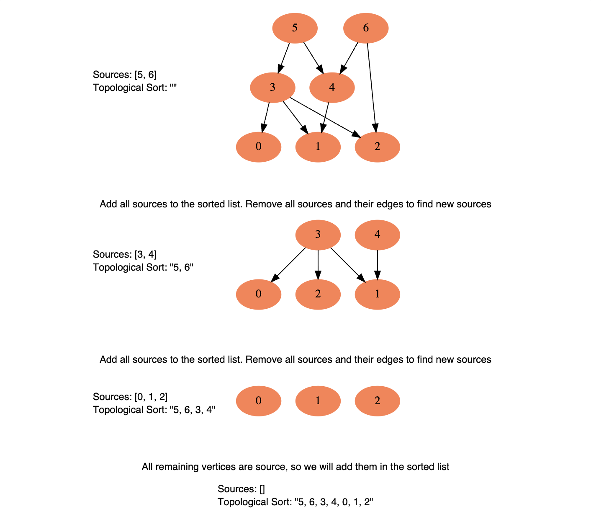
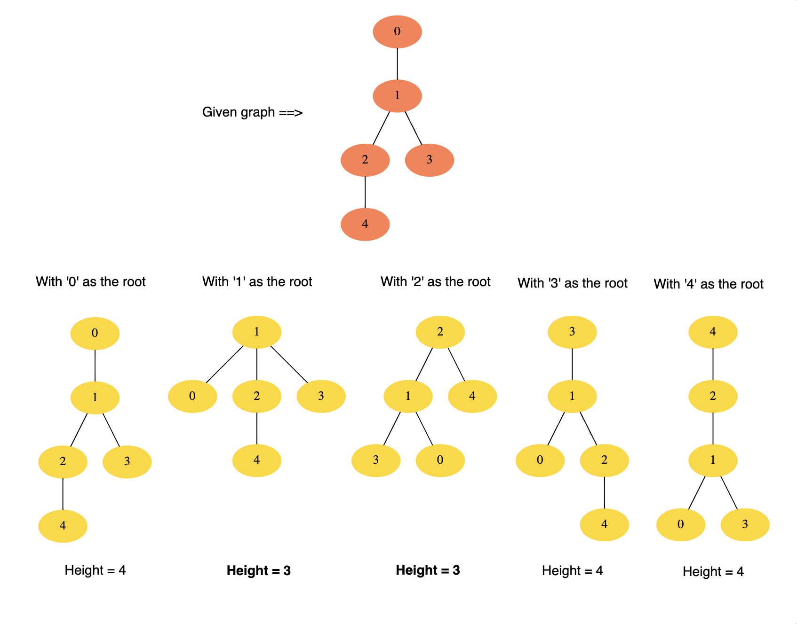
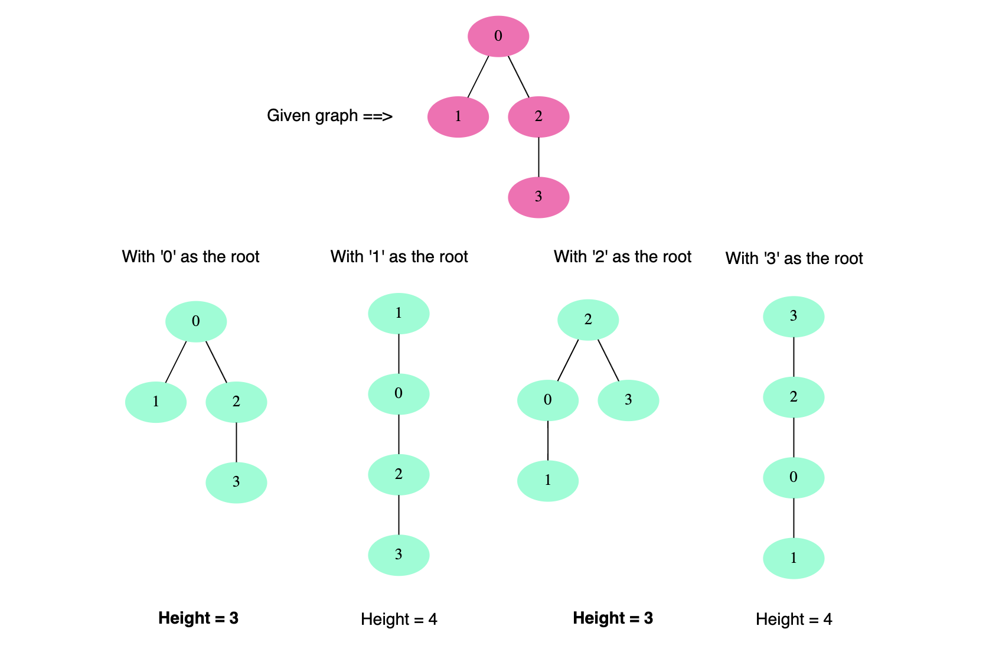

# 🔎 Pattern 16: Topological Sort (Graph)

<b>Topological Sort</b> is used to find a linear ordering of elements that have dependencies on each other. For example, if event `B` is dependent on event `A`, `A` comes before `B` in topological ordering.

This pattern defines an easy way to understand the technique for performing topological sorting of a set of elements and then solves a few problems using it.

Let’s see this pattern in action.

## Topological Sort (medium)

> Topological Sort of a directed graph (a graph with unidirectional edges) is a linear ordering of its vertices such that for every directed edge `(U, V)` from vertex `U` to vertex `V`, `U` comes before `V` in the ordering.
>
> Given a directed graph, find the topological ordering of its vertices.

### Example 1:

```text
Input: Vertices=4, Edges=[3, 2], [3, 0], [2, 0], [2, 1]
Output: Following are the two valid topological sorts for the given graph:
1) 3, 2, 0, 1
2) 3, 2, 1, 0
```


### Example 2:

```text
Input: Vertices=5, Edges=[4, 2], [4, 3], [2, 0], [2, 1], [3, 1]
Output: Following are all valid topological sorts for the given graph:
1) 4, 2, 3, 0, 1
2) 4, 3, 2, 0, 1
3) 4, 3, 2, 1, 0
4) 4, 2, 3, 1, 0
5) 4, 2, 0, 3, 1
```


### Example 3:

```text
Input: Vertices=7, Edges=[6, 4], [6, 2], [5, 3], [5, 4], [3, 0], [3, 1], [3, 2], [4, 1]
Output: Following are all valid topological sorts for the given graph:
1) 5, 6, 3, 4, 0, 1, 2
2) 6, 5, 3, 4, 0, 1, 2
3) 5, 6, 4, 3, 0, 2, 1
4) 6, 5, 4, 3, 0, 1, 2
5) 5, 6, 3, 4, 0, 2, 1
6) 5, 6, 3, 4, 1, 2, 0

There are other valid topological ordering of the graph too.
```


The basic idea behind the topological sort is to provide a partial ordering among the vertices of the graph such that if there is an edge from `U` to `V` then `U≤V` i.e., `U` comes before `V` in the ordering.

Here are a few fundamental concepts related to <b>topological sort</b>:

- <b>Source:</b> Any node that has no incoming edge and has only outgoing edges is called a <b>source</b>.
- <b>Sink:</b> Any node that has only incoming edges and no outgoing edge is called a <b>sink</b>.
- So, we can say that a topological ordering starts with one of the <b>sources</b> and ends at one of the <b>sinks</b>.
- A topological ordering is possible only when the graph has no directed <i>cycles</i>, i.e. if the graph is a <b>Directed Acyclic Graph (DAG)</b>. If the graph has a cycle, some vertices will have cyclic dependencies which makes it impossible to find a linear ordering among vertices.

To find the <i>topological sort</i> of a graph we can traverse the graph in a <b>Breadth First Search (BFS)</b> way. We will start with all the <i>sources</i>, and in a stepwise fashion, save all sources to a sorted list. We will then remove all sources and their edges from the graph. After the removal of the edges, we will have new sources, so we will repeat the above process until all vertices are visited.

#### 1. Initialization

- We will store the graph in <b>Adjacency Lists</b>, which means each parent vertex will have a list containing all of its children.
- We will do this using a <b>HashMap</b> where the `key` will be the parent vertex number and the value will be a List containing children vertices.
- To find the sources, we will keep a <b>HashMap</b> to count the in-degrees i.e., count of incoming edges of each vertex. Any vertex with `0` in-degree will be a source.

#### 2. Build the graph and find in-degrees of all vertices

- We will build the graph from the input and populate the in-degrees <b>HashMap</b>.

#### 3. Find all sources

- All vertices with `0` in-degrees will be our sources and we will store them in a <b>Queue</b>.

#### 4. Sort

- For each source, do the following things:
  - Add it to the sorted list.
  - Get all of its children from the graph.
  - Decrement the in-degree of each child by `1`.
  - If a child’s in-degree becomes `0`, add it to the sources <b>Queue</b>.
- Repeat for each source, until the source <b>Queue</b> is empty.

Here is the visual representation of this algorithm for <b>Example 3</b>:


This is how we can implement this algorithm:

```cpp
#include <iostream>
#include <vector>
#include <queue>
using namespace std;

vector<int> topologicalSort(int vertices, vector<vector<int>>& edges) {
  vector<int> sortedOrder;

  if (vertices <= 0) {
    return sortedOrder;
  }

  // 1. Initialize the graph
  // count incoming edges
  vector<int> inDegree(vertices, 0);
  // adjacency list graph
  vector<vector<int>> graph(vertices);

  // 2. Build the graph
  for(auto& edge : edges) {
    int parent = edge[0];
    int child = edge[1];
    // put the child into its parent's list
    graph[parent].push_back(child);
    // increment child's inDegree
    inDegree[child]++;
  }

  // 3. Find all sources/vertices with 0 inDegrees
  queue<int> sources;
  for (int i = 0; i < inDegree.size(); i++) {
    if (inDegree[i] == 0) sources.push(i);
  }

  // 4. For each source, add it to sortedOrder and decrement its children inDegree
  // if a child becomes 0, add to source queue
  while (!sources.empty()) {
    int vertex = sources.front();
    sources.pop();
    sortedOrder.push_back(vertex);
    for(int child : graph[vertex]) {
      // get the node's children to decrement their inDegree
      inDegree[child]--;
      if (inDegree[child] == 0) {
        sources.push(child);
      }
    }
  }

  // topological sort is not possible as the graph has a cycle
  if (sortedOrder.size() != vertices) {
    return vector<int>();
  }
  return sortedOrder;
}

int main() {
  // Following are the two valid topological sorts for the given graph:
  // 1) 3, 2, 0, 1
  // 2) 3, 2, 1, 0
  vector<vector<int>> edges1 = {{3, 2}, {3, 0}, {2, 0}, {2, 1}};
  vector<int> result1 = topologicalSort(4, edges1);
  cout << "Topological sort: ";
  for(int v : result1) cout << v << " ";
  cout << endl;

  // Following are all valid topological sorts for the given graph:
  // 1) 4, 2, 3, 0, 1
  // 2) 4, 3, 2, 0, 1
  // 3) 4, 3, 2, 1, 0
  // 4) 4, 2, 3, 1, 0
  // 5) 4, 2, 0, 3, 1
  vector<vector<int>> edges2 = {{4, 2}, {4, 3}, {2, 0}, {2, 1}, {3, 1}};
  vector<int> result2 = topologicalSort(5, edges2);
  cout << "Topological sort: ";
  for(int v : result2) cout << v << " ";
  cout << endl;

  // Following are all valid topological sorts for the given graph:
  // 1) 5, 6, 3, 4, 0, 1, 2
  // 2) 6, 5, 3, 4, 0, 1, 2
  // 3) 5, 6, 4, 3, 0, 2, 1
  // 4) 6, 5, 4, 3, 0, 1, 2
  // 5) 5, 6, 3, 4, 0, 2, 1
  // 6) 5, 6, 3, 4, 1, 2, 0
  // There are other valid topological ordering of the graph too.
  vector<vector<int>> edges3 = {{6, 4}, {6, 2}, {5, 3}, {5, 4}, {3, 0}, {3, 1}, {3, 2}, {4, 1}};
  vector<int> result3 = topologicalSort(7, edges3);
  cout << "Topological sort: ";
  for(int v : result3) cout << v << " ";
  cout << endl;

  return 0;
}
```

- In step `4`, each vertex will become a source only once and each edge will be accessed and removed once. Therefore, the time complexity of the above algorithm will be `O(V+E)`, where `V` is the total number of vertices and ‘E’ is the total number of edges in the graph.
- The space complexity will be `O(V+E)`, since we are storing all of the edges for each vertex in an adjacency list.

### Similar Problems

> Find if a given Directed Graph has a cycle in it or not.

<b>Solution:</b> If we can’t determine the topological ordering of all the vertices of a directed graph, the graph has a cycle in it. This was also referred to in the above code:
`cpp\nif (sortedOrder.size() != vertices)  // topological sort is not possible as the graph has a cycle\n  return vector<int>();\n`

## 👩🏽‍🦯 Tasks Scheduling (medium)

https://leetcode.com/problems/course-schedule/

> There are `N` `tasks`, labeled from `0` to `N-1`. Each task can have some `prerequisite` tasks which need to be completed before it can be scheduled. Given the number of `tasks` and a list of `prerequisite` pairs, find out if it is possible to schedule all the `tasks`.

This problem is asking us to find out if it is possible to find a <b>topological ordering</b> of the given `tasks`. The `tasks` are equivalent to the vertices and the `prerequisites` are the edges.

We can use a similar algorithm as described in <b>[Topological Sort](#topological-sort-medium)</b> to find the topological ordering of the tasks. If the ordering does not include all the `tasks`, we will conclude that some tasks have <i>cyclic dependencies</i>.

```cpp
#include <iostream>
#include <vector>
#include <queue>
using namespace std;

bool isSchedulingPossible(int tasks, vector<vector<int>>& prerequisites) {
  vector<int> schedule;

  if(tasks <= 0) {
    return false;
  }

  // 1. initialize the graph
  // count incoming edges
  vector<int> steps(tasks, 0);
  // adjacency list graph
  vector<vector<int>> graph(tasks);

  // 2. Build the graph
  for(auto& prereq : prerequisites) {
    int parent = prereq[0];
    int child = prereq[1];
    // put the child into its parent's list
    graph[parent].push_back(child);
    // increment child's step
    steps[child]++;
  }

  // 3. Find all sources with 0 steps
  queue<int> sources;
  for(int i = 0; i < steps.size(); i++) {
    if(steps[i] == 0) sources.push(i);
  }

  // 4. For each source, add it to schedule and decrement its children steps
  // if a child becomes 0, add to source queue
  while(!sources.empty()) {
    int vertex = sources.front();
    sources.pop();
    schedule.push_back(vertex);
    for(int child : graph[vertex]) {
      // get the node's children to decrement their steps
      steps[child]--;
      if(steps[child] == 0) sources.push(child);
    }
  }

  // if schedule doesn't contain all tasks,
  // there is a cyclic dependency between tasks,
  // therefore, we will not be able to schedule all tasks
  return schedule.size() == tasks;
}

int main() {
  vector<vector<int>> prereq1 = {{0, 1}, {1, 2}};
  cout << "Is scheduling possible: " << isSchedulingPossible(3, prereq1) << endl;  // true

  vector<vector<int>> prereq2 = {{0, 1}, {1, 2}, {2, 0}};
  cout << "Is scheduling possible: " << isSchedulingPossible(3, prereq2) << endl;  // false

  vector<vector<int>> prereq3 = {{0, 4}, {1, 4}, {3, 2}, {1, 3}};
  cout << "Is scheduling possible: " << isSchedulingPossible(6, prereq3) << endl;  // true

  return 0;
}
```

- In step `4`, each task can become a source only once, and each edge (i.e., `prereq`) will be accessed and removed once. Therefore, the time complexity of the above algorithm will be `O(V+E)`, where `V` is the total number of tasks and `E` is the total number of `prerequisites`.
- The space complexity will be `O(V+E)`, since we are storing all of the prerequisites for each task in an adjacency list.

### Similar Problems

<b>Course Schedule:</b> There are `N` courses, labeled from `0` to `N-1`. Each course can have some prerequisite courses which need to be completed before it can be taken. Given the number of courses and a list of prerequisite pairs, find if it is possible for a student to take all the courses.

<b>Solution:</b> This problem is exactly similar to our parent problem. In this problem, we have courses instead of tasks.

## 🔎 Tasks Scheduling Order (medium)

https://leetcode.com/problems/course-schedule-ii/

> There are `N` tasks, labeled from `0` to `N-1`. Each task can have some prerequisite tasks which need to be completed before it can be scheduled. Given the number of tasks and a list of prerequisite pairs, write a method to find the ordering of tasks we should pick to finish all tasks.

This problem is similar to <b>[Tasks Scheduling](#-tasks-scheduling-medium)</b>, the only difference being that we need to find the best ordering of tasks so that it is possible to schedule them all.

```cpp
#include <iostream>
#include <vector>
#include <queue>
using namespace std;

vector<int> findOrder(int tasks, vector<vector<int>>& prerequisites) {
  vector<int> schedule;

  if(tasks <= 0) {
    return vector<int>();
  }

  // 1. initialize the graph
  // count incoming edges
  vector<int> steps(tasks, 0);
  // adjacency list graph
  vector<vector<int>> graph(tasks);

  // 2. Build the graph
  for(auto& prereq : prerequisites) {
    int parent = prereq[0];
    int child = prereq[1];
    // put the child into its parent's list
    graph[parent].push_back(child);
    // increment child's step
    steps[child]++;
  }

  // 3. Find all sources with 0 steps
  queue<int> sources;
  for(int i = 0; i < steps.size(); i++) {
    if(steps[i] == 0) sources.push(i);
  }

  // 4. For each source, add it to schedule and decrement its children steps
  // if a child becomes 0, add to source queue
  while(!sources.empty()) {
    int vertex = sources.front();
    sources.pop();
    schedule.push_back(vertex);
    for(int child : graph[vertex]) {
      // get the node's children to decrement their steps
      steps[child]--;
      if(steps[child] == 0) sources.push(child);
    }
  }

  // if schedule doesn't contain all tasks,
  // there is a cyclic dependency between tasks,
  // therefore, we will not be able to schedule all tasks
  if(schedule.size() != tasks) {
    return vector<int>();
  }

  return schedule;
}

int main() {
  vector<vector<int>> prereq1 = {{0, 1}, {1, 2}};
  vector<int> result1 = findOrder(3, prereq1);
  cout << "Order: ";
  for(int t : result1) cout << t << " ";
  cout << endl;

  vector<vector<int>> prereq2 = {{0, 1}, {1, 2}, {2, 0}};
  vector<int> result2 = findOrder(3, prereq2);
  cout << "Order: ";
  for(int t : result2) cout << t << " ";
  cout << endl;

  vector<vector<int>> prereq3 = {{2, 5}, {0, 5}, {0, 4}, {1, 4}, {3, 2}, {1, 3}};
  vector<int> result3 = findOrder(6, prereq3);
  cout << "Order: ";
  for(int t : result3) cout << t << " ";
  cout << endl;

  return 0;
}
```

- In step `4`, each task can become a source only once, and each edge (i.e., `prereq`) will be accessed and removed once. Therefore, the time complexity of the above algorithm will be `O(V+E)`, where `V` is the total number of tasks and `E` is the total number of prerequisites.
- The space complexity will be `O(V+E)`, since we are storing all of the prerequisites for each task in an adjacency list.

### Similar Problems

<b>Course Schedule:</b>

> There are `N` courses, labeled from `0` to `N-1`. Each course has some `prerequisite` courses which need to be completed before it can be taken. Given the number of courses and a list of `prerequisite` pairs, write a method to find the best ordering of the courses that a student can take in order to finish all courses.

<b>Solution:</b> This problem is exactly similar to our parent problem. In this problem, we have courses instead of `tasks`.

## All Tasks Scheduling Orders (hard)

> There are `N` tasks, labeled from `0` to `N-1`. Each task can have some prerequisite tasks which need to be completed before it can be scheduled. Given the number of tasks and a list of prerequisite pairs, write a method to print all possible ordering of tasks meeting all prerequisites.

This problem is similar to <b>[Tasks Scheduling Order](#-tasks-scheduling-order-medium)</b>, the only difference is that we need to find <b>all</b> of the <i>topological orderings</i> of the `tasks`.

At any stage, if we have more than one source available and since we can choose any source, therefore, in this case, we will have multiple orderings of the tasks. We can use a recursive approach with <b>Backtracking</b> to consider all sources at any step.

```cpp
#include <iostream>
#include <vector>
using namespace std;

void printAllTopologicalSorts(vector<vector<int>>& graph, vector<int>& steps, vector<int>& sources, vector<int>& schedule) {
  // 4. For each source, add to schedule and decrement child steps
  // if child == 0, add to source queue
  if (sources.size() > 0) {
    for (int i = 0; i < sources.size(); i++) {
      int vertex = sources[i];
      schedule.push_back(vertex);

      // clone current sources
      vector<int> sourcesForNextCall = sources;

      // only remove the current source
      // all other sources will remain in queue for next call
      sourcesForNextCall.erase(sourcesForNextCall.begin() + i);

      for (int child : graph[vertex]) {
        // get the node's children to decrement their steps
        steps[child]--;
        if (steps[child] == 0) sourcesForNextCall.push_back(child);
      }

      // recursive call to print other ordering from the
      // remaining and new sources
      printAllTopologicalSorts(graph, steps, sourcesForNextCall, schedule);

      // backtrack, remove the vertex from the schedule and put
      // all of its children back to consider the next source
      // instead of the current vertex
      schedule.pop_back();
      for (int j = 0; j < graph[vertex].size(); j++) {
        steps[graph[vertex][j]]++;
      }
    }
  }

  // if schedule doesn't contain all tasks,
  // there is a cyclic dependency between tasks,
  // OR we have not processed all tasks in this recursive call
  if (schedule.size() == steps.size()) {
    for (int t : schedule) cout << t << " ";
    cout << endl;
  }
}

void printOrders(int tasks, vector<vector<int>>& prerequisites) {
  if (tasks <= 0) return;

  // 1. Initialize graph
  // count incoming edges
  vector<int> steps(tasks, 0);
  // adjacency list graph
  vector<vector<int>> graph(tasks);

  // 2. Build Graph
  for(auto& prereq : prerequisites) {
    int parent = prereq[0];
    int child = prereq[1];
    // put the child into its parent's list
    graph[parent].push_back(child);
    // increment child's steps
    steps[child]++;
  }

  // 3. Find sources with 0 steps
  vector<int> sources;
  for (int i = 0; i < steps.size(); i++) {
    if (steps[i] == 0) sources.push_back(i);
  }

  vector<int> schedule;
  printAllTopologicalSorts(graph, steps, sources, schedule);
}

int main() {
  cout << "Possible orders for tasks [0, 1]:" << endl;
  vector<vector<int>> prereq1 = {{0, 1}, {1, 2}};
  printOrders(3, prereq1);  // [0, 1, 2]

  cout << "\nPossible orders for tasks [0, 1, 2, 3]:" << endl;
  vector<vector<int>> prereq2 = {{3, 2}, {3, 0}, {2, 0}, {2, 1}};
  printOrders(4, prereq2);  // 1) [3, 2, 0, 1], 2) [3, 2, 1, 0]

  cout << "\nPossible orders for tasks [0-5]:" << endl;
  vector<vector<int>> prereq3 = {{2, 5}, {0, 5}, {0, 4}, {1, 4}, {3, 2}, {1, 3}};
  printOrders(6, prereq3);  // Multiple orderings

  return 0;
}
```

- If we don’t have any `prerequisites`, all combinations of the tasks can represent a <i>topological ordering</i>. As we know, that there can be `N` combinations for `N` numbers, therefore the <b>time and space complexity</b> of our algorithm will be `O(V! * E)` where `V` is the total number of `tasks` and `E` is the total `prerequisites`. We need the `E` part because in each recursive call, at max, we remove (and add back) all the edges.

## 👩🏽‍🦯 Alien Dictionary (hard)

https://leetcode.com/problems/alien-dictionary/

> There is a dictionary containing `words` from an alien language for which we don’t know the ordering of the alphabets. Write a method to find the correct order of the alphabets in the alien language. It is given that the input is a valid dictionary and there exists an ordering among its alphabets.

Since the given words are sorted lexicographically by the rules of the alien language, we can always compare two adjacent words to determine the ordering of the characters. Take <b>Example 1</b> below: `[“ba”, “bc”, “ac”, “cab”]`

Take the first two words `“ba”` and `“bc”`. Starting from the beginning of the words, find the first character that is different in both words: it would be `a` from `“ba”` and `c` from `“bc”`. Because of the sorted order of words (i.e. the <i>dictionary!</i>), we can conclude that `a` comes before `c` in the alien language.
Similarly, from `“bc”` and `“ac”`, we can conclude that `b` comes before `a`.
These two points tell us that we are actually asked to find the <b>topological ordering</b> of the characters, and that the ordering rules should be inferred from adjacent words from the alien dictionary.

This makes the current problem similar to <b>[Tasks Scheduling Order](#-tasks-scheduling-order-medium)</b>, the only difference being that we need to build the graph of the characters by comparing adjacent words first, and then perform the <i>topological sort</i> for the graph to determine the order of the characters.

```cpp
#include <iostream>
#include <vector>
#include <unordered_map>
#include <queue>
#include <string>
using namespace std;

string findOrder(vector<string>& words) {
  if(words.size() == 0) return "";

  // 1. Initialize the graph, with hashmaps
  // count of incoming edges
  unordered_map<char, int> steps;
  // adjacency list graph
  unordered_map<char, vector<char>> graph;

  for(string& word : words) {
    for(int i = 0; i < word.length(); i++) {
      steps[word[i]] = 0;
      graph[word[i]] = vector<char>();
    }
  }

  // 2. Build the graph
  for(int i = 0; i < words.size() - 1; i++) {
    // find ordering of characters from adjacent words
    string w1 = words[i];
    string w2 = words[i + 1];

    for(int j = 0; j < min(w1.length(), w2.length()); j++) {
      char parent = w1[j];
      char child = w2[j];

      // if the parent and child are different
      if(parent != child) {
        // put the child into its parent's list
        graph[parent].push_back(child);
        // increment child's step
        steps[child]++;
        // only the first different character between the two words
        // will help us find the order
        break;
      }
    }
  }

  // 3. Find all sources (vertices with 0 steps)
  queue<char> sources;
  for(auto& p : steps) {
    if(p.second == 0) {
      sources.push(p.first);
    }
  }

  // 4. For each source, add it to sortedDictionary and subtract 1 from all of its children's steps
  // if a child's step becomes 0, add it to the source queue
  string sortedDictionary = "";
  while(!sources.empty()) {
    char vertex = sources.front();
    sources.pop();
    sortedDictionary += vertex;
    for(char child : graph[vertex]) {
      // get the node's children to decrement their steps
      steps[child]--;
      if(steps[child] == 0) {
        sources.push(child);
      }
    }
  }

  // if sortedDictionary doesn't contain all chars
  // then there is a cyclic dependency between chars,
  // then we will not be able to find the correct ordering of the chars
  if(sortedDictionary.length() != steps.size()) return "";

  return sortedDictionary;
}

int main() {
  vector<string> words1 = {"ba", "bc", "ac", "cab"};
  cout << "Character order: " << findOrder(words1) << endl;  // bac

  vector<string> words2 = {"cab", "aaa", "aab"};
  cout << "Character order: " << findOrder(words2) << endl;  // cab

  vector<string> words3 = {"ywx", "wz", "xww", "xz", "zyy", "zwz"};
  cout << "Character order: " << findOrder(words3) << endl;  // ywxz

  return 0;
}
```

- In step <b>4</b>, each task can become a source only once and each edge (a rule) will be accessed and removed once. Therefore, the time complexity of the above algorithm will be `O(V+E)`, where `V` is the total number of different characters and `E` is the total number of the rules in the alien language. Since, at most, each pair of words can give us one rule, therefore, we can conclude that the upper bound for the rules is `O(N)`where `N` is the number of words in the input. So, we can say that the time complexity of our algorithm is `O(V+N)`.
- The space complexity will be `O(V+N)`, since we are storing all of the rules for each character in an <i>adjacency list</i>.

## 🌟 🔎 Reconstructing a Sequence (hard)

https://leetcode.com/problems/sequence-reconstruction/

> Given a sequence `originalSeq` and an array of `sequences`, write a method to find if `originalSeq` can be uniquely reconstructed from the array of `sequences`.
>
> Unique reconstruction means that we need to find if `originalSeq` is the <b>only</b> sequence such that all `sequences` in the array are subsequences of it.

Since each sequence in the given array defines the ordering of some numbers, we need to combine all these ordering rules to find two things:

1. Is it possible to construct the `originalSeq` from all these rules?
2. Are these ordering rules not sufficient enough to define the unique ordering of all the numbers in the `originalSeq`? In other words, can these rules result in more than one sequence?
   Take <b>Example 1</b>:

```cpp
// originalSeq: [1, 2, 3, 4], seqs:[[1, 2], [2, 3], [3, 4]]
// The first sequence tells us that 1 comes before 2; the second tells us 2 comes before 3;
// the third tells us 3 comes before 4. Result: unique sequence [1, 2, 3, 4]
```

The first sequence tells us that `1` comes before `2`; the second sequence tells us that `2` comes before `3`; the third sequence tells us that `3` comes before `4`. Combining all these sequences will result in a unique sequence: `[1, 2, 3, 4]`.

The above explanation tells us that we are actually asked to find the <i>topological ordering</i> of all the numbers and also to verify that there is only one <i>topological ordering</i> of the numbers possible from the given array of the sequences.

This makes the current problem similar to <b>[Tasks Scheduling Order](#-tasks-scheduling-order-medium)</b> with two differences:

1. We need to build the graph of the numbers by comparing each pair of numbers in the given array of sequences.
2. We must perform the <b>topological sort</b> for the graph to determine two things:

- Can the topological <b>ordering construct</b> the `originalSeq`?
- That there is only one <b>topological ordering</b> of the numbers possible. This can be confirmed if we do not have more than one <b>source</b> at any time while finding the <b>topological ordering</b> of numbers.

```cpp
#include <iostream>
#include <vector>
#include <unordered_map>
#include <queue>
using namespace std;

bool canConstruct(vector<int>& originalSeq, vector<vector<int>>& sequences) {
  vector<int> reconstructed;
  if (originalSeq.size() == 0) return false;

  // 1. Initialize the graph
  // count of incoming edges
  unordered_map<int, int> steps;
  // create adjacency list graph
  unordered_map<int, vector<int>> graph;

  for(auto& seq : sequences) {
    for (int i = 0; i < seq.size(); i++) {
      steps[seq[i]] = 0;
      graph[seq[i]] = vector<int>();
    }
  }

  // 2. Build the graph
  for(auto& seq : sequences) {
    for (int i = 1; i < seq.size(); i++) {
      int parent = seq[i - 1];
      int child = seq[i];
      graph[parent].push_back(child);
      steps[child]++;
    }
  }

  // if we don't have ordering rules for all the numbers
  // we will not be able to UNIQUELY construct the sequence
  if (steps.size() != originalSeq.size()) return false;

  // 3. Find all sources (all vertices with 0 steps)
  queue<int> sources;
  for(auto& p : steps) {
    if (p.second == 0) sources.push(p.first);
  }

  // 4. For each source, add it to the reconstructed and
  // subtract one for all its children's steps
  // if a child's steps become 0, add it to the source queue
  while (!sources.empty()) {
    if (sources.size() > 1) {
      // more than one source === more than one way to reconstruct the sequence
      return false;
    }

    if (originalSeq[reconstructed.size()] != sources.front()) {
      // the next source (or number) is different from the originalSeq
      return false;
    }
    int vertex = sources.front();
    sources.pop();
    reconstructed.push_back(vertex);
    for(int child : graph[vertex]) {
      // get the node's children to decrement their steps
      steps[child]--;
      if (steps[child] == 0) sources.push(child);
    }
  }

  // if reconstructed's size != originalSeq's size
  // there is no way to construct
  return reconstructed.size() == originalSeq.size();
}

int main() {
  vector<int> seq1 = {1, 2, 3, 4};
  vector<vector<int>> seqs1 = {{1, 2}, {2, 3}, {3, 4}};
  cout << "Can construct: " << canConstruct(seq1, seqs1) << endl;  // true

  vector<int> seq2 = {1, 2, 3, 4};
  vector<vector<int>> seqs2 = {{1, 2}, {2, 3}, {2, 4}};
  cout << "Can construct: " << canConstruct(seq2, seqs2) << endl;  // false

  vector<int> seq3 = {3, 1, 4, 2, 5};
  vector<vector<int>> seqs3 = {{3, 1, 5}, {1, 4, 2, 5}};
  cout << "Can construct: " << canConstruct(seq3, seqs3) << endl;  // true

  return 0;
}
```

- In step <b>4</b>, each task can become a source only once and each edge (a rule) will be accessed and removed once. Therefore, the time complexity of the above algorithm will be `O(V+E)`, where `V` is the total number of different characters and `E` is the total number of the rules in the alien language. Since, at most, each pair of words can give us one rule, therefore, we can conclude that the upper bound for the rules is `O(N)`where `N` is the number of words in the input. So, we can say that the time complexity of our algorithm is `O(V+N)`.
- The space complexity will be `O(V+N)`, since we are storing all of the rules for each character in an <i>adjacency list</i>.

## 🌟 Minimum Height Trees (hard)

https://leetcode.com/problems/minimum-height-trees/

> We are given an undirected graph that has characteristics of a <b>[k-ary tree](https://en.wikipedia.org/wiki/M-ary_tree)</b>. In such a graph, we can choose any node as the root to make a <b>k-ary tree</b>. The <i>root (or the tree)</i> with the minimum height will be called <b>Minimum Height Tree (MHT)</b>. There can be multiple <b>MHTs</b> for a graph. In this problem, we need to find all those roots which give us <b>MHTs</b>. Write a method to find all <b>MHTs</b> of the given graph and return a list of their roots.

### Example 1:

```cpp
// Input: vertices: 5, Edges: [[0, 1], [1, 2], [1, 3], [2, 4]]
// Output:[1, 2]
// Choosing '1' or '2' as roots give us MHTs.
```



### Example 2:

```cpp
// Input: vertices: 4, Edges: [[0, 1], [0, 2], [2, 3]]
// Output:[0, 2]
// Choosing '0' or '2' as roots give us MHTs.
```



### Example 3:

```cpp
// Input: vertices: 4, Edges: [[0, 1], [1, 2], [1, 3]]
// Output:[1]
```

From the above-mentioned examples, we can clearly see that any <i>leaf node (i.e., node with only one edge)</i> can never give us an <b>MHT</b> because its adjacent <i>non-leaf nodes</i> will always give an <b>MHT</b> with a smaller height. All the adjacent <i>non-leaf nodes</i> will consider the <i>leaf node</i> as a <i>subtree</i>.

Let’s understand this with another example. Suppose we have a tree with <i>root</i> `M` and <i>height</i> `5`. Now, if we take another <i>node</i>, say `P`, and make the `M` tree as its subtree, then the height of the overall tree with root `P` will be `6` (`=5+1`). Now, this whole tree can be considered a graph, where `P` is a leaf as it has only one edge (connection with `M`). This clearly shows that the leaf node `P` gives us a tree of height `6` whereas its adjacent non-leaf node `M` gives us a tree with smaller height `5` - since `P` will be a child of `M`.

This gives us a strategy to find <b>MHTs</b>. Since leaves can’t give us <b>MHT</b>, we can remove them from the graph and remove their `edges` too. Once we remove the leaves, we will have new leaves. Since these new leaves can’t give us <b>MHT</b>, we will repeat the process and remove them from the graph too. We will prune the leaves until we are left with one or two nodes which will be our answer and the roots for <b>MHTs</b>.

We can implement the above process using the <b>topological sort</b>. Any node with only one edge (i.e., a leaf) can be our source and, in a stepwise fashion, we can remove all sources from the graph to find new sources. We will repeat this process until we are left with one or two `nodes` in the graph, which will be our answer.

```cpp
#include <iostream>
#include <vector>
#include <queue>
using namespace std;

vector<int> findTrees(int nodes, vector<vector<int>>& edges) {
  if (nodes <= 0) return vector<int>();

  // with only one node, we need to handle it separately since its steps will be 0
  if (nodes == 1) return {0};

  // 1. Initialize the graph
  // Count of incoming edges
  vector<int> steps(nodes, 0);
  // adjacency list graph
  vector<vector<int>> graph(nodes);

  // 2. Build the graph
  for(auto& edge : edges) {
    int node1 = edge[0];
    int node2 = edge[1];

    // this is an undirected graph, so we will add a link for both nodes
    graph[node1].push_back(node2);
    graph[node2].push_back(node1);

    // increment the steps of both nodes
    steps[node1]++;
    steps[node2]++;
  }

  // 3. Find all leaves (all nodes with 1 step)
  queue<int> leaves;
  for (int i = 0; i < steps.size(); i++) {
    if (steps[i] == 1) leaves.push(i);
  }

  // 4. Remove leaves level by level and decrement each leaf's children's steps
  // repeat this until we are left with 1 or 2 nodes (our answer)
  // any node that has already been a leaf cannot be the root of a MHT
  // because its adjacent non-leaf node will always be the better option
  int totalNodes = nodes;
  while (totalNodes > 2) {
    int leavesSize = leaves.size();
    totalNodes -= leavesSize;

    for (int i = 0; i < leavesSize; i++) {
      int vertex = leaves.front();
      leaves.pop();

      // get the node's children to decrement their steps
      for(int child : graph[vertex]) {
        steps[child]--;
        if (steps[child] == 1) leaves.push(child);
      }
    }
  }

  vector<int> result;
  while (!leaves.empty()) {
    result.push_back(leaves.front());
    leaves.pop();
  }
  return result;
}

int main() {
  // [1, 2]
  // Choosing '1' or '2' as roots give us MHTs. The height of trees with roots '1' or '2' is three which is minimum.
  vector<vector<int>> edges1 = {{0, 1}, {1, 2}, {1, 3}, {2, 4}};
  vector<int> result1 = findTrees(5, edges1);
  cout << "Roots of MHTs: ";
  for(int r : result1) cout << r << " ";
  cout << endl;

  // [0, 2]
  // Choosing '0' or '2' as roots give us MHTs. The height of trees with roots '0' or '2' is three which is minimum.
  vector<vector<int>> edges2 = {{0, 1}, {0, 2}, {2, 3}};
  vector<int> result2 = findTrees(4, edges2);
  cout << "Roots of MHTs: ";
  for(int r : result2) cout << r << " ";
  cout << endl;

  // [1]
  vector<vector<int>> edges3 = {{1, 2}, {1, 3}};
  vector<int> result3 = findTrees(4, edges3);
  cout << "Roots of MHTs: ";
  for(int r : result3) cout << r << " ";
  cout << endl;

  return 0;
}
```

- In step <b>4</b>, each task can become a source only once and each edge (a rule) will be accessed and removed once. Therefore, the time complexity of the above algorithm will be `O(V+E)`, where `V` is the total number of different characters and `E` is the total number of the rules in the alien language. Since, at most, each pair of words can give us one rule, therefore, we can conclude that the upper bound for the rules is `O(N)`where `N` is the number of words in the input. So, we can say that the time complexity of our algorithm is `O(V+N)`.
- The space complexity will be `O(V+N)`, since we are storing all of the rules for each character in an <i>adjacency list</i>.
