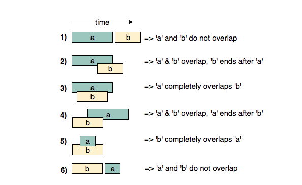

# Coding Patterns for Data Structures & Algorithms

<div align="center">

[](https://github.com/deekshithgowda85/Coding-Pattern-For-Dsa)
[](https://github.com/deekshithgowda85/Coding-Pattern-For-Dsa/stargazers)
[](https://github.com/deekshithgowda85/Coding-Pattern-For-Dsa/network/members)
[](LICENSE)

A comprehensive collection of **16 essential coding patterns** for solving Data Structures and Algorithms interview problems. Master the most important patterns used at top tech companies.

[Explore Patterns](#patterns) • [Quick Start](#getting-started) • [Resources](#additional-resources)

</div>

---

## 📚 About This Repository

This repository contains detailed notes and explanations on coding patterns for solving complex DSA problems, based on the **[Grokking the Coding Interview](https://www.educative.io/courses/grokking-the-coding-interview)** course. Each pattern is thoroughly documented with problem explanations, approach strategies, and time/space complexity analysis.

Perfect for:

- 💼 Technical interview preparation
- 🎓 Learning DSA fundamentals
- 📝 Quick pattern reference
- 🔄 Reinforcing algorithmic thinking

---

## 📋 Patterns

| #   | Pattern                                                                                  | #   | Pattern                                                                        |
| --- | ---------------------------------------------------------------------------------------- | --- | ------------------------------------------------------------------------------ |
| 1   | [Sliding Window](Pattern%2001%20-%20SlidingWindow.md)                                    | 9   | [Two Heaps](Pattern%2009%20-%20TwoHeaps.md)                                    |
| 2   | [Two Pointers](Pattern%2002%20-%20TwoPointers.md)                                        | 10  | [Subsets](Pattern%2010%20-%20Subsets.md)                                       |
| 3   | [Fast & Slow Pointers](Pattern%2003%20-%20Fast&Slowpointers.md)                          | 11  | [Modified Binary Search](Pattern%2011%20-%20ModifiedBinarySearch.md)           |
| 4   | [Merge Intervals](Pattern%2004%20-%20MergeIntervals.md)                                  | 12  | [Bitwise XOR](Pattern%2012%20-%20BitwiseXOR.md)                                |
| 5   | [Cyclic Sort](Pattern%2005%20-%20CyclicSort.md)                                          | 13  | [Top 'K' Elements](Pattern%2013%20-%20Top'K'Elements.md)                       |
| 6   | [In-place Reversal of LinkedList](Pattern%2006%20-%20In%20placeReversalofaLinkedList.md) | 14  | [K-way Merge](Pattern%2014%20-%20K%20waymerge.md)                              |
| 7   | [Tree BFS](Pattern%2007%20-%20TreeBreadthFirstSearch.md)                                 | 15  | [0/1 Knapsack (DP)](<Pattern%2015%20-%200%201Knapsack(DynamicProgramming).md>) |
| 8   | [Tree DFS](Pattern%2008%20-%20TreeDepthFirstSearch.md)                                   | 16  | [Topological Sort](<Pattern%2016%20-%20TopologicalSort(Graph).md>)             |

---

## 🚀 Getting Started

### Prerequisites

- Basic understanding of Data Structures
- Familiarity with JavaScript (or any programming language)
- Enthusiasm for problem-solving! 😊

### How to Use This Repository

1. **Clone the repository:**

   ```bash
   git clone https://github.com/deekshithgowda85/Coding-Pattern-For-Dsa.git
   cd Coding-Pattern-For-Dsa
   ```

2. **Browse the patterns:** Each pattern is a separate markdown file with detailed explanations
3. **Study systematically:** Start from Pattern 1 and progress sequentially
4. **Practice problems:** Solve problems related to each pattern to reinforce learning

---

## 📚 Additional Resources

Enhance your learning with these curated resources:

### Learning Tools

- 🎮 [LeetCode](https://leetcode.com/problemset/all/) - Premier platform for coding interview prep
- 📊 [NeetCode](https://neetcode.io/) - Video explanations for common patterns
- 🔍 [Blind 75](https://www.teamblind.com/post/New-Year-Gift---Curated-List-of-Top-75-LeetCode-Questions-to-Save-Your-Time-OaM1orEU) - Must-solve interview questions
- 📝 [Tech Interview Handbook](https://www.techinterviewhandbook.org/) - Comprehensive interview guide

### Reference Materials

- ⏱️ [Big O Cheat Sheet](https://www.bigocheatsheet.com/) - Time & space complexity reference
- 💻 [Edabit](https://edabit.com/) - JavaScript practice problems
- 🎯 [FreeCodeCamp Algorithms](https://www.freecodecamp.org/learn/coding-interview-prep/#algorithms) - Free structured learning
- 🤝 [Pramp](https://www.pramp.com/) - Mock interview practice with peers

---

## 📊 Pattern Overview

Each pattern includes:

- **Problem Understanding** - Clear explanation of pattern concepts
- **Visual Examples** - Diagrams to illustrate key ideas
- **Algorithm Approach** - Step-by-step strategy
- **Complexity Analysis** - Time and space complexity breakdown
- **Example Solutions** - Code implementations and examples
- **Related Problems** - Practice problems from popular platforms

---

## 💡 How to Approach Each Pattern

## [Pattern 1: Sliding Window](./✅%20%20Pattern%2001%20:%20Sliding%20Window.md)

In many problems dealing with an array (or a <b>LinkedList</b>), we are asked to find or calculate something among all the contiguous subarrays (or sublists) of a given size. For example, take a look at this problem:

> Given an array, find the average of all contiguous subarrays of size `K` in it.

Lets understand this problem with a real input:

`Array: [1, 3, 2, 6, -1, 4, 1, 8, 2], K=5`

A <b>brute-force</b> algorithm will calculate the sum of every 5-element contiguous subarray of the given array and divide the sum by 5 to find the average.

The efficient way to solve this problem would be to visualize each contiguous subarray as a sliding window of `5` elements. This means that we will slide the window by one element when we move on to the next subarray. To reuse the sum from the previous subarray, we will subtract the element going out of the window and add the element now being included in the sliding window. This will save us from going through the whole subarray to find the sum and, as a result, the algorithm complexity will reduce to `O(N)`.

## [Pattern 2: Two Pointer](./✅%20%20Pattern%2002:%20Two%20Pointers.md)

In problems where we deal with sorted arrays (or <b>LinkedList</b>s) and need to find a set of elements that fulfill certain constraints, the [Two Pointers](./✅%20%20Pattern%2002:%20Two%20Pointers.md) approach becomes quite useful. The set of elements could be a pair, a triplet or even a subarray. For example, take a look at the following problem:

> Given an array of sorted `numbers` and a `target` sum, find a pair in the array whose sum is equal to the given `target`.

To solve this problem, we can consider each element one by one (pointed out by the first pointer) and iterate through the remaining elements (pointed out by the second pointer) to find a pair with the given sum. The time complexity of this algorithm will be `O(N^2)` where `n` is the number of elements in the input array.

Given that the input array is sorted, an efficient way would be to start with one pointer in the beginning and another pointer at the end. At every step, we will see if the numbers pointed by the <b> two pointers</b> add up to the target sum. If they do not, we will do one of two things:

1. If the sum of the two numbers pointed by the <b> two pointers</b> is greater than the target sum, this means that we need a pair with a smaller sum. So, to try more pairs, we can decrement the end-pointer.
2. If the sum of the two numbers pointed by the <b> two pointers</b> is smaller than the target sum, this means that we need a pair with a larger sum. So, to try more pairs, we can increment the start-pointer.

## [Pattern 3: Fast & Slow pointers](./✅%20%20Pattern%2003:%20Fast%20%26%20Slow%20pointers.md)

The <b>Fast & Slow</b> pointer approach, also known as the <b>Hare & Tortoise algorithm</b>, is a pointer algorithm that uses <b> two pointers</b> which move through the array (or sequence/<b>LinkedList</b>) at different speeds. This approach is quite useful when dealing with cyclic <b>LinkedList</b>s or arrays.

By moving at different speeds (say, in a cyclic <b>LinkedList</b>), the algorithm proves that the <b> two pointers</b> are bound to meet. The <i>fast pointer</i> should catch the <i>slow pointer</i> once both the pointers are in a cyclic loop.

One of the famous problems solved using this technique was [Finding a cycle in a <b>LinkedList</b>](https://github.com/Chanda-Abdul/Several-Coding-Patterns-for-Solving-Data-Structures-and-Algorithms-Problems-during-Interviews/blob/main/%E2%9C%85%20%20Pattern%2003:%20Fast%20%26%20Slow%20pointers.md#linkedlist-cycle-easy). Lets jump onto this problem to understand the <b>Fast & Slow</b> pattern.

## [Pattern 4: Merge Intervals](./✅%20%20Pattern%2004%20:%20Merge%20Intervals.md)

This pattern describes an efficient technique to deal with overlapping intervals. In a lot of problems involving intervals, we either need to find overlapping intervals or merge intervals if they overlap.

Given two intervals (`a` and `b`), there will be six distinct ways the two intervals can relate to each other:

1. `a` and `b`do not overlap
2. `a` and `b` overlap, `b` ends after `a`
3. `a` completely overlaps `b`
4. `a` and `b` overlap, `a` ends after `b`
5. `b` completly overlaps `a`
6. `a` and `b` do not overlap

Understanding the above six cases will help us in solving all intervals related problems.


## [Pattern 5: Cyclic Sort](./✅%20%20Pattern%2005:%20Cyclic%20Sort.md)

This pattern describes an interesting approach to deal with problems involving arrays containing numbers in a given range. For example, take the following problem:

> You are given an unsorted array containing numbers taken from the range `1` to `n`. The array can have duplicates, which means that some numbers will be missing. Find all the missing numbers.

To efficiently solve this problem, we can use the fact that the input array contains numbers in the range of `1` to `n`.
For example, to efficiently sort the array, we can try placing each number in its correct place, i.e., placing `1` at index `0`, placing `2` at index `1`, and so on. Once we are done with the sorting, we can iterate the array to find all indices that are missing the correct numbers. These will be our required numbers.

## [Pattern 6: In-place Reversal of a LinkedList](./✅%20%20Pattern%2006:%20In-place%20Reversal%20of%20a%20LinkedList.md)

<b><i>in-place</i> Reversal of a <b>LinkedList</b> pattern</b> describes an efficient way to solve the above problem.

## [Pattern 7: Tree Breadth First Search](./✅%20%20Pattern%2007:%20Tree%20Breadth%20First%20Search.md)

This pattern is based on the <b>Breadth First Search (BFS)</b> technique to traverse a tree.

Any problem involving the traversal of a tree in a level-by-level order can be efficiently solved using this approach. We will use a <b>Queue</b> to keep track of all the nodes of a level before we jump onto the next level. This also means that the space complexity of the algorithm will be `O(W)`, where `W` is the maximum number of nodes on any level.

## [Pattern 8: Depth First Search (DFS)](./✅%20%20Pattern%2008:Tree%20Depth%20First%20Search.md)

This pattern is based on the <b>Depth First Search (DFS)</b> technique to traverse a tree.

We will be using recursion (or we can also use a stack for the iterative approach) to keep track of all the previous (parent) nodes while traversing. This also means that the space complexity of the algorithm will be `O(H)`, where `H` is the maximum height of the tree.

---

## 🎓 Advanced Resources

### YouTube Channels & Video Tutorials

- [Grokking the Coding Interview](https://www.educative.io/courses/grokking-the-coding-interview) - Original course inspiration
- [NeetCode Videos](https://www.youtube.com/c/NeetCode) - Excellent video explanations
- [Striver's DSA Sheet](https://takeuforward.org/) - Comprehensive DSA guide

### Books Recommended

- "Cracking the Coding Interview" by Gayle Laakmann McDowell
- "Elements of Programming Interviews" by Adnan Aziz
- "Introduction to Algorithms" (CLRS) for deep theory

---

## ❓ FAQ

**Q: Which pattern should I start with?**  
A: Start with Sliding Window and Two Pointers. They build the foundation for understanding other patterns.

**Q: How long does it take to master these patterns?**  
A: Typically 2-3 months of consistent practice (1-2 hours daily) to become proficient.

**Q: Are these patterns sufficient for technical interviews?**  
A: Yes! These 16 patterns cover approximately 90% of real interview questions.

**Q: Can I use these patterns for system design?**  
A: These patterns focus on coding/algorithm interviews. For system design, refer to separate resources.

---

## 📊 Repository Statistics

- **Total Patterns:** 16
- **Problem Coverage:** 90%+ of interview questions
- **Last Updated:** December 2025
- **License:** MIT

---

<div align="center">

**⭐ If you find this helpful, please give it a star! ⭐**

Share your success stories and feedback in issues/discussions!

</div>
